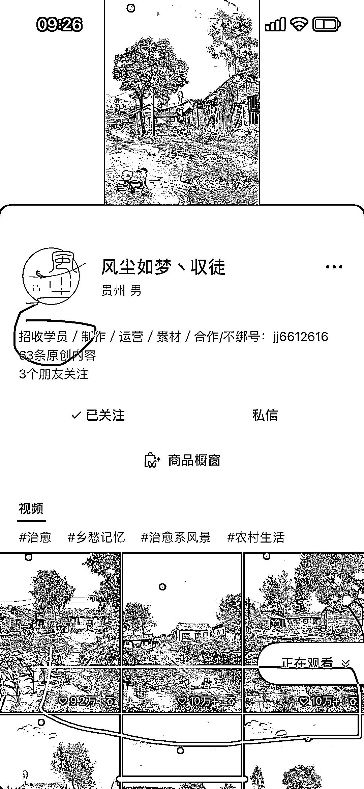

# 宁静夜晚，农村画面唤起童年记忆，引发情感共鸣

> 原文：[`www.yuque.com/for_lazy/xkrm14/raab6eep67gd85lx`](https://www.yuque.com/for_lazy/xkrm14/raab6eep67gd85lx)

<ne-text id="uf59c4c72">作者： Dai</ne-text>

<ne-text id="u221b6730">日期：2023-07-05</ne-text>

<ne-text id="u81883e9b">点赞数：</ne-text><ne-text id="u71ba2246" ne-bold="true">128</ne-text>

<ne-hole id="u5025a28a" data-lake-id="u5025a28a"><ne-card data-card-name="hr" data-card-type="block" id="HhRGQ" data-event-boundary="card">

<ne-text id="u167187c6">正文：</ne-text>

<ne-text id="u72436fc5">先听我（ChatGPT）描绘一幅场景：</ne-text> <ne-text id="u789b779d">在这个宁静而和谐的农村夜晚，皎洁的月光如银河一般洒落在大地上。小溪流淌在村庄的边缘，清澈的水波轻轻拂过一座小石桥。潺潺的流水声伴随着微风的呢喃，仿佛是大自然自己的歌声。</ne-text> <ne-text id="u866a305b">在溪水边，一位母亲轻轻地洗衣服。她的手指轻柔地抚摸着细腻的布料，伴随着水波的起伏，为衣物带来了宁静的洁净。她的脸上洋溢着母爱的温暖，一丝微笑温柔地浮现在她的唇角。</ne-text> <ne-text id="ua5474e0a">微风习习，飘拂着一根根垂柳的枝条，它们翩翩起舞，仿佛是在跳动着大自然的舞曲。它们的优雅舞姿随着微风的起伏，带来一份宁静和生机。</ne-text> <ne-text id="u8b03d88c">溪边有一座小小的乡间小屋，屋顶上冒出缕缕炊烟，暗示着晚餐的香气正在飘散。透过小窗户，温暖的灯光映照在屋内，仿佛是点亮了所有的家庭温暖和团聚的心。家人们围坐在一起，分享着一天的收获和喜悦。</ne-text> <ne-text id="u418208cd">月光透过稀疏的树叶洒在幽静的土路上，曲径小路和墙壁上也被月光涂上了皎洁的银色。这份纯净和静谧，仿佛是那个时光静止的童年，勾起了人们深深埋藏在内心深处的美好记忆。</ne-text> <ne-text id="u632f771d">在这个宁静的农村夜晚，人们仿佛回到了小时候，那个纯真而美好的时光。他们沉浸在大自然的怀抱中，感受到了自然的力量和生命的美妙。这幅画面勾起了人们内心深处的情感共鸣，让人们追忆起那些闪耀着温暖的童年记忆，唤起了一种深深的感动和安宁。</ne-text> <ne-text id="u66491bef">描述完了，你觉得画面美吗？产生情感共鸣了吗？有人把这个场景制作成了 10</ne-text> <ne-text id="u111bc83a">秒的视频，发在视频号里，就连喜欢都能上 10 万+，一边赚着流量主广告分成，一边招学徒收培训费。</ne-text>

<ne-card data-card-name="image" data-card-type="inline" id="MXvDz" data-event-boundary="card">  <ne-p id="u27dd6303" data-lake-id="u27dd6303"><ne-card data-card-name="image" data-card-type="inline" id="bKGLB" data-event-boundary="card">  <ne-hole id="u6aceaa4d" data-lake-id="u6aceaa4d"><ne-card data-card-name="hr" data-card-type="block" id="QPrXK" data-event-boundary="card"><ne-p id="u624608a8" data-lake-id="u624608a8"><ne-text id="u5f1ccdb7">评论区：</ne-text>

<ne-text id="u3a802637">云端 : 厉害！</ne-text>

<ne-text id="u14033b4e">云端 : 这种视频怎么做的？</ne-text>

<ne-text id="u2113e4c7">Alex : [强][强]</ne-text>

<ne-text id="u747f4854">Dai : 后来和作者交流中得知，最高播放量逼近 600 万</ne-text>

<ne-text id="u84f91286">老吴 : 关键是怎么做成视频</ne-text>

<ne-text id="u9349462f">阿雅爱学习 : 就是剪映里用素材做的，和忆乡系列一回事，我之前花了 99 买课了[捂脸]</ne-text>

<ne-text id="u7d14d111">彦威 : 视频号也有流量主吗</ne-text>

<ne-hole id="uafcd6c7d" data-lake-id="uafcd6c7d"><ne-card data-card-name="hr" data-card-type="block" id="yB4cO" data-event-boundary="card">

<ne-text id="u26fb7dda">公众号懒人找资源，懒人专属群分享</ne-text>

</ne-card></ne-hole></ne-card></ne-hole></ne-card></ne-p></ne-card></ne-p></ne-card></ne-hole>