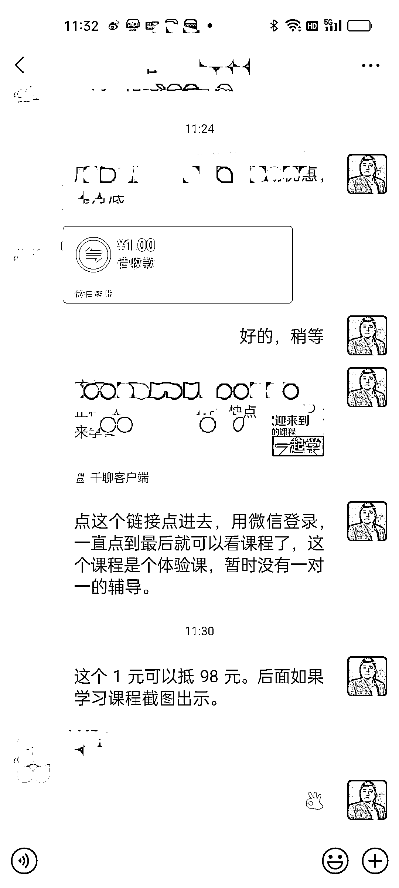

# 船长分享最近使用的促成交方法：1 元课引发怕失去效应

> 原文：[`www.yuque.com/for_lazy/xkrm14/mi0mwd38bi4nh4p6`](https://www.yuque.com/for_lazy/xkrm14/mi0mwd38bi4nh4p6)

<ne-text id="u8183da9a">作者： 老船长李阳</ne-text>

<ne-text id="u22c10983">日期：2023-07-06</ne-text>

<ne-text id="ub58733c8">点赞数：</ne-text><ne-text id="u0ec1aed1" ne-bold="true">137</ne-text>

<ne-hole id="u162c211b" data-lake-id="u162c211b"><ne-card data-card-name="hr" data-card-type="block" id="q0T7h" data-event-boundary="card">

<ne-text id="ue89a318a">正文：</ne-text>

<ne-text id="uac34833e">船长做的知识付费，分享一个最近用的挺爽的促成交方法。 对于精准引流来的客户，也做不到 100%成交。那不成交的客户怎么办？</ne-text> <ne-text id="u6ad778be">很多时候，客户体会不到课程的价值，自然不会主动掏钱。 怎么办？ 第一步，我会先卖给他一个 1 元课。</ne-text> <ne-text id="ua3f9513b">1 元钱买不了吃亏买不了上当。1 元课也要给足他价值，让他体会到课程对他带来的好处。</ne-text> <ne-text id="u67c4359b">第二步，1 元可以抵 98 元。后边如果参加一对一学习，可以使用。当然抵多少钱，大家自己说了算。 为什么设置 1 元课，而不是白给？</ne-text> <ne-text id="uf1dc1650">在客户认知里，免费的东西是没用的没价值价值不大的东西，免费的东西别人看不上，只有付出了，花了钱他才会珍惜。哪怕这个钱是 1 毛还是 1 元，在他心里是个事。</ne-text> <ne-text id="u44fb060e">为什么要使用抵扣？ 制造一种怕失去的效应。花 1 元享受到了 98 的优惠。他感觉这个 98 已经到手了。如果不买课，他会失去这个 98 元。</ne-text> <ne-text id="ue11498e0">人担心的不是怕得不到，怕的是得到的东西失去了。 好了，其实是一个很简单的小策略。希望对大家有点启发。转化高手可以无视。</ne-text>

<ne-card data-card-name="image" data-card-type="inline" id="VIiLp" data-event-boundary="card">  <ne-hole id="u7a91e8c0" data-lake-id="u7a91e8c0"><ne-card data-card-name="hr" data-card-type="block" id="G9JVJ" data-event-boundary="card"><ne-p id="u808d54c2" data-lake-id="u808d54c2"><ne-text id="ud1a5926f">评论区：</ne-text>

<ne-text id="uef90d04e">新世界 : 很棒，我最近就被用这种方法成交过</ne-text>

<ne-text id="uf165ec55">强哥手记 : 这个方法好啊</ne-text>

<ne-text id="u53669100">宜早&星辰 : 这个方法 我曾看到亦仁大佬在 2019 年左右分享过这类理财的案例。这方法又加温了一遍</ne-text>

<ne-text id="u8aa83e24">胖大魔 : 所以什么时候写精华帖，老船长[呲牙]</ne-text>

<ne-text id="u1054abd1">老船长李阳 : 能力有限啊[微笑]</ne-text>

<ne-text id="u5e7c223f">胖大魔 : 不要局限自己</ne-text>

<ne-text id="u2ae44b48">贝壳 : 我在抖音付费 9.9 元，他们引流到同城店铺做眉毛，到现在半年了都没去，说是预定金，只有交了预定金的才是 398 元，没交的可能就是三千，明明知道不可能还是试了</ne-text>

<ne-hole id="uccf860dc" data-lake-id="uccf860dc"><ne-card data-card-name="hr" data-card-type="block" id="NfRlv" data-event-boundary="card">

<ne-text id="ueb0ea43e">公众号懒人找资源，懒人专属群分享</ne-text>

</ne-card></ne-hole></ne-card></ne-hole></ne-card></ne-p></ne-card></ne-hole>