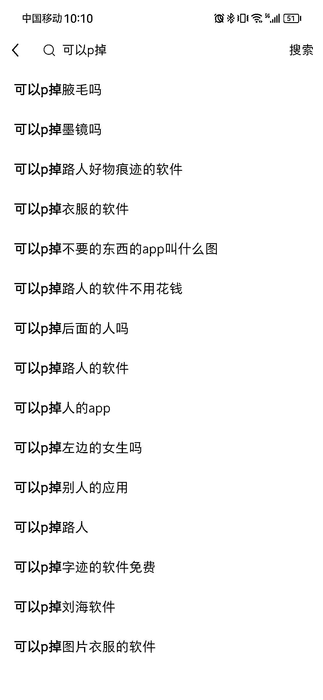
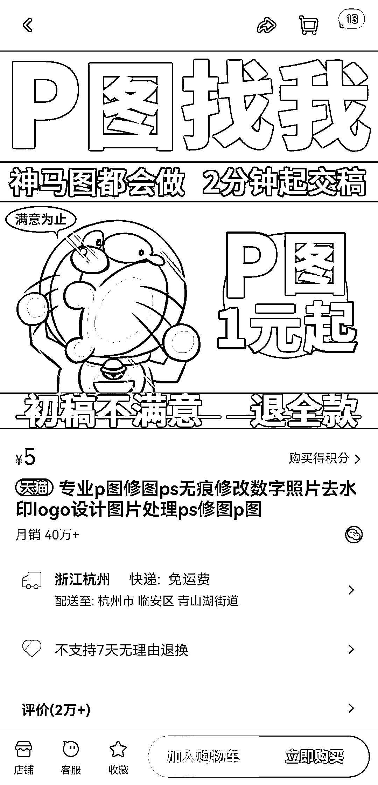

# 小红书上的 P 图小技能月赚 200 万，引发热议

> 原文：[`www.yuque.com/for_lazy/xkrm14/gt41ybcfhwvh7md1`](https://www.yuque.com/for_lazy/xkrm14/gt41ybcfhwvh7md1)

作者： hedy

日期：2023-07-07

点赞数：128

正文：

一个 p 图小技能，居然月赚 200 万😱 在小红书上经常刷到这种「高手可以帮忙 p 掉 xx」「能不能帮我 p 掉 xx」 之类的笔记，评论区非常活跃。一般是有人 p 个搞笑点的图，会引起更多人围观评论，然后带动更多人 p 出更多搞笑的。 p 出来的图片自带流量，在某宝随便搜了下 p 图，月销竟然 40w，暑假来了，需求又会大涨～

  <ne-p id="ue1f77801" data-lake-id="ue1f77801">  <ne-p id="ufe2f60bd" data-lake-id="ufe2f60bd">  <ne-p id="uf76b2cb8" data-lake-id="uf76b2cb8">  <ne-p id="u57fd5111" data-lake-id="u57fd5111">评论区：

无念 : 哇靠，竟然这么神奇

胖大魔 : 产业链了[呲牙]

牛油果 : 他客单价还不止五块，承接能力很强

hedy : 确实，5 块是最低的了

叉叉敌 : 没想到市场这么大

天使陷落 : 我的理解是，更多人 p 图，都不是自己 p 的，而是在淘宝上找人 p 的，是这个意思不

徐同学 : 经常看到这个

公众号懒人找资源，懒人专属群分享

</ne-p></ne-p></ne-p></ne-p>