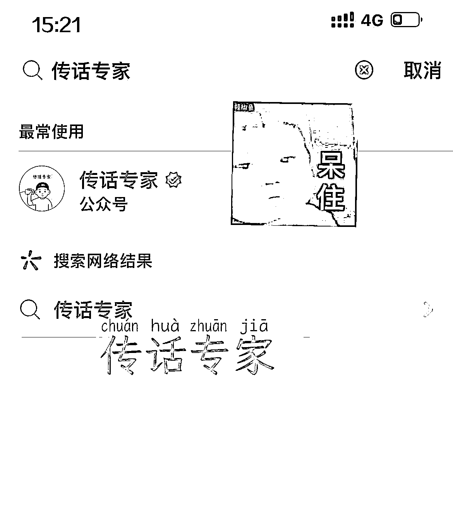
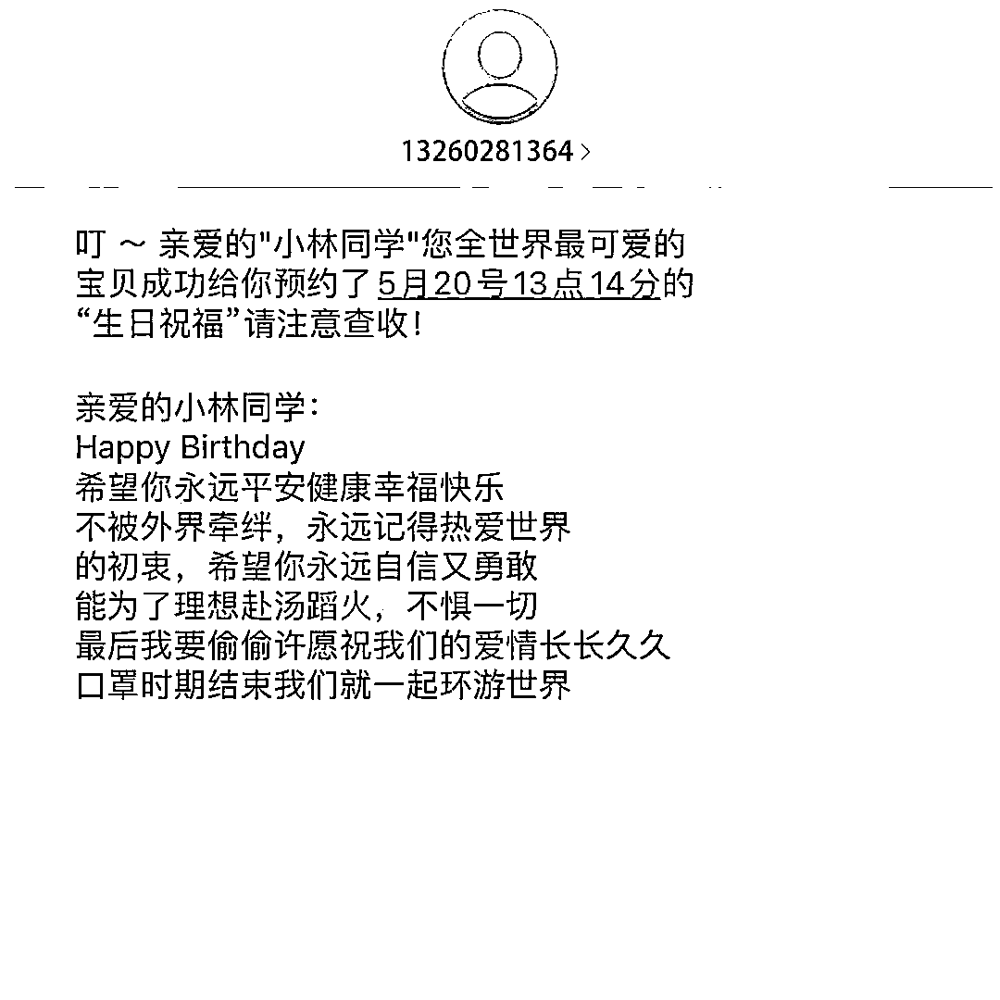
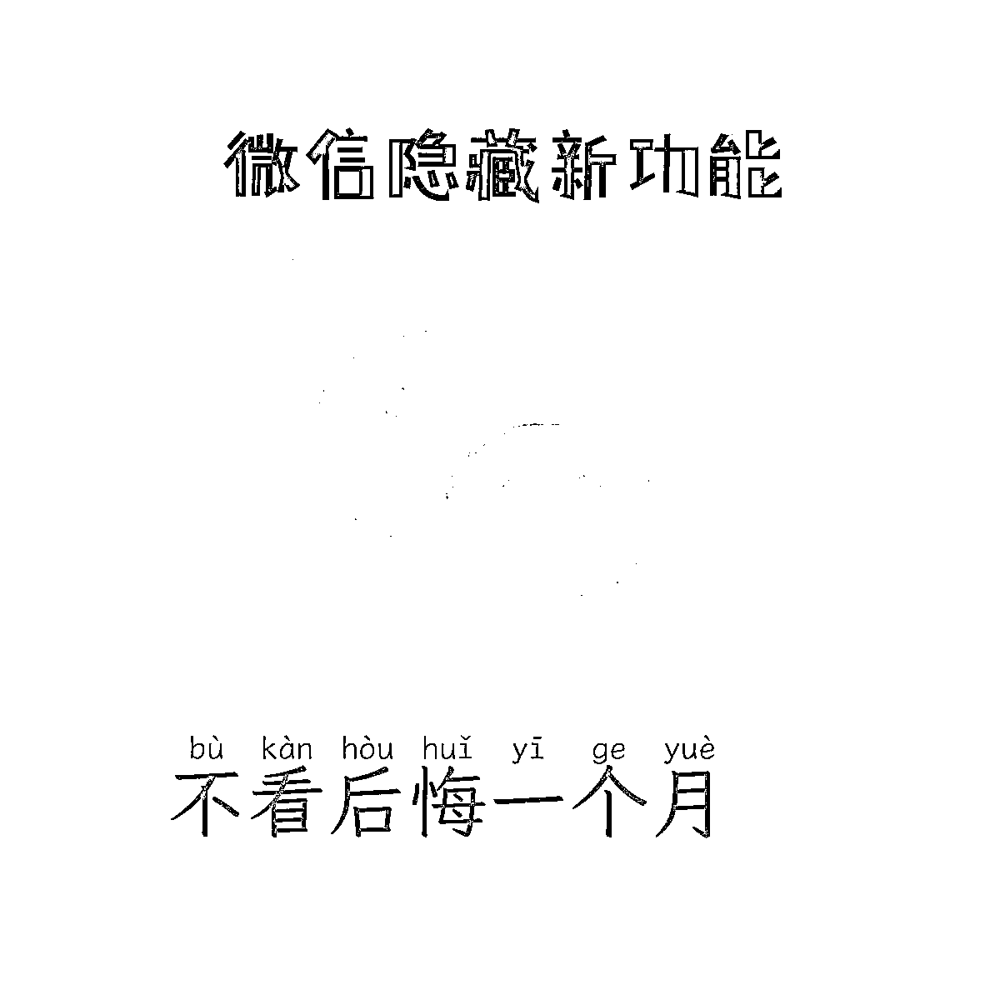

# 闷声发财的公域引流公众号的小项目，切中痛点引来高活性用户

> 原文：[`www.yuque.com/for_lazy/xkrm14/lq11v2pl3gkh7yxm`](https://www.yuque.com/for_lazy/xkrm14/lq11v2pl3gkh7yxm)

<ne-p id="u22faa792" data-lake-id="u22faa792"><ne-text id="u977eb1b8">作者： 悦佬</ne-text></ne-p> <ne-p id="ubdb61093" data-lake-id="ubdb61093"><ne-text id="ub4f72ffb">日期：2023-07-04</ne-text></ne-p> <ne-p id="ue9010a7d" data-lake-id="ue9010a7d"><ne-text id="u445e63c7">点赞数：</ne-text><ne-text id="u9acfcda9" ne-bold="true">111</ne-text></ne-p> <ne-hole id="u50cb412a" data-lake-id="u50cb412a"><ne-card data-card-name="hr" data-card-type="block" id="jDALJ" data-event-boundary="card"><ne-p id="u371e4973" data-lake-id="u371e4973"><ne-text id="u879254c9">正文：</ne-text></ne-p> <ne-p id="ubab2e0f6" data-lake-id="ubab2e0f6"><ne-text id="u186032da">闷声发财的公域引流公众号的小项目！ 一、突然的发现</ne-text> <ne-text id="u7b4d0cee">抖音最近冒出来一些引流到公众号“传话专家”的人，刷到了三个号，每天只需要无脑怼一个模板的图文 or 视频从公域引流，切谈恋爱分手被拉黑的、暗恋不敢表白的、想骂老板又不敢的等等人的痛点（确实挺痛），就有一大批人去公众号关注并下单。</ne-text> <ne-text id="u70736273">二、深入的扒玩法 扒了一下，目前他们的变现形式主要有 2 种 1.短信传话一次 1.88，人工传话一次 9.9，发图片另收费 2.广告主收益</ne-text> <ne-text id="u70fdd160">虽然无法看到后台变现情况，但基于人性角度分析（切中客户很痛的痛点）加上他们疯狂铺号的情况来看，收益比较可观。（公众号只发了三篇文章，前两篇 5 月 30 日发送 1000 多观看，最后一篇 6 月 30 号发送 6000 多观看，一个月引流至少 5000＋高活性用户）</ne-text> <ne-text id="u117883d2">三、项目逻辑通畅 这个项目，个人认为从视频制作→公域引流到私域→变现逻辑很清晰，唯一的难点就是公众号短信系统的搭建，懂行的朋友可直接复制</ne-text></ne-p> <ne-p id="ub8a9a3d8" data-lake-id="ub8a9a3d8"><ne-card data-card-name="image" data-card-type="inline" id="sIlN7" data-event-boundary="card">  <ne-p id="uc85f2a08" data-lake-id="uc85f2a08"><ne-card data-card-name="image" data-card-type="inline" id="s1yvo" data-event-boundary="card">  <ne-p id="u73cbe518" data-lake-id="u73cbe518"><ne-card data-card-name="image" data-card-type="inline" id="lkGDM" data-event-boundary="card">  <ne-p id="u14fc88cc" data-lake-id="u14fc88cc"><ne-card data-card-name="image" data-card-type="inline" id="a2qYn" data-event-boundary="card">  <ne-p id="uc2af4ee2" data-lake-id="uc2af4ee2"><ne-card data-card-name="image" data-card-type="inline" id="KNkN9" data-event-boundary="card">  <ne-p id="uf172f8f3" data-lake-id="uf172f8f3"><ne-card data-card-name="image" data-card-type="inline" id="GZ2Wx" data-event-boundary="card">  <ne-hole id="u223ca676" data-lake-id="u223ca676"><ne-card data-card-name="hr" data-card-type="block" id="mOlCE" data-event-boundary="card"><ne-p id="ud29e1498" data-lake-id="ud29e1498"><ne-text id="u965f362f">评论区：</ne-text></ne-p> <ne-p id="uce613310" data-lake-id="uce613310"><ne-text id="uc5764525">九歌 : 匿名短信</ne-text></ne-p> <ne-p id="u2d765a44" data-lake-id="u2d765a44"><ne-text id="ue1661514">伟业 : 这个和前面的匿名短信项目应该是差不多的。</ne-text></ne-p> <ne-p id="ubbde2d4d" data-lake-id="ubbde2d4d"><ne-text id="u3ddcc134">朱朱侠 : 把这个生日做成视频形式的岂不是更好，让送祝福的人提供一张个人照片+祝福语，用 ai 工具把照片做成会说话的视频，在生日当天，在当地城市的地铁站投放这个生日祝福，这可比花 200 块钱买个大同小异的礼物要来的更有意思。</ne-text></ne-p> <ne-p id="u68232168" data-lake-id="u68232168"><ne-text id="ua7ccd16c">潮州痞子蔡 : 和当年 sp 的陌生表白短信一样的原理，当年 sp 的很多创意现在依然能用</ne-text></ne-p> <ne-p id="u08c0de1c" data-lake-id="u08c0de1c"><ne-text id="u59aa5410">刘卡卡 : sp 是啥</ne-text></ne-p> <ne-p id="u11837062" data-lake-id="u11837062"><ne-text id="u6cea6f50">徐同学 : 查了一下是信息服务商 ，service provide ，应该是发短信的渠道，发一些你中奖了类似的点击领取。</ne-text></ne-p> <ne-p id="u9b5d5227" data-lake-id="u9b5d5227"><ne-text id="ua18fc6d1">… : 短信系统不用搭建，直接买短信服务</ne-text></ne-p> <ne-hole id="u60fa6fb9" data-lake-id="u60fa6fb9"><ne-card data-card-name="hr" data-card-type="block" id="dQc6H" data-event-boundary="card"><ne-p id="u54f25602" data-lake-id="u54f25602"><ne-text id="u2c8a3174">公众号懒人找资源，懒人专属群分享</ne-text></ne-p></ne-card></ne-hole></ne-card></ne-hole></ne-card></ne-p></ne-card></ne-p></ne-card></ne-p></ne-card></ne-p></ne-card></ne-p></ne-card></ne-p></ne-card></ne-hole>