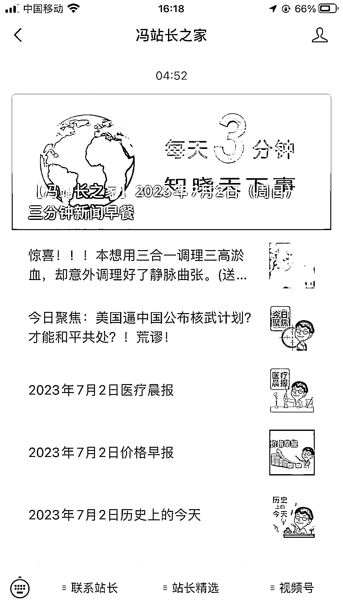
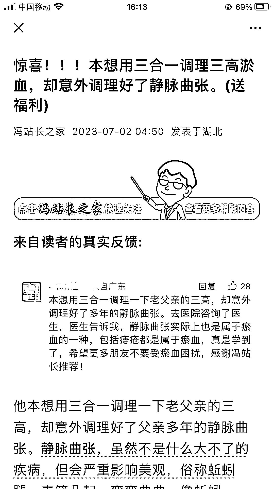
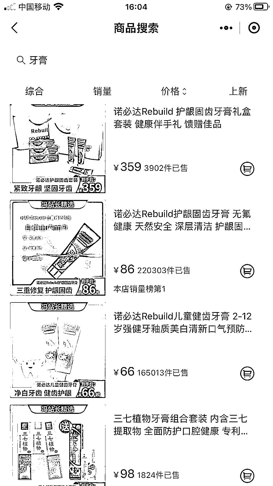
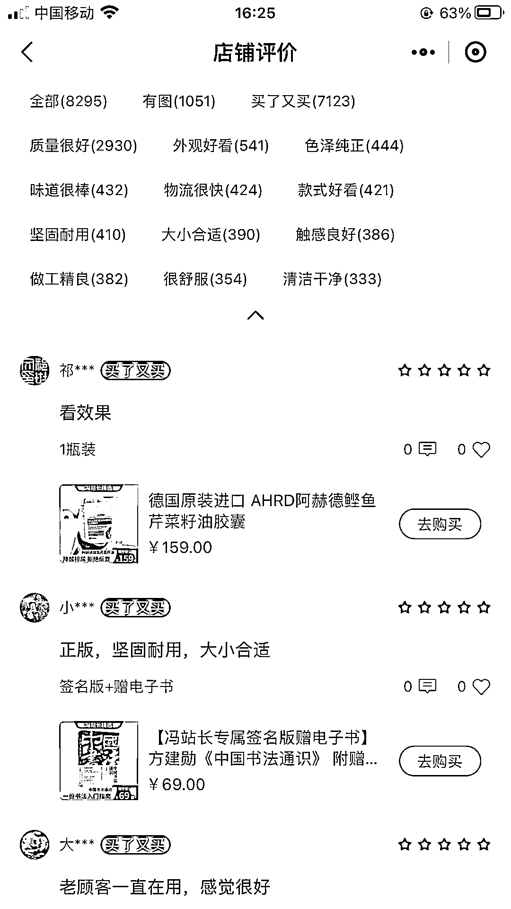

# 中老年人市场：简单粗暴，利润高，退货率低

> 原文：[`www.yuque.com/for_lazy/xkrm14/egryicg09h6cgoxs`](https://www.yuque.com/for_lazy/xkrm14/egryicg09h6cgoxs)

<ne-text id="u4a2f4701">作者： 大雨</ne-text>

<ne-text id="uc688451d">日期：2023-07-03</ne-text>

<ne-text id="u805a5f8b">点赞数：</ne-text><ne-text id="uecee08f2" ne-bold="true">100</ne-text>

<ne-hole id="uac192bd2" data-lake-id="uac192bd2"><ne-card data-card-name="hr" data-card-type="block" id="B02SC" data-event-boundary="card">

<ne-text id="u388f11c6">正文：</ne-text>

<ne-text id="uf4a6b4fe">中老年人市场，简单粗暴利润高。</ne-text> <ne-text id="uc27b3dd6">刷到这个公众号，点进去感觉排版简单，但是特别对中老年人的胃口，每天发出来的文章，第一篇基本都是 10w+。评论区购买意向强的客户有很多，有的是子女给父母买，有的是中老年人自己买。点进栏目里面的线上商场，单看牙膏这一栏，86 元牙膏，销量 22w+，0 差评。</ne-text> <ne-text id="u45ae7228">并且感觉中老年人退货率和差评率都很低。商品评价那一栏，即时是 1000+的客单价的产品，也没有差评。不仅仅是因为老年人不会退货，根据自己对家里长辈的观察，老年人会更有同理心，站在商家的角度上去考虑，怕退货麻烦别人。</ne-text>

<ne-card data-card-name="image" data-card-type="inline" id="SAaBO" data-event-boundary="card">  <ne-p id="uc8712b08" data-lake-id="uc8712b08"><ne-card data-card-name="image" data-card-type="inline" id="yaSk5" data-event-boundary="card">  <ne-p id="uc26e53b8" data-lake-id="uc26e53b8"><ne-card data-card-name="image" data-card-type="inline" id="CanKD" data-event-boundary="card">  <ne-p id="uf74e18ca" data-lake-id="uf74e18ca"><ne-card data-card-name="image" data-card-type="inline" id="rIaIY" data-event-boundary="card">  <ne-p id="u747b6634" data-lake-id="u747b6634"><ne-card data-card-name="image" data-card-type="inline" id="M5Omk" data-event-boundary="card">  <ne-p id="u54184aa1" data-lake-id="u54184aa1"><ne-card data-card-name="image" data-card-type="inline" id="PT4PV" data-event-boundary="card">  <ne-hole id="uad4c69aa" data-lake-id="uad4c69aa"><ne-card data-card-name="hr" data-card-type="block" id="xCeDp" data-event-boundary="card"><ne-p id="ue3533b52" data-lake-id="ue3533b52"><ne-text id="u81ce6a2b">评论区：</ne-text>

<ne-text id="u2d547fc1">伟业 : 解读：中老年市场是相对好赚的一个群体，可以认真做一下。重点领域在 公众号，头条号和视频号，用户群体年龄都偏大</ne-text>

<ne-text id="ufe0d5ca4">镜泊森源 : 这是一个头部大号。</ne-text>

<ne-text id="uf87bc33a">波哥 : 这号有些年头了，头部大号</ne-text>

<ne-text id="u2c3d02d2">爱飞的鱼 : 头部大号不缺流量，卖什么都行！</ne-text>

<ne-hole id="u6fe4ea70" data-lake-id="u6fe4ea70"><ne-card data-card-name="hr" data-card-type="block" id="kS1tv" data-event-boundary="card">

<ne-text id="u4df58fe2">公众号懒人找资源，懒人专属群分享</ne-text>

</ne-card></ne-hole></ne-card></ne-hole></ne-card></ne-p></ne-card></ne-p></ne-card></ne-p></ne-card></ne-p></ne-card></ne-p></ne-card></ne-p></ne-card></ne-hole>