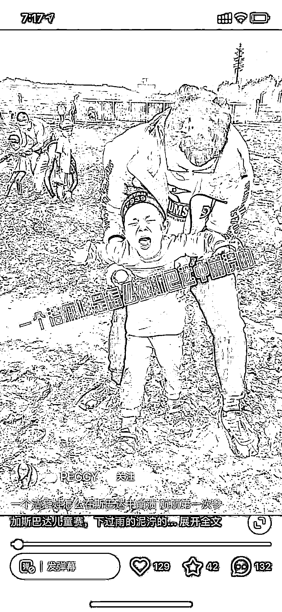

# 小红书分享斯巴达勇士赛“划水指南”，适合想玩又怕吃苦的参赛选手

> 原文：[`www.yuque.com/for_lazy/xkrm14/rf3e889axwvs4gga`](https://www.yuque.com/for_lazy/xkrm14/rf3e889axwvs4gga)

<ne-text id="uaaf65a6b">作者： 波本零</ne-text>

<ne-text id="u6a02cdcb">日期：2023-07-07</ne-text>

<ne-text id="u50412ca7">点赞数：</ne-text><ne-text id="uedbb36f3" ne-bold="true">108</ne-text>

<ne-hole id="u4b5ddc4a" data-lake-id="u4b5ddc4a"><ne-card data-card-name="hr" data-card-type="block" id="cCooL" data-event-boundary="card">

<ne-text id="u1b7e10ef">正文：</ne-text>

<ne-text id="uc5cd5665">飞盘的的热度过了，现在流行跳泥坑 小红书上有人分享斯巴达勇士赛“划水指南”，专门为想去玩又怕吃苦的参赛选手准备，在每个环节都有适合的开挂小技巧。</ne-text> <ne-text id="u1a79de7a">比如翻不上去的栅栏可以让队友在底下托你一把（甚至有壮小伙在旁边在旁边专门帮忙），抱不动的大石头直接绕过即可，主打一个浑水摸鱼。</ne-text> <ne-text id="u2131245e">报名费一次大约在 400-500 元，完赛时间 1-3 小时不等，对于一项潮酷的运动来说，也算不上很贵的价格，毕竟山姆的泡面桶都炒到 500 块了，还供不应求。</ne-text> <ne-text id="u37b1802f">每年暑假都有家长送小孩参加户外拓展或者夏令营来锻炼心智。如果有做这个的业务的圈友，可以借此拓展一下。</ne-text> <ne-text id="ueb74c8b7">这是属于有钱小孩的健身游戏，数据显示，51%的斯巴达儿童赛参赛儿童家庭年收入超过 50 万元，超 67%的斯巴达家庭每年在一名孩子的教育上投入超过 10 万元。</ne-text>

<ne-card data-card-name="image" data-card-type="inline" id="UKFwa" data-event-boundary="card"></ne-card>

<ne-card data-card-name="image" data-card-type="inline" id="UZpsw" data-event-boundary="card"></ne-card>

<ne-card data-card-name="image" data-card-type="inline" id="pAyHc" data-event-boundary="card"></ne-card>

<ne-card data-card-name="image" data-card-type="inline" id="oFMDL" data-event-boundary="card"></ne-card>

<ne-card data-card-name="image" data-card-type="inline" id="Ym0pJ" data-event-boundary="card"></ne-card>

<ne-hole id="ua7f7c7d4" data-lake-id="ua7f7c7d4"><ne-card data-card-name="hr" data-card-type="block" id="y0gr9" data-event-boundary="card">

<ne-text id="u8ef4c9d9">评论区：</ne-text>

<ne-text id="uef980e75">胖大魔 : 很小众，发展了起码四五年了[呲牙]</ne-text>

<ne-text id="ua5da12f5">陈真 : 好像是穷人养孩子的方法，然后起个国外的名字，卖给中产家庭父母。</ne-text>

<ne-text id="ue21b74fe">大勇非勇 : 不错，不知道推广佣金给的高不高。</ne-text>

<ne-text id="ua6ae453f">枫晓陌 : 有意思 以前在北京念书的时候还去做过志愿者</ne-text>

<ne-hole id="ubb1bb00a" data-lake-id="ubb1bb00a"><ne-card data-card-name="hr" data-card-type="block" id="AdaNQ" data-event-boundary="card">

<ne-text id="ucbd00389">公众号懒人找资源，懒人专属群分享</ne-text>

</ne-card></ne-hole></ne-card></ne-hole></ne-card></ne-hole>