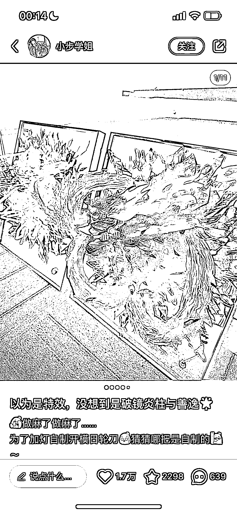
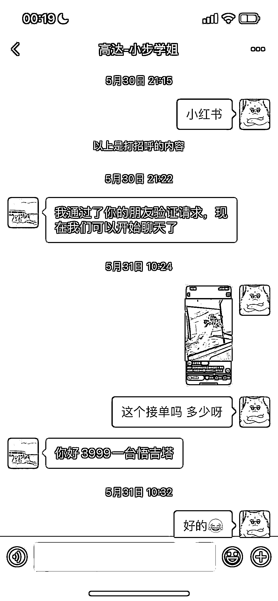

# 破镜系列手作赛道，高达模型利润翻六倍

> 原文：[`www.yuque.com/for_lazy/xkrm14/krqacmt9muzdsa7i`](https://www.yuque.com/for_lazy/xkrm14/krqacmt9muzdsa7i)

<ne-p id="u14e1e323" data-lake-id="u14e1e323"><ne-text id="u53844177">作者： 一只鸵鸟</ne-text></ne-p> <ne-p id="u18a0417e" data-lake-id="u18a0417e"><ne-text id="u9201218b">日期：2023-07-05</ne-text></ne-p> <ne-p id="uc2fbdc20" data-lake-id="uc2fbdc20"><ne-text id="uc60823bd">点赞数：</ne-text><ne-text id="u19095f93" ne-bold="true">86</ne-text></ne-p> <ne-hole id="u4c717755" data-lake-id="u4c717755"><ne-card data-card-name="hr" data-card-type="block" id="PIVAl" data-event-boundary="card"><ne-p id="uc514974e" data-lake-id="uc514974e"><ne-text id="ucfaabe1a">正文：</ne-text></ne-p> <ne-p id="u9ec9b709" data-lake-id="u9ec9b709"><ne-text id="uf7f7829a">喜欢手作的朋友可以看下这个赛道——破镜系列 破镜高达、破镜悟空、悟吉塔等等（不算模型，破镜成本 40 左右）</ne-text> <ne-text id="u7cd63461">图 1、2 是小红书这个博主的，可以算是成品和图片拍的是全站最好的，加了微信居然卖 3.9k😂（同个品咸鱼只要 300➕ 血赚 3.6k）高达会贵一点。</ne-text> <ne-text id="ub392613b">高达和其他人物模型可以咸鱼买，自己只做破镜，这样又省时间利润翻六倍（破镜高达均价 1k➕，其他人物的 300➕）小红书这个博主估计是高端线，是我看到过的最贵的[捂脸]</ne-text></ne-p> <ne-p id="u5e4c19ff" data-lake-id="u5e4c19ff"><ne-card data-card-name="image" data-card-type="inline" id="EtEZm" data-event-boundary="card">  <ne-p id="uc87eedcb" data-lake-id="uc87eedcb"><ne-card data-card-name="image" data-card-type="inline" id="uldMJ" data-event-boundary="card">  <ne-p id="uff28bec8" data-lake-id="uff28bec8"><ne-card data-card-name="image" data-card-type="inline" id="egx73" data-event-boundary="card">  <ne-hole id="u7bffc498" data-lake-id="u7bffc498"><ne-card data-card-name="hr" data-card-type="block" id="pRMYM" data-event-boundary="card"><ne-p id="uc45e2208" data-lake-id="uc45e2208"><ne-text id="u272a59e5">评论区：</ne-text></ne-p> <ne-p id="u4bed41ba" data-lake-id="u4bed41ba"><ne-text id="ue645876e">铲哥带你飞 : 这个品类很早就关注到过，客单价确实不错，但是有一定的门槛</ne-text></ne-p> <ne-p id="u226fec0f" data-lake-id="u226fec0f"><ne-text id="u0dbae986">伟业 : 可不可以通过 AI 绘画来进行内容的制作呢？</ne-text></ne-p> <ne-p id="u23585556" data-lake-id="u23585556"><ne-text id="u41a47e10">一只鸵鸟 : 不能，是实体的。适合送人特别是男生，或者自己买了摆在家中装饰。里面一般会装 usb 小夜灯💡好看炸了</ne-text></ne-p> <ne-p id="ub30df6d6" data-lake-id="ub30df6d6"><ne-text id="u34195891">Alex : 恭喜中标[呲牙]</ne-text></ne-p> <ne-p id="u73f57ea6" data-lake-id="u73f57ea6"><ne-text id="ufcae3b5f">Alex : 视觉效果真好[强][强]</ne-text></ne-p> <ne-hole id="u437a7dd2" data-lake-id="u437a7dd2"><ne-card data-card-name="hr" data-card-type="block" id="saDC6" data-event-boundary="card"><ne-p id="u04007d3e" data-lake-id="u04007d3e"><ne-text id="u4393fcce">公众号懒人找资源，懒人专属群分享</ne-text></ne-p></ne-card></ne-hole></ne-card></ne-hole></ne-card></ne-p></ne-card></ne-p></ne-card></ne-p></ne-card></ne-hole>