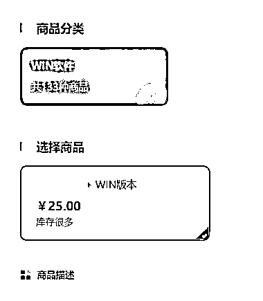

# 信息差自动赚钱的小项目分享

> 原文：[`www.yuque.com/for_lazy/xkrm14/fe7kggxzlp0t8vpv`](https://www.yuque.com/for_lazy/xkrm14/fe7kggxzlp0t8vpv)

作者： 大麦子

日期：2023-07-05

点赞数：81

<ne-hole id="u78f0f644" data-lake-id="u78f0f644">

正文：

信息差自动赚钱的小项目，之前在网上找一款软件，360 软件系统搜索没有找到，其他地方下载软件，流氓插件太多，就在微信搜索，找到了软件的详细介绍，下边还有百度网盘的链接，打开百度网盘链接，下载电脑，打开压缩包才发现需要密码，文件里边有获取密码 HTML 链接，代开链接就会得到一个支付的页面，一个 25 元。市面上有很多不好找，软件商城下架的软件。项目流量获取网上发布软件介绍和使用文章，精准获取搜索客户，也是一个可以操作的小项目。

  <ne-p id="u6829bcc1" data-lake-id="u6829bcc1">  <ne-hole id="u42ee3988" data-lake-id="u42ee3988"><ne-p id="ubae06b93" data-lake-id="ubae06b93">评论区：

程序员八两 : 试试 万能的淘宝和闲鱼

Alex : 恭喜中标

蚂蚁快跑 : 之前下载某些资料，也是这种操作逻辑，资料下载下来需要付费才能解压

may : 套路真是深[偷笑]

随想 : 我想回农村

希平 : 这个还真的见过，之前我下载 notepad++试过

<ne-hole id="uce774753" data-lake-id="uce774753">

公众号懒人找资源，懒人专属群分享

</ne-hole></ne-hole></ne-p></ne-p></ne-hole>