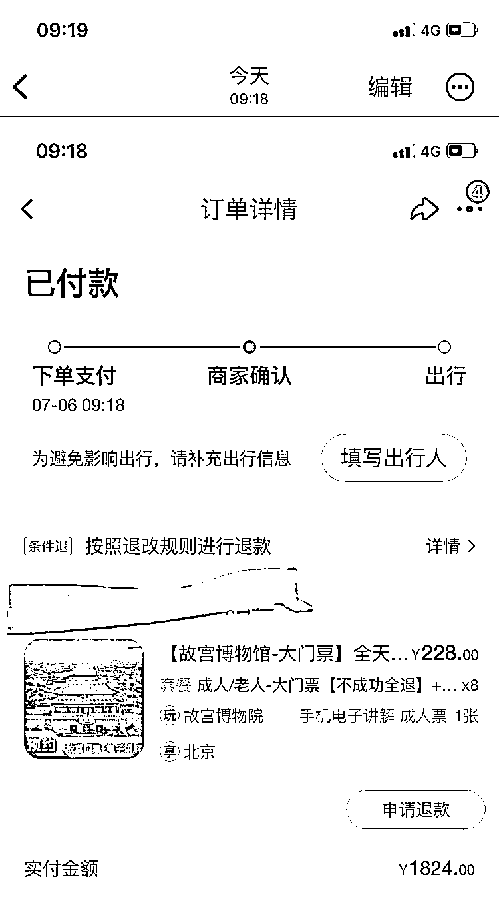

# 代购北京热门景点门票，短期赚钱新机会

> 原文：[`www.yuque.com/for_lazy/xkrm14/bahm91agobalay04`](https://www.yuque.com/for_lazy/xkrm14/bahm91agobalay04)

作者： 刘容

日期：2023-07-06

点赞数：80

正文：

短期赚钱新机会 窗口期未来 30 天 代购北京故宫、国博、毛主席纪念堂、清华北大门票致富 现状： 故宫门票一秒光，60 元一张，目前买都要 200～300 一张了 清华每天 2000 张，一秒光，根本看不到票 我的付费订单见配图： 故宫门票 8 张，1824 元，很难相信吧，但事实就是如此，我还是找了 10 家比价，有卖 288 一张的

  <ne-p id="u3883755e" data-lake-id="u3883755e">评论区：

花满楼 : 清华北大还需要门票？

刘容 : 很难预约，真的太恐怖了

蝈蝈、 : 最近帮对象抢，抢得我头昏脑涨，代购的人是怎么抢的！！！

刘容 : 不知道，估计有渠道

刘容 : 故宫，代购吧，我所有方法试过了，需要靠代购

蝈蝈、 : 国博，故宫，清华北大，最后只抢到个故宫的，没有想到找黄牛那么贵！

小白脸 : 这是假期到了

A℡zoe : 刚从北京回来，人挤人，高温 40 度，父母带小孩老人居多

公众号懒人找资源，懒人专属群分享

</ne-p>