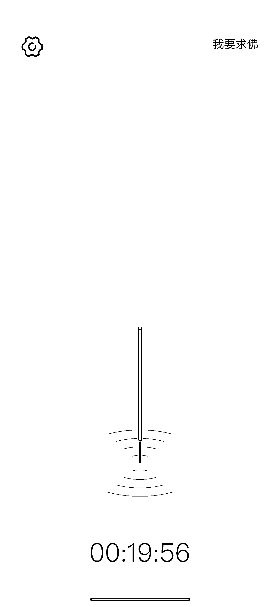
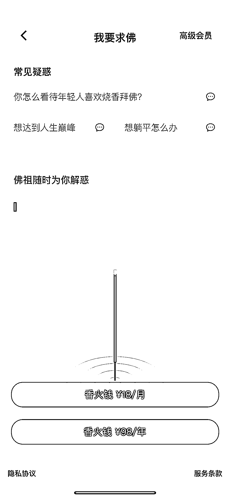
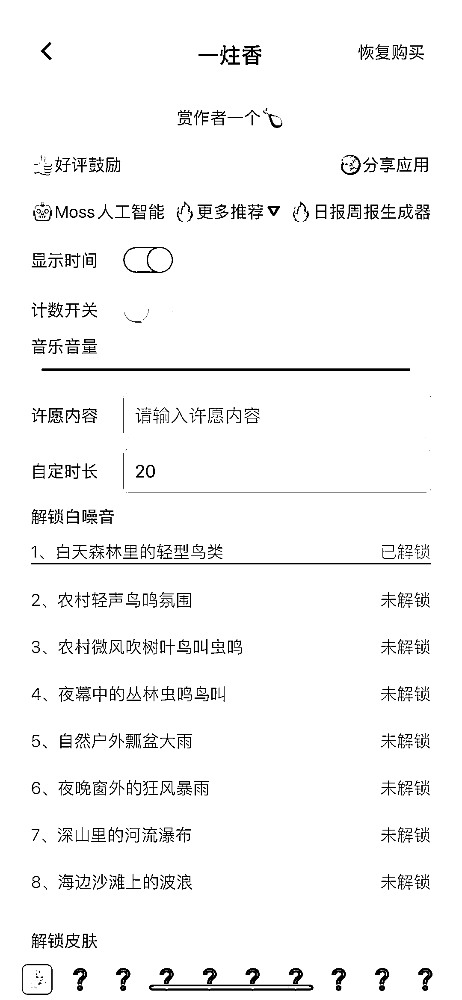
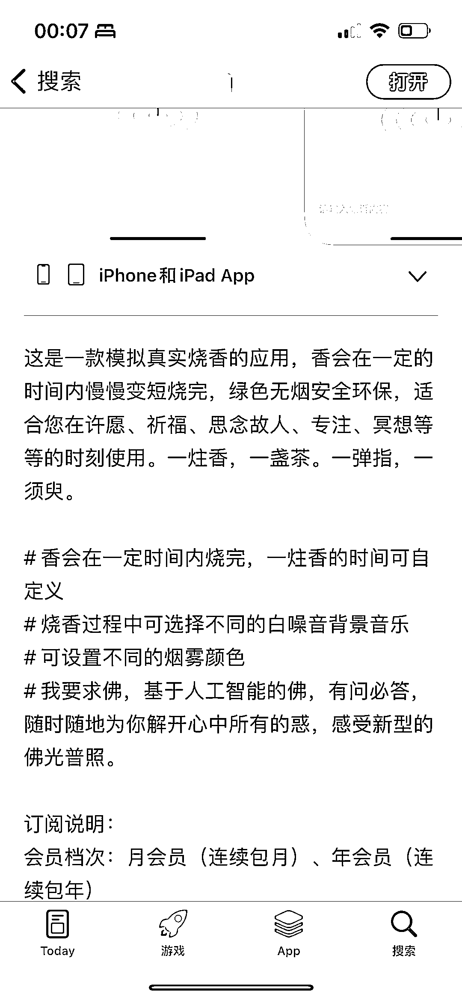

# 一炷香软件：冥想、白噪音一应俱全，付费会员享受更多功能

> 原文：[`www.yuque.com/for_lazy/xkrm14/czgomzlrkzweh6xf`](https://www.yuque.com/for_lazy/xkrm14/czgomzlrkzweh6xf)

作者： 桃花

日期：2023-07-04

点赞数：74

正文：

一款叫一炷香的软件，主要功能是用于精心、冥想、播放白噪音。 打开页面可以插入广告赚取广告费。里面有个功能叫“我要求佛”，人工智能进行回答，提问需付费加入会员。更换不同的白噪音和解锁新背景也需要付费。 现在冥想、念经挺火的。App store 也有一些同类型的应用，如在线念经，在线敲木鱼。

  <ne-p id="uf4bf6904" data-lake-id="uf4bf6904">  <ne-p id="u3076171d" data-lake-id="u3076171d">  <ne-p id="uf9b4aef4" data-lake-id="uf9b4aef4">  <ne-p id="u7f8ba879" data-lake-id="u7f8ba879">  <ne-p id="u5f83b49c" data-lake-id="u5f83b49c">评论区：

胖大魔 : 妙

唐山 173 : 单一功能，别人都有做，这个集合起来了，因为他找到一个特定场景（蓝海），锁定一个群体做服务。

公众号懒人找资源，懒人专属群分享

</ne-p></ne-p></ne-p></ne-p></ne-p>