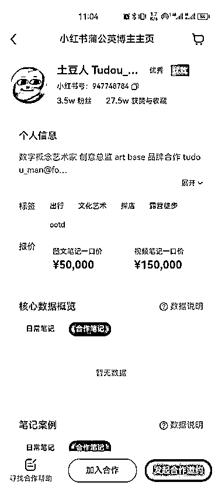
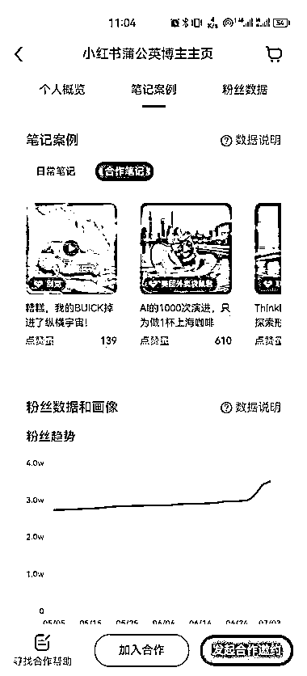
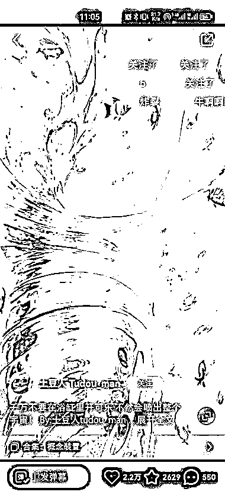

# 这种视频形式可尝试一下，图文笔记 5W，视频笔记 15W

> 原文：[`www.yuque.com/for_lazy/xkrm14/kgsmfp2gzlcadsbi`](https://www.yuque.com/for_lazy/xkrm14/kgsmfp2gzlcadsbi)

<ne-text id="u5056a5b7">作者： 凌州</ne-text>

<ne-text id="uc0afd7b3">日期：2023-07-04</ne-text>

<ne-text id="ua91246d6">点赞数：</ne-text><ne-text id="uc4ee1ca1" ne-bold="true">72</ne-text>

<ne-hole id="u009a80af" data-lake-id="u009a80af"><ne-card data-card-name="hr" data-card-type="block" id="fMJiU" data-event-boundary="card">

<ne-text id="uc5de39d6">正文：</ne-text>

<ne-text id="u01ae1dee">图文笔记报价 5w 视频笔记报价 15w 已接广告 6 个 这种视频形式要是有兴趣的可以去看一下 应该是某个 AI 视频软件不断调教相关参数后生成的</ne-text>

<ne-card data-card-name="image" data-card-type="inline" id="lzbtW" data-event-boundary="card">  <ne-p id="u6b310228" data-lake-id="u6b310228"><ne-card data-card-name="image" data-card-type="inline" id="vQhMb" data-event-boundary="card">  <ne-p id="u80ef9739" data-lake-id="u80ef9739"><ne-card data-card-name="image" data-card-type="inline" id="WcKX6" data-event-boundary="card">  <ne-hole id="u28694c92" data-lake-id="u28694c92"><ne-card data-card-name="hr" data-card-type="block" id="Re5G8" data-event-boundary="card"><ne-p id="u8c0c6045" data-lake-id="u8c0c6045"><ne-text id="u91ee9a5f">评论区：</ne-text>

<ne-text id="u4d90b11b">凌州 : 谢谢老大😭</ne-text>

<ne-text id="ub76cc029">一个无聊且无趣的人 : 大佬，你这个图一图二是怎么查的呢？</ne-text>

<ne-text id="u55634cf2">Sora : 从哪看里看到别人的数据呢</ne-text>

<ne-text id="ub0098189">凌州 : 博主主页“点我合作”</ne-text>

<ne-text id="uc989d0a3">凌州 : 博主主页“点我合作”</ne-text>

<ne-text id="u2c90af77">Sora : 感谢</ne-text>

<ne-text id="ubbced245">Alex : 恭喜中标[呲牙]</ne-text>

<ne-hole id="uf862033c" data-lake-id="uf862033c"><ne-card data-card-name="hr" data-card-type="block" id="GzeQk" data-event-boundary="card">

<ne-text id="ub497718d">公众号懒人找资源，懒人专属群分享</ne-text>

</ne-card></ne-hole></ne-card></ne-hole></ne-card></ne-p></ne-card></ne-p></ne-card></ne-p></ne-card></ne-hole>