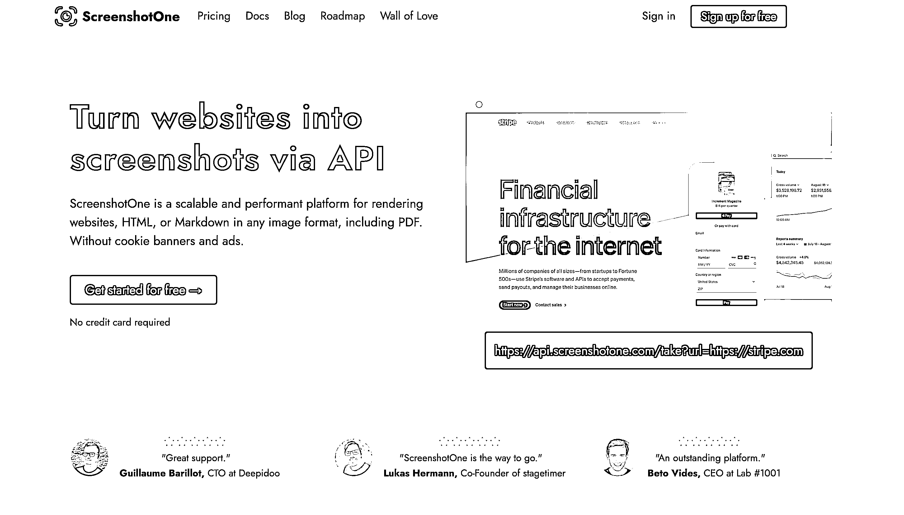

# 个人开发者的成功案例：一个函数的产品带来稳定收入

> 原文：[`www.yuque.com/for_lazy/xkrm14/roz6sth9b0q34nh2`](https://www.yuque.com/for_lazy/xkrm14/roz6sth9b0q34nh2)

<ne-p id="u601e7d2c" data-lake-id="u601e7d2c"><ne-text id="u66009bcb">作者： 张小吉</ne-text></ne-p> <ne-p id="u64210fd0" data-lake-id="u64210fd0"><ne-text id="u424e41ff">日期：2023-07-03</ne-text></ne-p> <ne-p id="ucb627ff6" data-lake-id="ucb627ff6"><ne-text id="ub5c63637">点赞数：</ne-text><ne-text id="u3c494cd4" ne-bold="true">64</ne-text></ne-p> <ne-hole id="u36675e91" data-lake-id="u36675e91"><ne-card data-card-name="hr" data-card-type="block" id="OctEW" data-event-boundary="card"><ne-p id="u2939d0b9" data-lake-id="u2939d0b9"><ne-text id="uc7083ac9">正文：</ne-text></ne-p> <ne-p id="u5b3380bd" data-lake-id="u5b3380bd"><ne-text id="u1abce575">这是一个非常值得个人开发者或准备做出海项目的小伙伴研究的案例，他就是刘小排老师说的一个函数的产品。screenshotone 的功能非常简单，就是你提供</ne-text> <ne-text id="ub44ffdad">URL，我给你把这个 URL 的页面截图通过 API 返回给你，还别说我之前做自动化运营的场景，还真就需要这个功能。 作者分享了他的</ne-text> <ne-text id="ucabed53b">MRR（月度经常性收入）， 2.5K 美元，折合人民币 1.8W ，作为自由职业其实可以了，而且可以预见后续会有更多的收入增长。</ne-text> <ne-text id="ub87c23de">这个作者还有其他的产品正在开发中，都属于那种一个函数的产品。一个人花一个周末的时间就足够了，比如 这个产品的功能是通过 API</ne-text> <ne-text id="uc4a12439">从任何站点提取结构化的数据。当然我敢说绝大部分需要权限验证的站点，它这个函数就实现不了，但影响吗？不影响啊！如果最后发布之后，被市场验证没有多少用户需要这个工具，弃了就是。抓紧时间去研究下一个「一个函数的产品」</ne-text> <ne-text id="u8a7c9bb1">另外做海外市场的童鞋，也应该多关注这个开发者的博客和 Twitter。他的做法正好体现了 build in public 的特点。他在博客和 twitter</ne-text> <ne-text id="u65b27d68">上公开了他做过的产品的心路历程。比如这篇文章 作者提到了上线 product hunt</ne-text> <ne-text id="ua5964609">的整个过程，最后还被他们的头号竞争对手支持。不得不说，海外的氛围是尊的好啊 👏👏👏 生财朋友圈</ne-text> [<ne-text id="ua361ad47">GetURLData</ne-text>](https://geturldata.com/) [<ne-text id="u34ee1b28">WastheProductHuntlaunchworthitDmytroKrasun</ne-text>](https://dmytrokrasun.com/posts/the-product-hunt-launch-for-screenshotone/)</ne-p> <ne-p id="u1c97b736" data-lake-id="u1c97b736"><ne-card data-card-name="image" data-card-type="inline" id="chmQt" data-event-boundary="card">  <ne-hole id="u396d8f0f" data-lake-id="u396d8f0f"><ne-card data-card-name="hr" data-card-type="block" id="Oh5JK" data-event-boundary="card"><ne-p id="u16faf650" data-lake-id="u16faf650"><ne-text id="u935f01b5">评论区：</ne-text></ne-p> <ne-p id="uc179413a" data-lake-id="uc179413a"><ne-text id="u4d8b59f1">伟业 : 解读：细分再细分，越细分越容易变现。我们做自媒体刚刚起号的时候，也要做细分，比如小红书，不讲怎么起号，就讲怎么引流。因为将大而全的东西，没有办法和前人竞争，切细分反而有一席之地。张 sir 就是一个很好的例子，只教投抖加</ne-text></ne-p> <ne-p id="ue3953c5b" data-lake-id="ue3953c5b"><ne-text id="u27005c3b">张小吉 : [色][色][色]</ne-text></ne-p> <ne-hole id="u979b0f27" data-lake-id="u979b0f27"><ne-card data-card-name="hr" data-card-type="block" id="pBcMQ" data-event-boundary="card"><ne-p id="u8a35dcd5" data-lake-id="u8a35dcd5"><ne-text id="ub966c0a9">公众号懒人找资源，懒人专属群分享</ne-text></ne-p></ne-card></ne-hole></ne-card></ne-hole></ne-card></ne-p></ne-card></ne-hole>