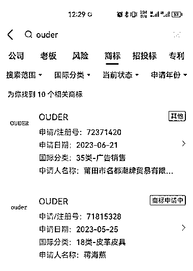
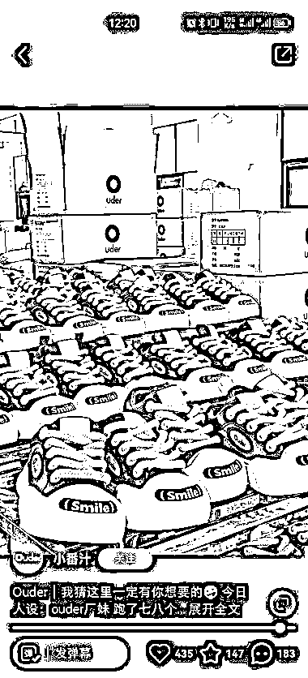
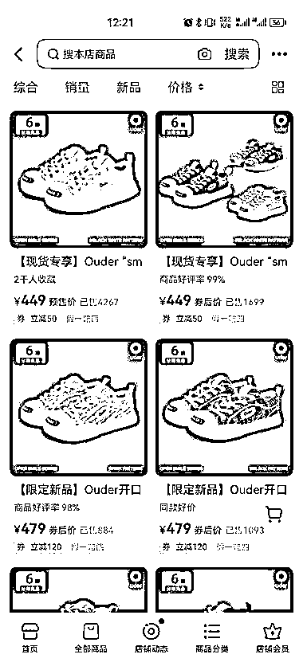
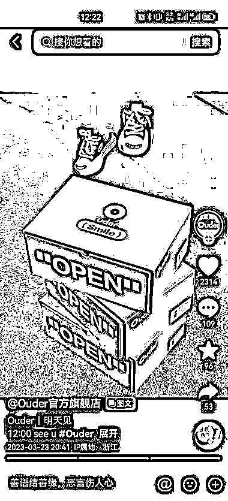

# 新品牌 ouder 瞄准中高端人群，专注少女风板鞋市场，销量已达 600w

> 原文：[`www.yuque.com/for_lazy/xkrm14/nx85xbikg31qwuwe`](https://www.yuque.com/for_lazy/xkrm14/nx85xbikg31qwuwe)

<ne-text id="u965bb9ae">作者： 凌州</ne-text>

<ne-text id="u9d007121">日期：2023-07-05</ne-text>

<ne-text id="u02cfaeb5">点赞数：</ne-text><ne-text id="u558a23d5" ne-bold="true">66</ne-text>

<ne-hole id="u455647a8" data-lake-id="u455647a8"><ne-card data-card-name="hr" data-card-type="block" id="iEJzZ" data-event-boundary="card">

<ne-text id="u9c50f3f2">正文：</ne-text>

<ne-text id="u83977287">瞄准特定人群去做细分赛道切入 ouder，一个新品牌 今年 6 月 21 日申请商标注册 看地址是莆田工厂代工 只做这种动漫可爱风格的少女风板鞋</ne-text> <ne-text id="ube361038">抖音、小红书皆是 3 月起号 抖音销量 1.4w，淘宝销量 1k 客单价 400-500 之间 算是定位中高端人群了 只算这两个平台销量 GMV 已达 600w</ne-text>

<ne-card data-card-name="image" data-card-type="inline" id="TzX4K" data-event-boundary="card">  <ne-p id="u90c5d847" data-lake-id="u90c5d847"><ne-card data-card-name="image" data-card-type="inline" id="vOda3" data-event-boundary="card">  <ne-p id="ua86adbb1" data-lake-id="ua86adbb1"><ne-card data-card-name="image" data-card-type="inline" id="rUGOG" data-event-boundary="card">  <ne-p id="u8e3f64e7" data-lake-id="u8e3f64e7"><ne-card data-card-name="image" data-card-type="inline" id="f086V" data-event-boundary="card">  <ne-p id="u63ef1c48" data-lake-id="u63ef1c48"><ne-card data-card-name="image" data-card-type="inline" id="ivI6B" data-event-boundary="card">  <ne-hole id="uc724e7e6" data-lake-id="uc724e7e6"><ne-card data-card-name="hr" data-card-type="block" id="CKXr3" data-event-boundary="card"><ne-p id="ub8c714b4" data-lake-id="ub8c714b4"><ne-text id="u51d2423e">评论区：</ne-text>

<ne-hole id="u1dc85e0c" data-lake-id="u1dc85e0c"><ne-card data-card-name="hr" data-card-type="block" id="zgKrL" data-event-boundary="card">

<ne-text id="u673963a6">公众号懒人找资源，懒人专属群分享</ne-text>

</ne-card></ne-hole></ne-card></ne-hole></ne-card></ne-p></ne-card></ne-p></ne-card></ne-p></ne-card></ne-p></ne-card></ne-p></ne-card></ne-hole>