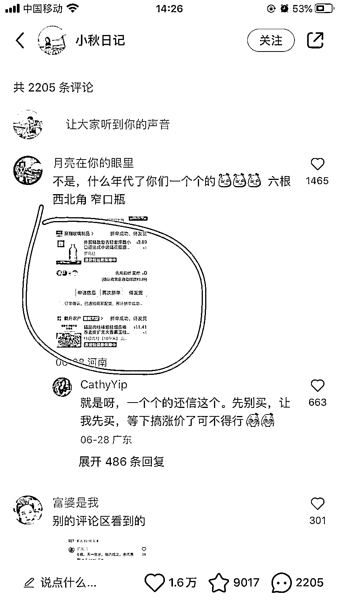
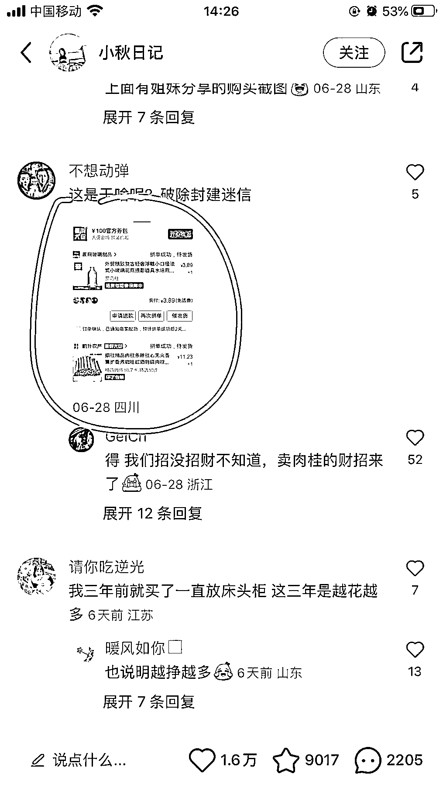
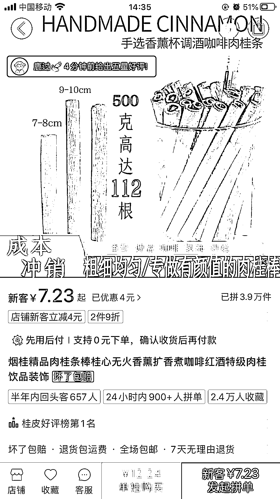

# 肉桂招财热度引发商家赚钱疑问，推广方式受关注

> 原文：[`www.yuque.com/for_lazy/xkrm14/mgownqmcdal8rcas`](https://www.yuque.com/for_lazy/xkrm14/mgownqmcdal8rcas)

<ne-p id="u407e8467" data-lake-id="u407e8467"><ne-text id="u82cdbf5c">作者： 艾小飞</ne-text></ne-p> <ne-p id="u4690f65e" data-lake-id="u4690f65e"><ne-text id="ue32bcabd">日期：2023-07-05</ne-text></ne-p> <ne-p id="u5e5254d4" data-lake-id="u5e5254d4"><ne-text id="u07eeed54">点赞数：</ne-text><ne-text id="u88caf4de" ne-bold="true">59</ne-text></ne-p> <ne-hole id="ubc14ab1c" data-lake-id="ubc14ab1c"><ne-card data-card-name="hr" data-card-type="block" id="wxR62" data-event-boundary="card"><ne-p id="u5cad1ef9" data-lake-id="u5cad1ef9"><ne-text id="u6892ca66">正文：</ne-text></ne-p> <ne-p id="u63d930d3" data-lake-id="u63d930d3"><ne-text id="ue4774528">这个卖肉桂的推广方式不错，我刷到了好几条类似这样的笔记，然后评论区里面说下单了的肉桂都是同一家店 肉桂招不招财，我不知道，但这家卖肉桂的老板肯定赚钱了~</ne-text> <ne-text id="u824147c6">我有个疑问? 是肉桂招财这个玄学先有热度 还是这个商家找博主宣传推广说肉桂招财才有的热度 这家店铺目前在拼多多排行榜第 1</ne-text> <ne-text id="u6143aa0a">不管是前者还是后者，这个老板都很厉害 1.前者如果先是肉桂招财有热度，才有人去下单肉桂，那这位老板能很快嗅到商机，然后找人推广</ne-text> <ne-text id="u112349dc">2.后者找博主宣传说肉桂可以招财！这个点确实能撬动用户的需求点，毕竟心诚则灵嘛 如果是你，你会怎么通过这个信息差赚到钱！</ne-text></ne-p> <ne-p id="u713d33ec" data-lake-id="u713d33ec"><ne-card data-card-name="image" data-card-type="inline" id="KdHpE" data-event-boundary="card">  <ne-p id="u9c27a2df" data-lake-id="u9c27a2df"><ne-card data-card-name="image" data-card-type="inline" id="KtFOO" data-event-boundary="card">  <ne-p id="u2b5c4674" data-lake-id="u2b5c4674"><ne-card data-card-name="image" data-card-type="inline" id="d0fsa" data-event-boundary="card">  <ne-p id="u3ff03db5" data-lake-id="u3ff03db5"><ne-card data-card-name="image" data-card-type="inline" id="Fuy0d" data-event-boundary="card">  <ne-p id="ud3b04ac9" data-lake-id="ud3b04ac9"><ne-card data-card-name="image" data-card-type="inline" id="j6wh7" data-event-boundary="card">  <ne-p id="ue9cc87a6" data-lake-id="ue9cc87a6"><ne-card data-card-name="image" data-card-type="inline" id="BdR5W" data-event-boundary="card">  <ne-hole id="u0e35117e" data-lake-id="u0e35117e"><ne-card data-card-name="hr" data-card-type="block" id="PVlws" data-event-boundary="card"><ne-p id="u3339aaaa" data-lake-id="u3339aaaa"><ne-text id="ud32f4220">评论区：</ne-text></ne-p> <ne-p id="ue1143fbb" data-lake-id="ue1143fbb"><ne-text id="u66a70a71">杜小盼 : 链接已挂，等财来[坏笑]</ne-text></ne-p> <ne-hole id="u0e5a7391" data-lake-id="u0e5a7391"><ne-card data-card-name="hr" data-card-type="block" id="c6ydU" data-event-boundary="card"><ne-p id="u0afc8cf9" data-lake-id="u0afc8cf9"><ne-text id="ub23913d1">公众号懒人找资源，懒人专属群分享</ne-text></ne-p></ne-card></ne-hole></ne-card></ne-hole></ne-card></ne-p></ne-card></ne-p></ne-card></ne-p></ne-card></ne-p></ne-card></ne-p></ne-card></ne-p></ne-card></ne-hole>