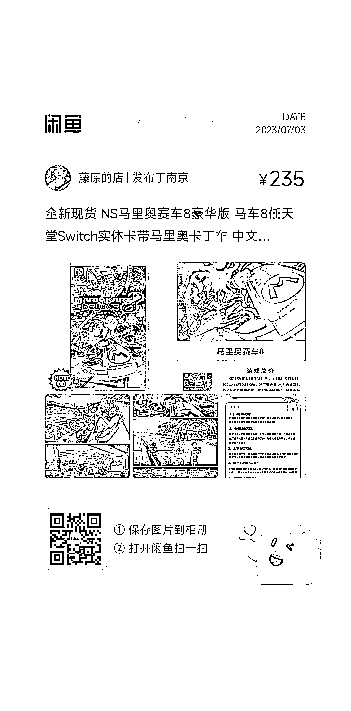

# 闲鱼热销游戏卡带，每天 20-30 单，利润可观

> 原文：[`www.yuque.com/for_lazy/xkrm14/pd3o8t733lbwhgnl`](https://www.yuque.com/for_lazy/xkrm14/pd3o8t733lbwhgnl)

作者： 远方

日期：2023-07-03

点赞数：53

正文：

编号 02 分享一个闲鱼挺火的产品，游戏卡带， 在闲鱼卖的挺火的，每天 20～30 单 有些门槛，但很好做，竞争少 把门槛研究透，就是赚钱 【简单分析下】 商品是挂着卖，同时也是挂着寻回收 我认为大概率 有玩家出售找到他，他会说帮忙挂着卖 由买家找到他之后，直接让玩家发货过去 同时 有人买了 把这游戏要通关之后 可能会再卖给商家 名称:switch 游戏卡带 价格:235-280 想要数:394 总销量:1832 近 3 天销量:65 利润:9-20 左右 店铺名称:藤原的店 点评:卡带利润不等 这个类目可持续发展前景不错

  <ne-p id="u5d65719a" data-lake-id="u5d65719a">  <ne-p id="u0af64024" data-lake-id="u0af64024">  <ne-p id="uf859ab22" data-lake-id="uf859ab22">评论区：

大圣大老师 : 哪里能拿到货，我找很久也没找到

Irene : 求货源

闰土 : 小红书抖音起号 收 或者拼多多 淘宝 找商家谈 还是得自己收 但是这玩意 前期学 得教不少学费 说道挺多 我从来不敢买二手卡带 都是买新的 怕出问题 小红书这玩意流量挺大的

小橘子 : 我买过，顾客也是他的货源，就他也负责回收

远方 : 商品是挂着卖，同时也是挂着寻回收 我认为大概率 有玩家出售找到他，他会说帮忙挂着卖 由买家找到他之后，直接让玩家发货过去 同时 有人买了 把这游戏要通关之后 可能会再卖给商家

远方 : 二手的，卡带，都是玩家流通 售后不大，几乎 0 不会像手机翻新扩容门道太多

首页作者 : 这种一般都是去闲鱼淘宝自己收自己卖，卡带二手交易

公众号懒人找资源，懒人专属群分享

</ne-p></ne-p></ne-p>