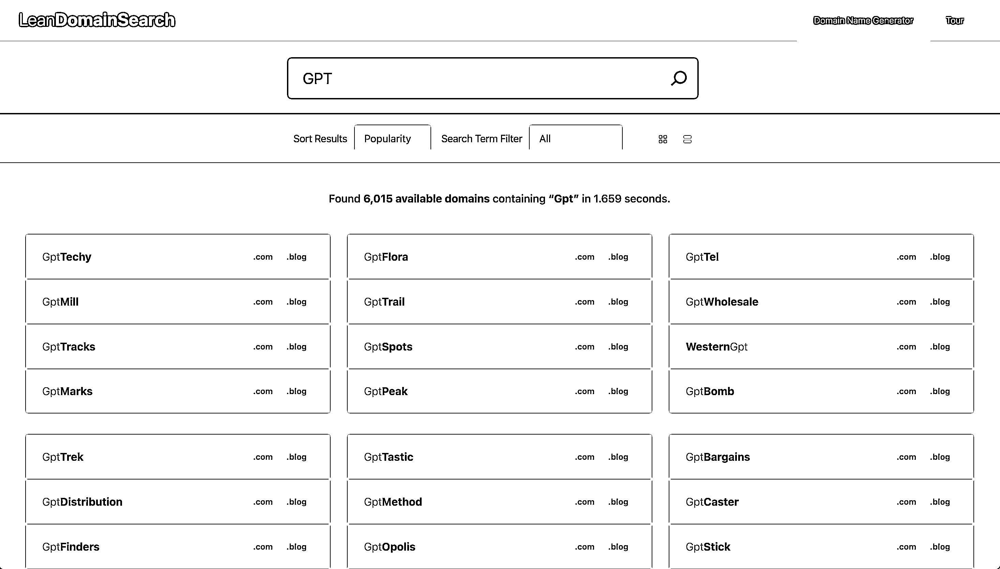
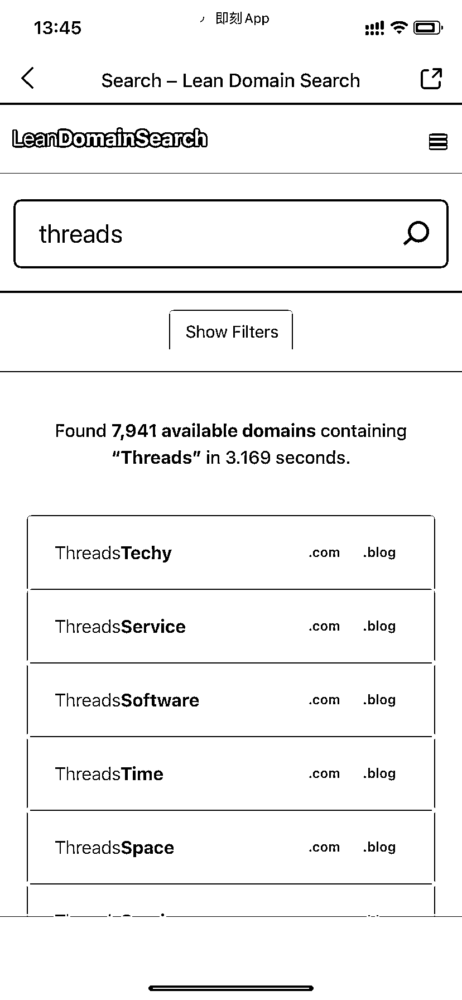
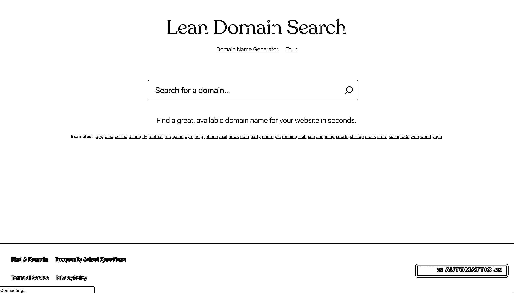

# 一个神器帮你快速查询域名组合取名

> 原文：[`www.yuque.com/for_lazy/xkrm14/pzgd8qly3tn4gecd`](https://www.yuque.com/for_lazy/xkrm14/pzgd8qly3tn4gecd)

<ne-text id="ue2afc56b">作者： 三林</ne-text>

<ne-text id="u8d879ae0">日期：2023-07-06</ne-text>

<ne-text id="u80783769">点赞数：</ne-text><ne-text id="u7b153347" ne-bold="true">56</ne-text>

<ne-hole id="ubbfb732b" data-lake-id="ubbfb732b"><ne-card data-card-name="hr" data-card-type="block" id="OgNYc" data-event-boundary="card">

<ne-text id="u991992ae">正文：</ne-text>

<ne-text id="u2b2b5dec">一个简易查询域名组合取名的神器 在产品出海时，如何取一个信雅达、接地气的产品名字或域名是一个困恼人的点，昨晚体验到了一款域名注册查询的神器，叫 Lean</ne-text> <ne-text id="uc44f9265">Domain Search 该网站 leandomainsearch.com 上个月访问次数 20 万，停留时长四分半。而</ne-text> <ne-text id="u45afc887">70%的用户来自直接访问，间接说明有一定忠实用户了。 ▍工具怎么使用？ 1）搜索查找：在网站的搜索框，直接输入一个关键词，比如 GPT，比如当下热点</ne-text> <ne-text id="u9ef54693">threads； 2）秒出结果：Lean Domain Search 自动帮你组词，5 秒钟内，出 5000 千条左右备选域名结果。</ne-text> <ne-text id="u73f58898">3）查询结果：他为你查询好了，是否已注册。默认情况下，排名在前的是可以注册的。 4）筛选域名：可以按流行度、按长度、按字母 ABC</ne-text> <ne-text id="ucd216474">进行排序；也可以筛选关键词是前缀还是后缀。 5）细节来了：这些结果在一个页面里全部返回，你可以直接浏览器搜索 Command 或 Ctrl +</ne-text> <ne-text id="uff32c03c">F，搜索看看有没有自己喜欢的。 不足之处：比如用户无法维护自己的词表。比如我就喜欢某个单词，这不支持自定义。还有其他吗？你去体验试试~ ▌网站怎么变现？</ne-text> <ne-text id="ueb4bb614">他目前顺滑的导流给了 WordPress 官方进行域名注册或开启新站。 难道被 WordPress 官方收购了吗？——</ne-text> <ne-text id="u0607cd38">进一步求证，果然是的，AutoMattic 这家公司怎么如此叼。 ▍延伸思考</ne-text> <ne-text id="uba886e7b">通过这个产品，我很快就搜索到了自己满意的域名。如果让我来做这个产品，我会寻求他的 API+自定义词表，来满足更个性化的需求。 总之很强！</ne-text> <ne-text id="uc660e94b">来吧，域名党同僚们，推荐体验</ne-text> [<ne-text id="u6b9fa460">https://leandomainsearch.com/search/?q=threads</ne-text>](https://leandomainsearch.com/search/?q=threads)

<ne-card data-card-name="image" data-card-type="inline" id="p5pvx" data-event-boundary="card">  <ne-p id="uc64eb0d4" data-lake-id="uc64eb0d4"><ne-card data-card-name="image" data-card-type="inline" id="cxXpA" data-event-boundary="card">  <ne-p id="ubd500472" data-lake-id="ubd500472"><ne-card data-card-name="image" data-card-type="inline" id="ABQAT" data-event-boundary="card">  <ne-hole id="ua0ba68f3" data-lake-id="ua0ba68f3"><ne-card data-card-name="hr" data-card-type="block" id="grAYI" data-event-boundary="card"><ne-p id="u7cabb928" data-lake-id="u7cabb928"><ne-text id="u3939709c">评论区：</ne-text>

<ne-text id="u7ce36068">木桶伯 : 试试秋玉米</ne-text>

<ne-text id="ud86064c9">三林 : 不一样的，秋域名的作者赞扬了这个产品：这个好。</ne-text>

<ne-text id="u63a56150">三林 : 不止是批量查询，核心是取名、组合</ne-text>

<ne-text id="u343acb69">野鸭冲锋队 : 这个好，之前我都是用脑子想，自己排列组合</ne-text>

<ne-text id="u2dd61a5e">野鸭冲锋队 : 它是不是在 GPT 上有插件？怎么看着有点眼熟</ne-text>

<ne-text id="ufaada7a2">三林 : 这个不知道呢 你可以确认一下。 因为现在也有一些工具 ai domain generator 工具</ne-text>

<ne-text id="u3e27ee88">三林 : 识货</ne-text>

<ne-hole id="uffd08bff" data-lake-id="uffd08bff"><ne-card data-card-name="hr" data-card-type="block" id="xNugK" data-event-boundary="card">

<ne-text id="u354e3a6e">公众号懒人找资源，懒人专属群分享</ne-text>

</ne-card></ne-hole></ne-card></ne-hole></ne-card></ne-p></ne-card></ne-p></ne-card></ne-p></ne-card></ne-hole>