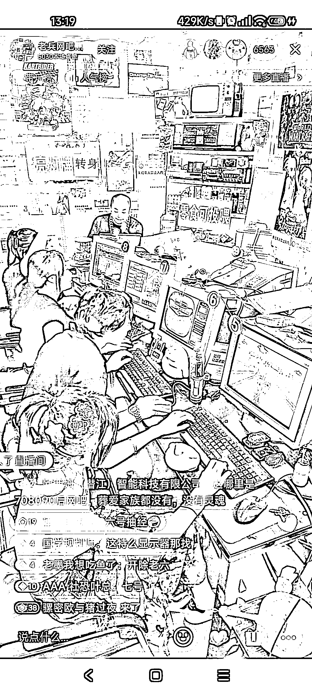

# 复古流直播间：2003 年的网吧回忆杀，互动打赏成变现模式

> 原文：[`www.yuque.com/for_lazy/xkrm14/oroglnyr7i57ue30`](https://www.yuque.com/for_lazy/xkrm14/oroglnyr7i57ue30)

<ne-text id="ube0ab3af">作者： 陈南方</ne-text>

<ne-text id="u8dbddc4f">日期：2023-07-03</ne-text>

<ne-text id="u156a1415">点赞数：</ne-text><ne-text id="ue300b97e" ne-bold="true">51</ne-text>

<ne-hole id="u2efcd1dc" data-lake-id="u2efcd1dc"><ne-card data-card-name="hr" data-card-type="block" id="w9Ct0" data-event-boundary="card">

<ne-text id="u9218985f">正文：</ne-text>

<ne-text id="u0e5a6345">“2003 年 7 月 3 号的网吧” 抖音刷直播见到的复古流直播间，六千人在线观看，感觉挺好玩的，有四个流量密码值得借鉴：</ne-text> <ne-text id="ub07b81e8">❶复古的视觉第一眼留住人，包括环境设置和大头显示器（另外他们说这是 2003 年，装不起空调的，热的要命[撇嘴]）</ne-text> <ne-text id="uf557775f">❷显示屏的游戏都是老游戏，80 后 90 后的老网民一眼就认出来，勾起人回忆，留住人。 ❸三个美女+一个男生（这个男生其实是气氛组，专门拉仇恨，搞怪）</ne-text> <ne-text id="u9b04ce6c">❹提示音不断在说几号几号余额不足，再次勾起记忆点。</ne-text> <ne-text id="u5db9710e">变现模式主要靠互动打赏，比如亮灯牌三位美女转身露脸，给 5 号美女冲网费空投泡面，点播 8 号美女玩侠盗飞车等等。</ne-text> <ne-text id="u59604ddd">但具体变现如何没有仔细研究，有兴趣的圈友可以留意。主打的就是一个回忆杀。</ne-text>

<ne-card data-card-name="image" data-card-type="inline" id="lhknx" data-event-boundary="card">  <ne-hole id="u77c43ed9" data-lake-id="u77c43ed9"><ne-card data-card-name="hr" data-card-type="block" id="iegZR" data-event-boundary="card"><ne-p id="u8d2d1edf" data-lake-id="u8d2d1edf"><ne-text id="ua67545a1">评论区：</ne-text>

<ne-text id="udfad4ef5">逍遥 : 这个风向标群有聊过</ne-text>

<ne-text id="u3369280e">songyy : 男生还专门留了逗号刘海</ne-text>

<ne-hole id="u642f9af4" data-lake-id="u642f9af4"><ne-card data-card-name="hr" data-card-type="block" id="bPWLS" data-event-boundary="card">

<ne-text id="ua438d37d">公众号懒人找资源，懒人专属群分享</ne-text>

</ne-card></ne-hole></ne-card></ne-hole></ne-card></ne-p></ne-card></ne-hole>