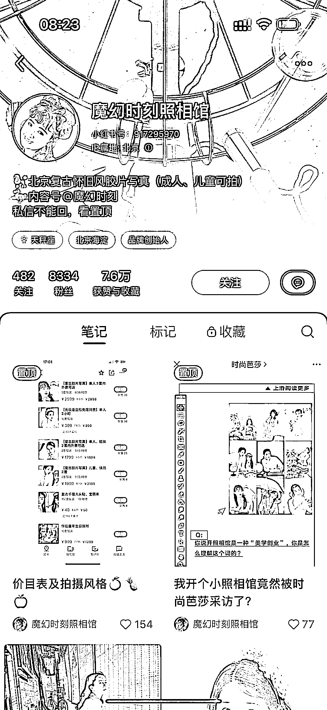
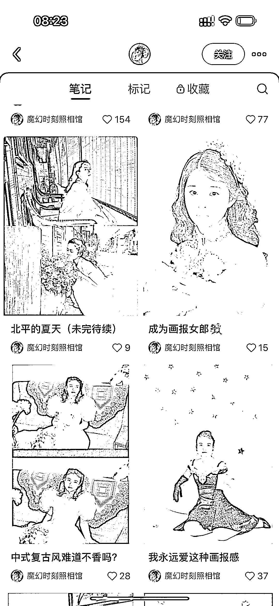
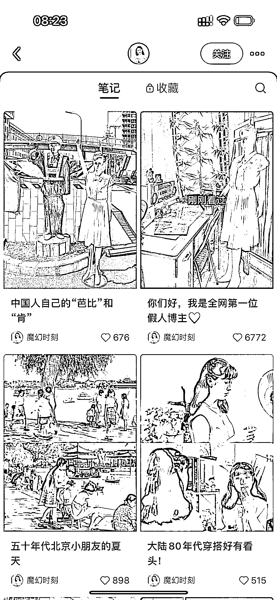
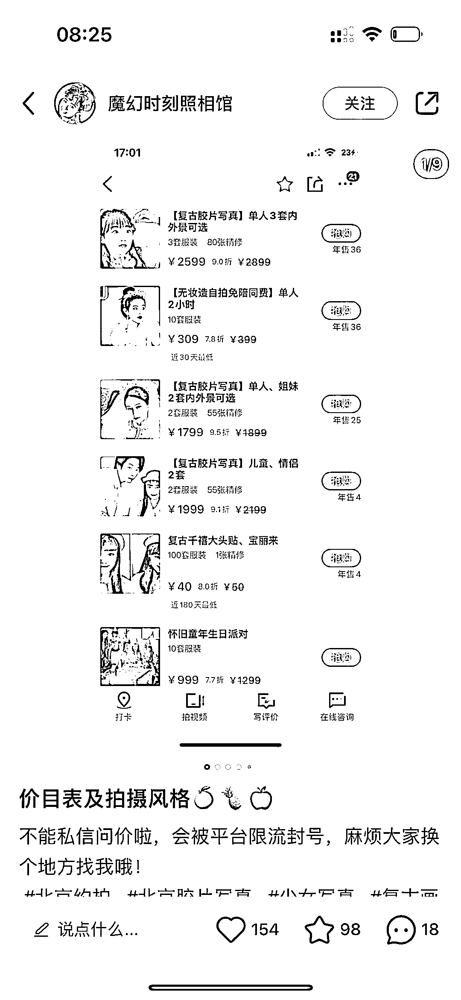
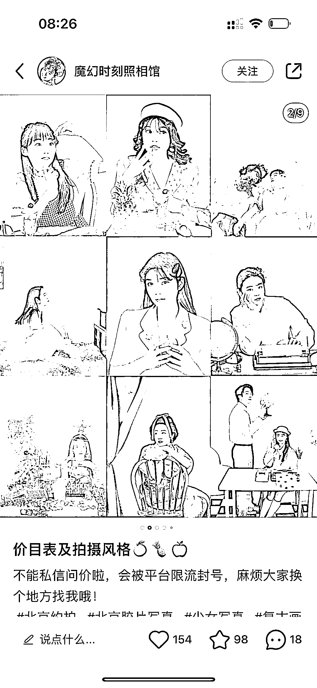

# 复古胶片写真，两个号粉丝总数超过 2W，引流效果显著

> 原文：[`www.yuque.com/for_lazy/xkrm14/mdam7mkwhgfhefyy`](https://www.yuque.com/for_lazy/xkrm14/mdam7mkwhgfhefyy)

作者： 七七

日期：2023-07-03

点赞数：49

正文：

复古胶片写真，给用户拍摄复古照片。两个号，一个照相馆的号，用来发复古照片，8000 多粉丝。一个内容号，用来引流，1.9 万粉丝。

  

  

  

  

  

  

评论区：

伟业 : 解读：可否使用 AI 绘图来实现相同的效果，降低交付的成本呢？

Alex : 恭喜中标[呲牙]

木锋 : 难，写真做的是用户体验，缺乏过程，目前用户不买单（卖不上价格）

公众号懒人找资源，懒人专属群分享

</ne-p></ne-p></ne-p></ne-p></ne-p></ne-p>