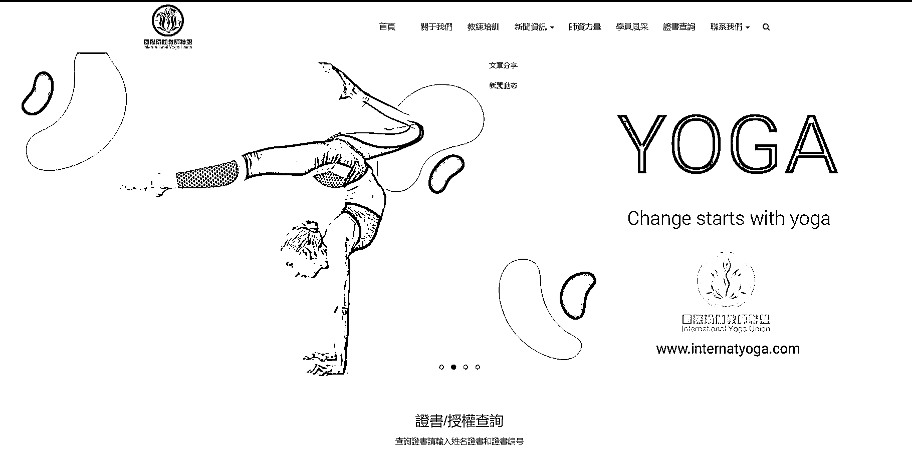

# 行业认证证书变现的商机和方法

> 原文：[`www.yuque.com/for_lazy/xkrm14/hlosqv7qwci7oxnw`](https://www.yuque.com/for_lazy/xkrm14/hlosqv7qwci7oxnw)

作者： 封伟-自动化变现

日期：2023-07-03

点赞数：49

<ne-hole id="u791c5f6e" data-lake-id="u791c5f6e"><ne-card data-card-name="hr" data-card-type="block" id="FJdv1" data-event-boundary="card">

正文：

卖行业认证证书变现 目前国内很多行业并没有国家级的资质证书，但一样发展得有模有样，比如运动领域的瑜伽，普拉提 这些行业的人成为专家前，大部分都是通过参加第三方机构教培，获得机构或者其联盟发布的证书 用户需求：行业专业资质快速开通，行业专业能力证明，自媒体行业资质辅助认证 以上这 3 点，我认为是长期可以变现的需求 变现空间：组成 XX 行业联盟，建立官网，线下联动各地教培机构培训发证，证书官网可查，线上结合电商平台和内容营销，用培训塑造权威，用证书无本变现，后续可以逐步完善行业标准，整合资源 比如这个国际瑜伽联盟联盟，一个证书几百块，加上一些互联网的打法，从流量到变现更加流畅。 单单一个新媒体达人辅助认证，就是其中一个变现小项目 有行业资源的完全可以起盘，从一个行业证书官网开始......

<ne-card data-card-name="image" data-card-type="inline" id="KlVdf" data-event-boundary="card">  <ne-p id="u182000a3" data-lake-id="u182000a3"><ne-card data-card-name="image" data-card-type="inline" id="cNth6" data-event-boundary="card">  <ne-hole id="ue4cb5125" data-lake-id="ue4cb5125"><ne-card data-card-name="hr" data-card-type="block" id="g1KbE" data-event-boundary="card"><ne-p id="u54c11f94" data-lake-id="u54c11f94">评论区：

胖大魔 : 中标警告[呲牙]

封伟-自动化变现 : 哈哈感谢支持[呲牙]

<ne-hole id="u706b3d52" data-lake-id="u706b3d52"><ne-card data-card-name="hr" data-card-type="block" id="s4w45" data-event-boundary="card">

公众号懒人找资源，懒人专属群分享

</ne-card></ne-hole></ne-card></ne-hole></ne-card></ne-p></ne-card></ne-p></ne-card></ne-hole>