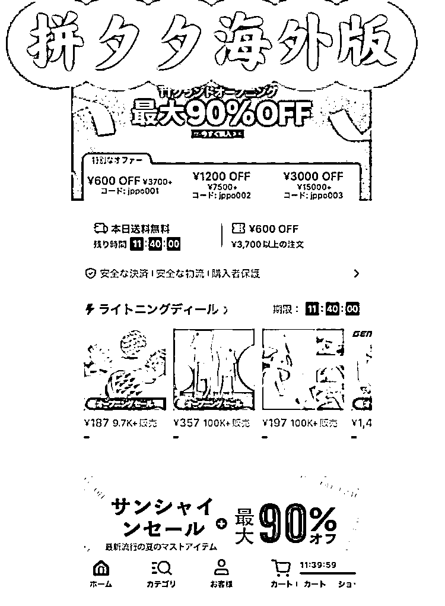

# TEMU 海外版在日本上线，具备巨大商机和变现空间

> 原文：[`www.yuque.com/for_lazy/xkrm14/kugfzguzix4ak1sr`](https://www.yuque.com/for_lazy/xkrm14/kugfzguzix4ak1sr)

作者： 国强，坐标日本

日期：2023-07-05

点赞数：85

正文：

TEMU（拼多多海外版）正式上线日本，比日亚便宜一半 ⭕TEMU 是什么？ 拼多多的海外跨境电商版本，2022 年 9 月在美国上线后下载量爆火，今年 6 月登陆日本，有网页及手机版。 TEMU 意思，Team Up，Price Down。买的人越多价格越便宜。真的太便宜啦！真香！ ⭕物流及配送费用 目前阶段，最低消费是 1400 日元起。配送时间大概为一周左右。 ⭕如何变现？ 如何在 TEMU 上打造一个爆款： ------------------------------------------ TEMU 是拼多多的海外版本，运用了拼多多独特的团购模式，即“买的人越多，价格越便宜”。 1.变现空间：日本是一个发达国家，具有很高的消费能力和消费水平，因此在这个市场上运营的电商平台有着巨大的变现空间。特别是对于价格更便宜、购买方式独特的 TEMU 来说，可能会吸引更多寻求性价比的消费者，从而有更大的变现空间。 2.异常值：对于很多日本的消费者来说，团购或拼单的购物模式是个新鲜事物，和他们之前的购物体验有所不同，这可以看作是一个"异常值"。这种异常值可能会吸引一部分寻求新鲜体验的消费者，从而增加用户量和销售额。 3.商机：目前，日本的电商市场还未被像亚马逊、楽天等巨头完全占领，尤其是团购模式的电商平台在日本市场上还非常稀少。这为 TEMU 提供了巨大的商机，可以利用其独特的商业模式在市场上占据一席之地。 4.用户需求：日本消费者对于价格和品质都有较高的要求。而 TEMU 的模式，即"买的人越多，价格越便宜"，恰好可以满足消费者的这两种需求。因此，TEMU 可能会受到日本消费者的欢迎。[如何在 TEMU 上打造一个爆款](https://articles.zsxq.com/id_igfw014xqdsk.html)

  <ne-p id="u645e70b9" data-lake-id="u645e70b9">评论区：

国强，坐标日本 : 1000 日币约为 50RMB

胖大魔 : 国强哥哥可以写精华帖[害羞]

国强，坐标日本 : [奋斗][奋斗][奋斗] 俺努力

小白脸 : TEMU，真的那么好做吗？作为二道贩子商家请慎入！作为工厂，请想想 TEMU 仅仅是压榨的工厂利润吗？

国强，坐标日本 : 确实有的人适合，有的不适合

徐 Ken : 风向标航海日志的味道[呲牙][强]

国强，坐标日本 : 后半段是[得意] 嘘🤫

公众号懒人找资源，懒人专属群分享

</ne-p>