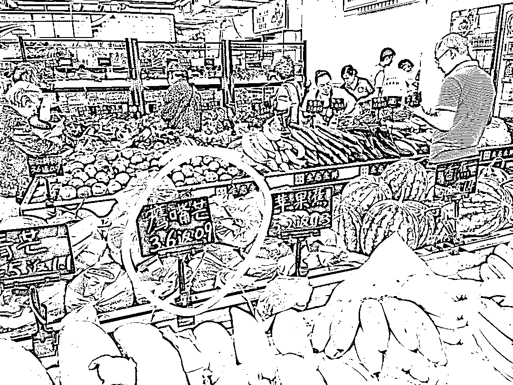

# 超市端午节特别卷，免费办卡直接返现，吸引顾客购买

> 原文：[`www.yuque.com/for_lazy/xkrm14/qgrgik4n0a7kmaim`](https://www.yuque.com/for_lazy/xkrm14/qgrgik4n0a7kmaim)

<ne-text id="u3595147d">作者： 老马</ne-text>

<ne-text id="u53485860">日期：2023-06-28</ne-text>

<ne-text id="u72a4e1db">点赞数：</ne-text><ne-text id="u5239e426" ne-bold="true">123</ne-text>

<ne-hole id="u4db3b44c" data-lake-id="u4db3b44c"><ne-card data-card-name="hr" data-card-type="block" id="G50Kj" data-event-boundary="card">

<ne-text id="u963aa4c0">正文：</ne-text>

<ne-text id="u5d855b08">端午节逛楼下超市，我发现超市都特别卷，而且还玩出了新花样。 其他超市办卡都是买后送积分，大家一般都不太在意。</ne-text> <ne-text id="u34dbab8a">但这家超市免费办卡，拉会员群，直接返现。重点是这个直接返现。 我们那天买了 90 几块，返现 15 元左右，可以直接用来买东西。</ne-text> <ne-text id="ue90c19ad">为了这 15 块钱，我妈第二天又来这个超市买菜了，以前都在其他超市买的。 这种及时反馈，马上见效，比兑换积分爽多了。</ne-text>

<ne-card data-card-name="image" data-card-type="inline" id="qMo9F" data-event-boundary="card">  <ne-p id="ue28a5310" data-lake-id="ue28a5310"><ne-card data-card-name="image" data-card-type="inline" id="RTbJc" data-event-boundary="card">  <ne-hole id="u05a83a2b" data-lake-id="u05a83a2b"><ne-card data-card-name="hr" data-card-type="block" id="lfWMS" data-event-boundary="card"><ne-p id="ua1a1e548" data-lake-id="ua1a1e548"><ne-text id="uf519bf11">评论区：</ne-text>

<ne-text id="u19f63486">我的名字叫蓝 : 免费办理会员卡，拉会员群，购物返现。促成复购。</ne-text>

<ne-text id="u0db942da">远帆 : 线下班的多多买菜返现</ne-text>

<ne-text id="ua5f3921f">三行 MU : 和天猫超市返猫超卡的玩法很像</ne-text>

<ne-text id="uf8d1420f">昊东.Lee : 这个建立用户关系的方法挺好的</ne-text>

<ne-text id="u951ea6c4">阿黎 : 天猫超市返现套娃[强]</ne-text>

<ne-text id="u1ca07983">贝壳 : 什么省份的？第一次见这种玩法</ne-text>

<ne-text id="ud66feda1">Alex : 厉害👍🏻</ne-text>

<ne-hole id="ud3b58bfc" data-lake-id="ud3b58bfc"><ne-card data-card-name="hr" data-card-type="block" id="qkrFc" data-event-boundary="card">

<ne-text id="ue364d129">公众号懒人找资源，懒人专属群分享</ne-text>

</ne-card></ne-hole></ne-card></ne-hole></ne-card></ne-p></ne-card></ne-p></ne-card></ne-hole>