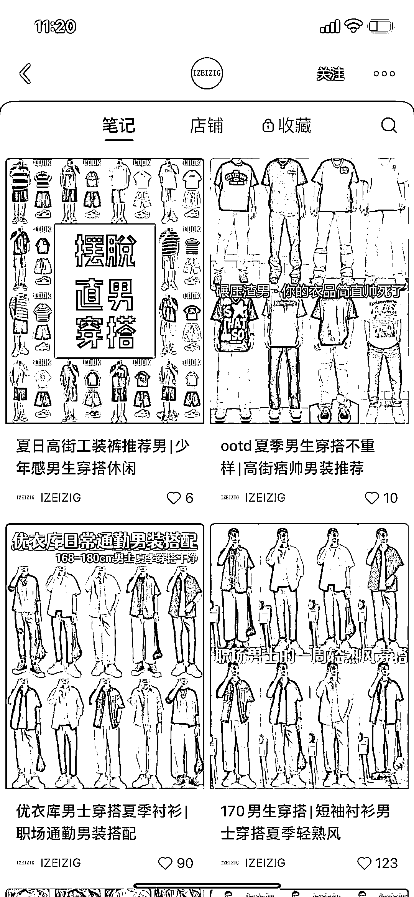
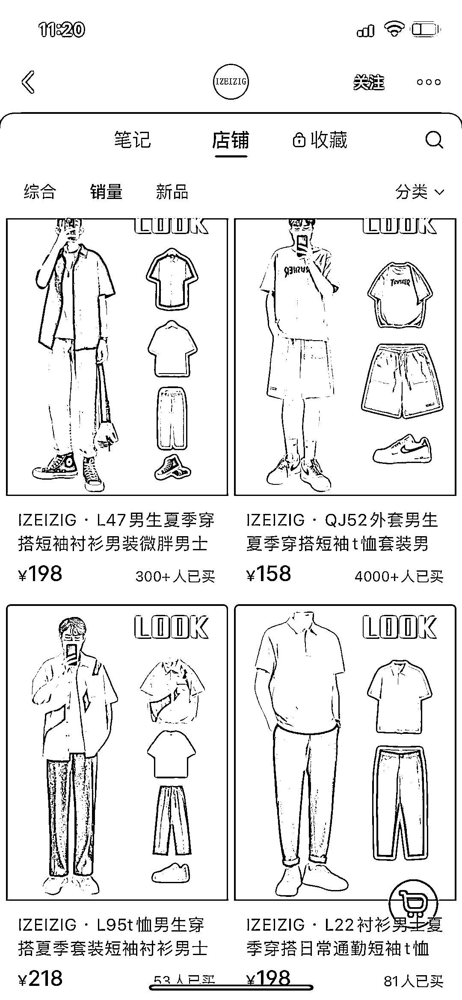

# 小红书男生穿搭图文笔记销量不错，制作成本低，适合各种需求

> 原文：[`www.yuque.com/for_lazy/xkrm14/wngfsh14k52dhm56`](https://www.yuque.com/for_lazy/xkrm14/wngfsh14k52dhm56)

作者： 扑克脸的兔

日期：2023-06-29

点赞数：112

<ne-hole id="u9d90be8d" data-lake-id="u9d90be8d">

正文：

男生穿搭图文笔记在小红书销量不错，关键是制作成本不高，可矩阵，还不露脸，没技术的就抠图，有技术的就 ai 模特搞起

  <ne-p id="u6c549798" data-lake-id="u6c549798">  <ne-p id="u00896c1c" data-lake-id="u00896c1c">  <ne-p id="ud617277b" data-lake-id="ud617277b">  <ne-hole id="ud1ae7670" data-lake-id="ud1ae7670"><ne-p id="ubf6b187c" data-lake-id="ubf6b187c">评论区：

张耑一 : 抠图怎么弄

佩佩 : 这个方式怎么变现呢？

惠玲 : 卖货呀

钱多多 : 美图秀秀，有一个功能可以抠图，但是限量免费。另外登录淘宝千牛后台----创意中心----创意工具----智能抠图，可以实现批量抠图，而且是免费的。

悦佬 : 为啥别人抠出来的图都这么高清 ~~

Frank 老师 : 理解：小红书上的男生穿搭图文笔记销售良好，其优势在于制作成本低，可进行矩阵营销，且不需露脸。对于没有技术的人可以选择抠图，有技术的可以使用 AI 模特进行创作。借助 ChatGPT，我们可以生成时尚潮流分析，提供更精准的穿搭建议，进一步降低内容制作的难度和成本。

铁酱酱 : [强][强]

<ne-hole id="ufac203bc" data-lake-id="ufac203bc">

公众号懒人找资源，懒人专属群分享

</ne-hole></ne-hole></ne-p></ne-p></ne-p></ne-p></ne-hole>