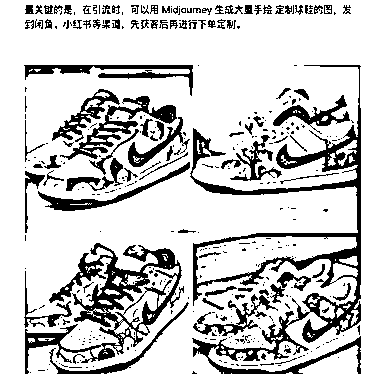

# 定制球鞋赚钱思路：从经典款到手绘定制，轻松翻倍利润

> 原文：[`www.yuque.com/for_lazy/xkrm14/ndhni19un3e11ryg`](https://www.yuque.com/for_lazy/xkrm14/ndhni19un3e11ryg)

<ne-text id="u44dce7b3">作者： 强哥手记</ne-text>

<ne-text id="ucb7fa9d6">日期：2023-06-28</ne-text>

<ne-text id="u84ce8367">点赞数：</ne-text><ne-text id="ua1ec6d44" ne-bold="true">106</ne-text>

<ne-hole id="uc6b5af2a" data-lake-id="uc6b5af2a"><ne-card data-card-name="hr" data-card-type="block" id="SnIGi" data-event-boundary="card">

<ne-text id="u8eac1ad8">正文：</ne-text>

<ne-text id="u8bab4c3c">分享个赚钱的思路，也是朋友沟通而来，做部分参考吧： 朋友去年在得物上开始做，今年买上了保时捷。 介绍这个 AI 赚钱思路：定制球鞋</ne-text> <ne-text id="uc0fc904e">首先选择经典款的球鞋，比如 Nike 的 Dunk 系列， 知乎、抖音学习定制鞋打孔，手绘，贴牌等技巧。 最关键的是，在引流时，可以用 MidJourney</ne-text> <ne-text id="uebb49028">生成大量手绘图，发到闲鱼、小红书等渠道，先获客后再进行定制， 这种一般都是预交费，两周到四周的时间交货，免去了自己库存的风险。 一双 700</ne-text> <ne-text id="u46ca2786">块的球鞋，经过定制，价格都是翻倍的。 短期内还是一个很好的赛道。</ne-text>

<ne-card data-card-name="image" data-card-type="inline" id="OUvvt" data-event-boundary="card">  <ne-p id="uaec83f58" data-lake-id="uaec83f58"><ne-card data-card-name="image" data-card-type="inline" id="LzqsG" data-event-boundary="card">  <ne-hole id="uecd7d348" data-lake-id="uecd7d348"><ne-card data-card-name="hr" data-card-type="block" id="hLe0f" data-event-boundary="card"><ne-p id="u601c7b40" data-lake-id="u601c7b40"><ne-text id="uce41b9aa">评论区：</ne-text>

<ne-text id="u468b7378">伟业 : 产品交付的成本会不会很高？</ne-text>

<ne-text id="u257827fe">强哥手记 : 核心是和商家确定好。产业链我觉得比较重要</ne-text>

<ne-text id="uef03c661">天择 : 这种东西贴牌不算售假嘛？</ne-text>

<ne-text id="u85d3674b">字节叔叔 : 鞋子是正品鞋子（比如正品√），只是在鞋子上进行手绘。</ne-text>

<ne-text id="u338acbbe">弃天 : 打孔、手绘、贴牌等技术活有没有渠道可合作？</ne-text>

<ne-text id="u06f97cd6">天择 : 哦哦，谢谢指数</ne-text>

<ne-text id="ue9da84b5">🌲jungle : 定制球鞋还是挺小众的，看得物上的订单销售量也不高，另外产品交付也会容易起纠纷。这应该不算是特别好的机会。</ne-text>

<ne-hole id="u9b41de06" data-lake-id="u9b41de06"><ne-card data-card-name="hr" data-card-type="block" id="b1sML" data-event-boundary="card">

<ne-text id="u81a2d549">公众号懒人找资源，懒人专属群分享</ne-text>

</ne-card></ne-hole></ne-card></ne-hole></ne-card></ne-p></ne-card></ne-p></ne-card></ne-hole>