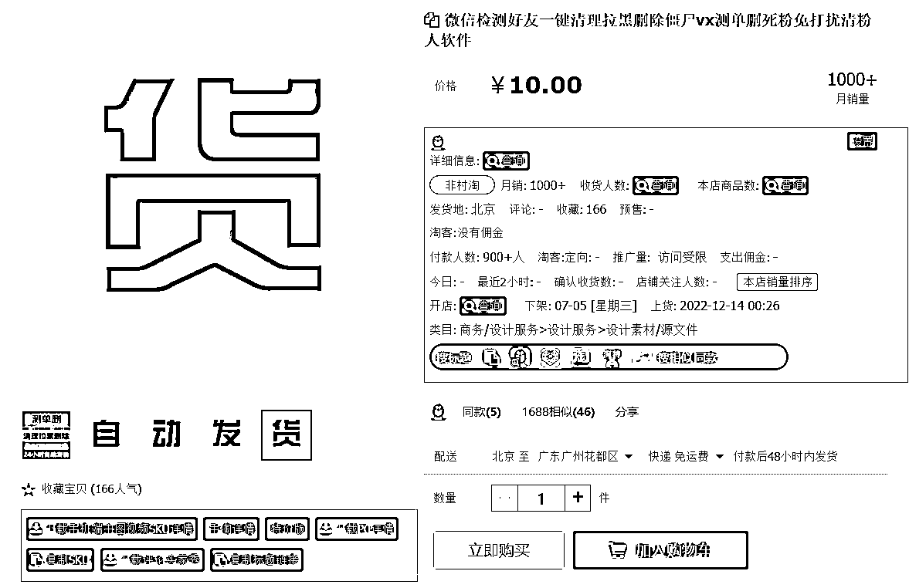
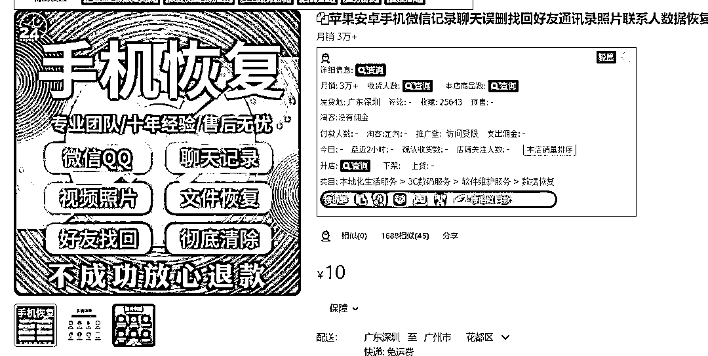

# 围绕微信的小需求在淘宝销量大

> 原文：[`www.yuque.com/for_lazy/xkrm14/rmvtafgwxiv57z5z`](https://www.yuque.com/for_lazy/xkrm14/rmvtafgwxiv57z5z)

<ne-p id="uec0bb957" data-lake-id="uec0bb957"><ne-text id="u8b0204f2">作者： GS</ne-text></ne-p> <ne-p id="u3049b6b7" data-lake-id="u3049b6b7"><ne-text id="u7a0d9899">日期：2023-06-29</ne-text></ne-p> <ne-p id="u5d4c71cb" data-lake-id="u5d4c71cb"><ne-text id="u847efafb">点赞数：</ne-text><ne-text id="ude6f220e" ne-bold="true">93</ne-text></ne-p> <ne-hole id="ue771056f" data-lake-id="ue771056f"><ne-card data-card-name="hr" data-card-type="block" id="mYnrq" data-event-boundary="card"><ne-p id="u547828e4" data-lake-id="u547828e4"><ne-text id="u5a2c6d07">正文：</ne-text></ne-p> <ne-p id="u1b18d167" data-lake-id="u1b18d167"><ne-text id="u8c0ab832">围绕微信挖掘的小需求，在淘宝销量都很大 1.微信去除地区去改性别 2.微信豆苹果手机充值 3.微信检测好友一键清理拉黑 4.微信隐藏好友密友</ne-text> <ne-text id="u19718703">5.苹果安卓手机微信记录聊天误删找回</ne-text></ne-p> <ne-p id="u30df90f0" data-lake-id="u30df90f0"><ne-card data-card-name="image" data-card-type="inline" id="XnltC" data-event-boundary="card"></ne-card></ne-p> <ne-p id="ub31d150b" data-lake-id="ub31d150b"><ne-card data-card-name="image" data-card-type="inline" id="UUxNv" data-event-boundary="card">  <ne-p id="ufe481a66" data-lake-id="ufe481a66"><ne-card data-card-name="image" data-card-type="inline" id="hpfMA" data-event-boundary="card">  <ne-p id="u25993367" data-lake-id="u25993367"><ne-card data-card-name="image" data-card-type="inline" id="Zddmt" data-event-boundary="card">  <ne-p id="u93935d4a" data-lake-id="u93935d4a"><ne-card data-card-name="image" data-card-type="inline" id="kJKMf" data-event-boundary="card">  <ne-hole id="udd630b60" data-lake-id="udd630b60"><ne-card data-card-name="hr" data-card-type="block" id="BWvaW" data-event-boundary="card"><ne-p id="u63f544e0" data-lake-id="u63f544e0"><ne-text id="u14489d42">评论区：</ne-text></ne-p> <ne-p id="u839faddb" data-lake-id="u839faddb"><ne-text id="udcff91de">周彦充 : 围绕微信生态有很多生意可以做，期待开发更多有意思的内容[呲牙]</ne-text></ne-p> <ne-p id="u526265f6" data-lake-id="u526265f6"><ne-text id="u265c46f9">GS : 会的[呲牙]</ne-text></ne-p> <ne-p id="u94d05e1c" data-lake-id="u94d05e1c"><ne-text id="u7040a90d">周宇 : 我一残疾人朋友，卖 wetool 一年十几万收入，他非常满足，售后也做的很好很好，靠自己的双手挣钱养活一家，我很佩服他</ne-text></ne-p> <ne-p id="uc440f0f9" data-lake-id="uc440f0f9"><ne-text id="ua5422a20">我的名字叫蓝 : 这个现在听说没正版了呀</ne-text></ne-p> <ne-p id="u070194c6" data-lake-id="u070194c6"><ne-text id="u3381b7e1">从小就很帅 : 现在还能用吗？以前大规模封号是不是因为用的这个</ne-text></ne-p> <ne-p id="ufbc1a437" data-lake-id="ufbc1a437"><ne-text id="u4b5a292b">老黄 : WeTool 尽量不要用，3 月初用了一次清理，然后 3 个账号限制社交功能，很麻烦，</ne-text></ne-p> <ne-p id="uc9ca07b0" data-lake-id="uc9ca07b0"><ne-text id="ub64ff801">周宇 : 最近是有很多封号的</ne-text></ne-p> <ne-hole id="u999b88dc" data-lake-id="u999b88dc"><ne-card data-card-name="hr" data-card-type="block" id="OyJk5" data-event-boundary="card"><ne-p id="u9324aea0" data-lake-id="u9324aea0"><ne-text id="u70fe44e6">公众号懒人找资源，懒人专属群分享</ne-text></ne-p></ne-card></ne-hole></ne-card></ne-hole></ne-card></ne-p></ne-card></ne-p></ne-card></ne-p></ne-card></ne-p></ne-card></ne-hole>