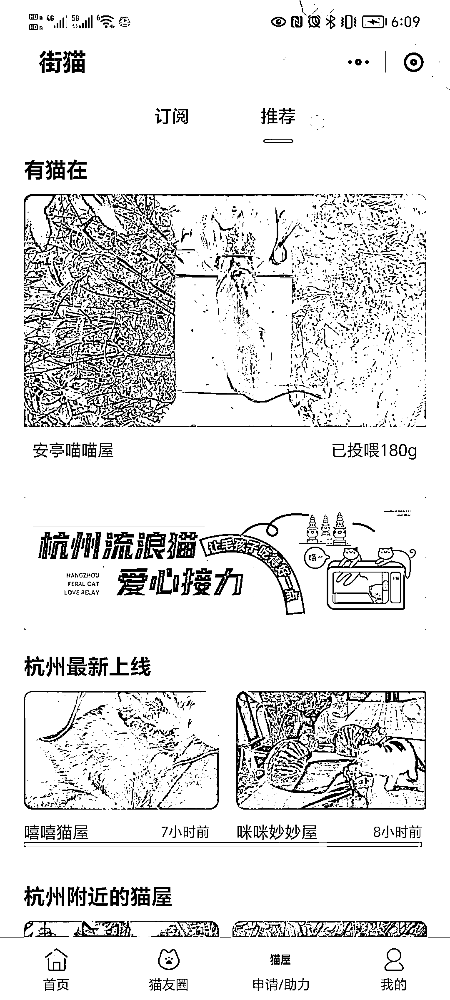
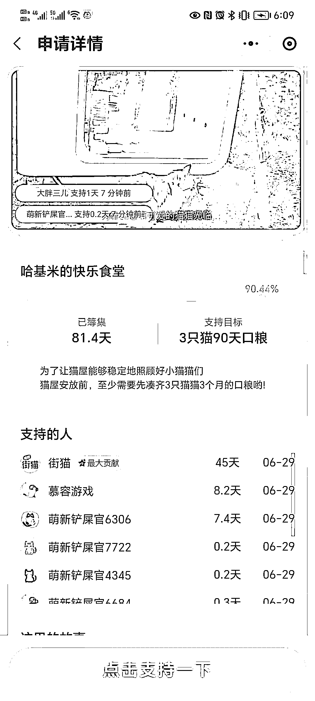
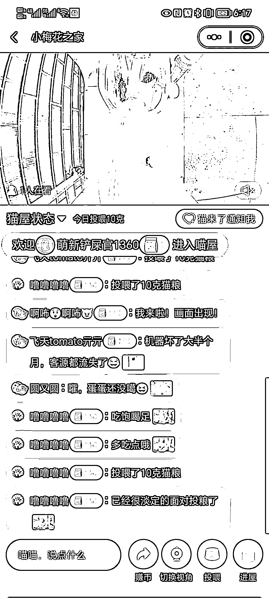

# 小区居民申请流浪猫猫屋，引发养宠物社群热议

> 原文：[`www.yuque.com/for_lazy/xkrm14/ykd6pbomhdchuf99`](https://www.yuque.com/for_lazy/xkrm14/ykd6pbomhdchuf99)

作者： 一巴子

日期：2023-06-29

点赞数：84

<ne-hole id="u50164665" data-lake-id="u50164665">

正文：

小区最近有人申请了这个流浪猫猫屋，最近很多养宠物社群也在聊，这真是有价值的事业！

  <ne-p id="u0c0ed4bf" data-lake-id="u0c0ed4bf">  <ne-p id="uc8924047" data-lake-id="uc8924047">  <ne-p id="ue1eb21b6" data-lake-id="ue1eb21b6">  <ne-p id="u730756b1" data-lake-id="u730756b1">  <ne-hole id="udcd71c15" data-lake-id="udcd71c15"><ne-p id="u02e3cb09" data-lake-id="u02e3cb09">评论区：

安然小姐 : 太棒啦，每次看见流浪猫都很心酸，也不知道自己能做多少，一般也就给点猫粮。希望更多帮助给到它们

一巴子 : 每人伤害的话，流浪猫也享受着绝对的自由

一巴子 : [拥抱]

我的名字叫蓝 : 个人理解：最后的最后不知道会发展成怎么的形态。 目前情况下，我们可以通过提供相关服务去赚钱。

<ne-hole id="u20a4fcae" data-lake-id="u20a4fcae">

公众号懒人找资源，懒人专属群分享

</ne-hole></ne-hole></ne-p></ne-p></ne-p></ne-p></ne-p></ne-hole>