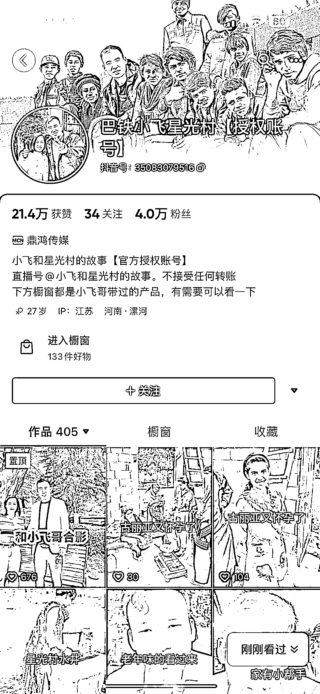
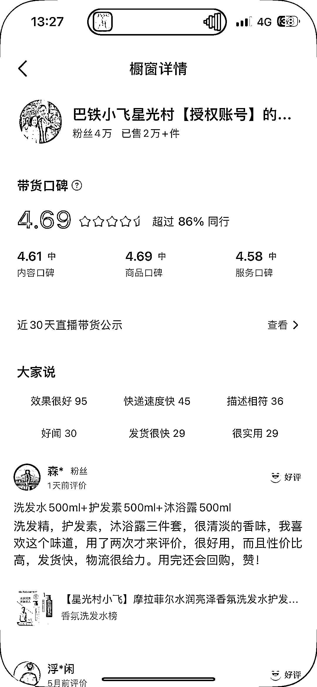

# 小飞和星光村的故事切片开放，粉丝 1077 万，涨粉利器

> 原文：[`www.yuque.com/for_lazy/xkrm14/zza0g6dcamamrb83`](https://www.yuque.com/for_lazy/xkrm14/zza0g6dcamamrb83)

作者： 小鱼学长

日期：2023-06-29

点赞数：76

正文：

小飞和星光村的故事今天切片开放了 粉丝 1077 万 长期在巴基斯坦做搞笑段子，可以剪辑他的作品涨粉，做的早点账号很多都起来了 需要条件 1000➕开橱窗 这个账号剪辑小飞的切片涨粉 4 万，已经售卖 2w➕产品，这个授权很不错的，可以批量起号 风向标

  

  

  

评论区：

周彦充 : 垂直风招标，[强]

小鱼学长 : 哈哈哈

平凡不平凡 : 这些切片都要到哪个平台申请

小鱼学长 : 个人 v 申请

小鱼学长 : 这个授权不通过平台

比心飞扬 : 可惜我的粉丝不够，还不能做切片[流泪] 你们都是怎么涨粉的

小鱼学长 : 买一千粉丝

小鱼学长 : 你可以私信我

公众号懒人找资源，懒人专属群分享

