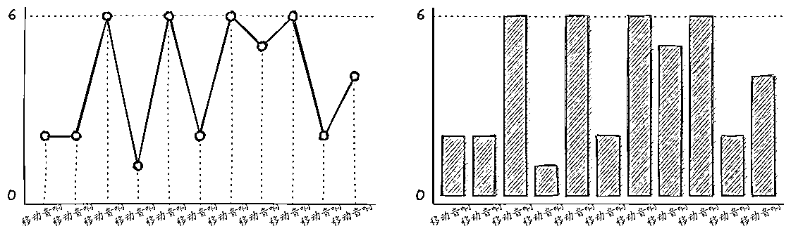

# 分享一个草绘流程图的项目，Handraw 中文友好的手写效果白板工具

> 原文：[`www.yuque.com/for_lazy/xkrm14/dwli075smv6ngkoz`](https://www.yuque.com/for_lazy/xkrm14/dwli075smv6ngkoz)

作者： 从小就很帅

日期：2023-06-29

点赞数：74

<ne-hole id="ud397018a" data-lake-id="ud397018a"><ne-card data-card-name="hr" data-card-type="block" id="f499b" data-event-boundary="card">

正文：

分享一个草绘流程图的项目 网址： 开源地址： 风格如图一，大家可以自行尝试。 还可以绘制表格，把表格的两列直接复制进去就行，如图二。 网站自带素材库，把现有的素材添加到工作台即可，图一中的图标都是素材库里的。 还能发给队友进行协作，自定义画布背景等等，有点耳目一新的感觉。[Handraw 中文友好的手写效果白板工具](https://handraw.top/) [GitHub-korbinzhaoexcalidraw-cn 支持中文手写和多画布的 Excalidra...](https://github.com/korbinzhao/excalidraw-cn)

<ne-card data-card-name="image" data-card-type="inline" id="OHmpw" data-event-boundary="card">  <ne-p id="u828fa88a" data-lake-id="u828fa88a"><ne-card data-card-name="image" data-card-type="inline" id="ILo43" data-event-boundary="card">  <ne-hole id="uc2fd37c4" data-lake-id="uc2fd37c4"><ne-card data-card-name="hr" data-card-type="block" id="RaKXH" data-event-boundary="card"><ne-p id="u91062329" data-lake-id="u91062329">评论区：

从小就很帅 : 感谢亦仁老板

木桶伯 : 特别好用，感谢推荐

子木（二哥） : 可以用用我们的产品 teamind.co

Frank 老师 : 理解：Handraw 是一个支持中文和多画布的开源手写效果白板工具，可以进行草绘流程图制作，支持表格复制粘贴，包含内置素材库，支持团队协作以及自定义画布背景等功能。借助 ChatGPT，我们可以将相关信息更清晰、系统地呈现给用户，也可以为用户解答有关工具使用上的问题，提高用户体验。

<ne-hole id="uac78de0a" data-lake-id="uac78de0a"><ne-card data-card-name="hr" data-card-type="block" id="aaEW8" data-event-boundary="card">

公众号懒人找资源，懒人专属群分享

</ne-card></ne-hole></ne-card></ne-hole></ne-card></ne-p></ne-card></ne-p></ne-card></ne-hole>