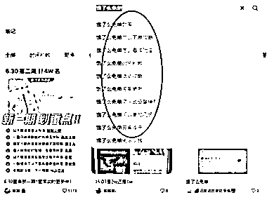
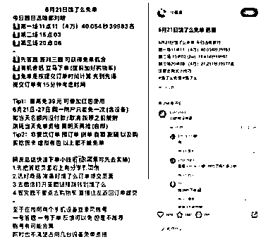

# 饿了么猜答案免单活动回归，小红书成为外卖引流变现新利器

> 原文：[`www.yuque.com/for_lazy/xkrm14/iwzrnvv068qoiyvq`](https://www.yuque.com/for_lazy/xkrm14/iwzrnvv068qoiyvq)

作者： 深圳老刘

日期：2023-06-30

点赞数：78

正文：

火爆的饿了么猜答案免单又双叒叕回归了 1\. 主要内容 夏至将至，一年一度的夏令经济即将到来。在 6 月 20 日饿了么 2023 夏季商家大会上，饿了么宣布正式开启 2023 年“夏季行动”：去年火爆全网的“猜答案免单”将继续回归，此外今年还将上线多种全新玩法，并全面升级多项夏令特色服务。 在相应时间进入饿了么 APP 搜”免单“，用户即可进入活动页面，在 1 分钟内答对三题下单就有机会抢到免单名额，最高免单奖励金额 39 元。 而小红书上面的做法就是提供题库，让大家提前熟悉答案，以便在 1 分钟以内可以答对题目，从而抢到免单。 2\. 引流变现 看了一下，发这种笔记的博主的周报数据都很不错，这个是非常好的外卖公众号引流变现的切入点。有做外卖 CPS 业务的亲们，赶紧上手操作吧！

  <ne-p id="ua254e7d4" data-lake-id="ua254e7d4">  <ne-p id="u357f4eb3" data-lake-id="u357f4eb3">  <ne-p id="u130f0286" data-lake-id="u130f0286">  <ne-p id="u19eb4a73" data-lake-id="u19eb4a73">评论区：

我的名字叫蓝 : 理解：饿了么出相应答题活动，小红书提供答案（服务） 引流公众号做 CPS（变现）

黄增添 Tony : 题库和答案去哪里找？

深圳老刘 : 这个题库到处都是，天下文章一大抄嘛。你可以去知乎上面搜索，百度上面搜索，再搬到小红薯上面来

黄增添 Tony : [呲牙][呲牙]

Frank 老师 : 题库和答案，似乎可以考虑用 ChatGPT 来整理

Alex : 恭喜中标[呲牙]

公众号懒人找资源，懒人专属群分享

</ne-p></ne-p></ne-p></ne-p>