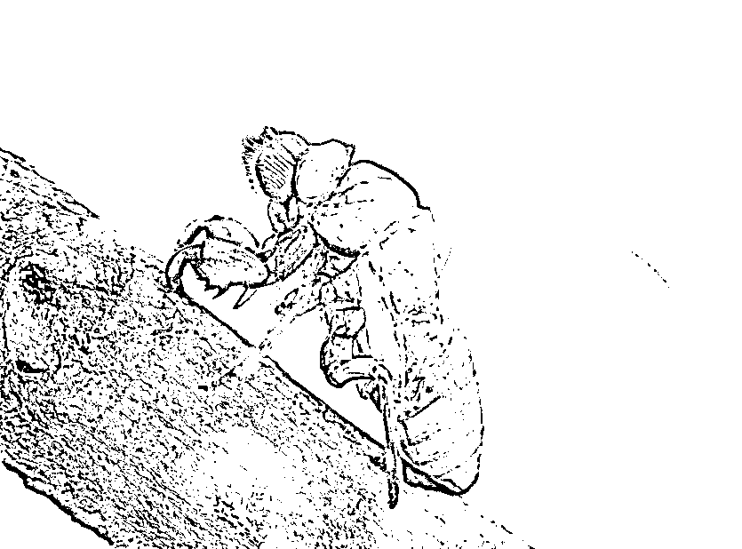
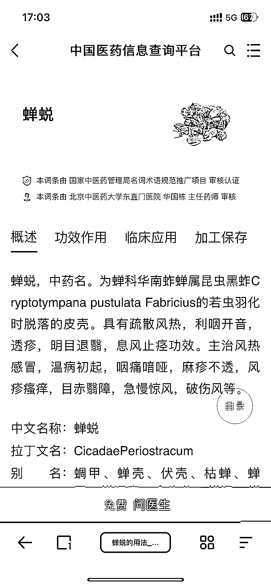

# 中药市场中，蝉蜕价格创新高，养蝉或成商机

> 原文：[`www.yuque.com/for_lazy/xkrm14/fmsnbk2chw1oozyd`](https://www.yuque.com/for_lazy/xkrm14/fmsnbk2chw1oozyd)

作者： 一小小撮阳光

日期：2023-06-26

点赞数：64

正文：

中药：蝉蜕价格近几年达到最高！ 水洗干净的已经达到了 500 元/kg 养蝉说不定是一个商机。

评论区：

易生 : 针对它治疗的病症来做，没准也可以

万简 : 好养吗

在路上 : 很轻

互联网｜老张 : 我们老家就有人专门收这个，以前读书放假我还经常去找，然后卖给人家当药材[憨笑]

昊东.Lee : 2000 个也不一定有一公斤，相比蝉蜕不如卖麻寂寥

左超 : 卖蝉幼虫是个商机，挖金子的人能不能淘到不知道，卖铲子的是赚到了

在路上 : 对的

公众号懒人找资源，懒人专属群分享

