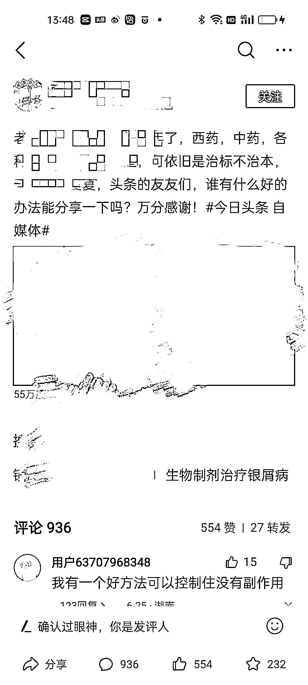
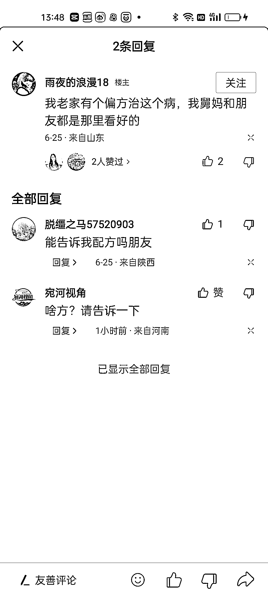
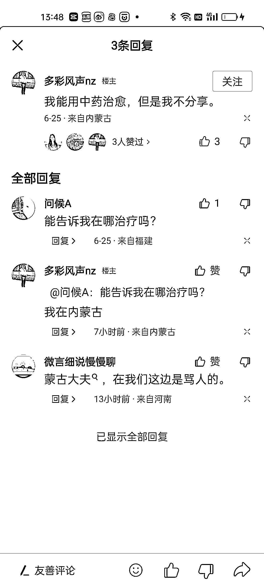

# 评论引流：有效避免删除和封号的方法

> 原文：[`www.yuque.com/for_lazy/xkrm14/rhy4ilad534svwub`](https://www.yuque.com/for_lazy/xkrm14/rhy4ilad534svwub)

<ne-text id="u338a0ca7">作者： 老船长李阳</ne-text>

<ne-text id="ue486b7bb">日期：2023-06-26</ne-text>

<ne-text id="ud62196c0">点赞数：</ne-text><ne-text id="u3cf02561" ne-bold="true">63</ne-text>

<ne-hole id="u47d93bee" data-lake-id="u47d93bee"><ne-card data-card-name="hr" data-card-type="block" id="cc5H2" data-event-boundary="card">

<ne-text id="u453fcff0">正文：</ne-text>

<ne-text id="u9bf072bc">评论引流，对于一些网络要求比较严格，经常容易删除或者被封号的内容。评论引流是一种不错的方法。论引流需要注意: 1.一个账号一天不要评论太多，最多十条</ne-text> <ne-text id="uae2e697f">2.评论时间要分开，不要集中在一个时间点评论多条 3.评论的内容不能重复，可以事先写好 50 条内容循环发</ne-text> <ne-text id="u86d92a7b">4.合理的利用好留微信的方法，不然容易被删除，甚至被封号或者被封私信</ne-text>

<ne-card data-card-name="image" data-card-type="inline" id="EHrPT" data-event-boundary="card">  <ne-p id="u09f54b0f" data-lake-id="u09f54b0f"><ne-card data-card-name="image" data-card-type="inline" id="QQiKK" data-event-boundary="card">  <ne-p id="u94f1060b" data-lake-id="u94f1060b"><ne-card data-card-name="image" data-card-type="inline" id="YgQLC" data-event-boundary="card">  <ne-p id="u5f30ad70" data-lake-id="u5f30ad70"><ne-card data-card-name="image" data-card-type="inline" id="yQxiZ" data-event-boundary="card">  <ne-p id="u7d7c4f38" data-lake-id="u7d7c4f38"><ne-card data-card-name="image" data-card-type="inline" id="PQXKT" data-event-boundary="card">  <ne-hole id="u6d7ac66b" data-lake-id="u6d7ac66b"><ne-card data-card-name="hr" data-card-type="block" id="BU3Wg" data-event-boundary="card"><ne-p id="uce62da8a" data-lake-id="uce62da8a"><ne-text id="u5252c2dc">评论区：</ne-text>

<ne-text id="u52185a93">周彦充 : 感觉这个很香，可以好好研究下</ne-text>

<ne-text id="u564d11d5">非驰 : 就是截流吗</ne-text>

<ne-text id="u63e1635c">互联网｜老张 : 这应该算是截流一种</ne-text>

<ne-text id="u98b8dfc7">田小田的甜 : 这是自问自答吧</ne-text>

<ne-text id="ue3526192">陈工 : 主动曝光截流评论区我们一直都在做，我们通过的是软件工具，可以解放我们的双手，而且还可以多个号批量操作</ne-text>

<ne-text id="uc915dda5">千幻 : 楼下陈工,就相当于一种截流~</ne-text>

<ne-text id="uaa7019c3">千幻 : 这是啥平台老哥</ne-text>

<ne-hole id="ua447ea79" data-lake-id="ua447ea79"><ne-card data-card-name="hr" data-card-type="block" id="a3sGK" data-event-boundary="card">

<ne-text id="u3a33467f">公众号懒人找资源，懒人专属群分享</ne-text>

</ne-card></ne-hole></ne-card></ne-hole></ne-card></ne-p></ne-card></ne-p></ne-card></ne-p></ne-card></ne-p></ne-card></ne-p></ne-card></ne-hole>