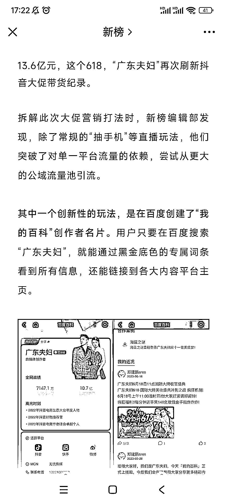

# 百度百科推出“我的百科”创作者名片，助力流量增长和商业变现

> 原文：[`www.yuque.com/for_lazy/xkrm14/uosvnbxvb3cmb6gr`](https://www.yuque.com/for_lazy/xkrm14/uosvnbxvb3cmb6gr)

作者： 阿黎

日期：2023-06-28

点赞数：58

正文：

百度百科—“我的百科”创作者名片，可以聚合展示并跳转博主在各大平台的主页，依靠百度的搜索流量入口，展示自己在各个平台的活动和主页，获得更多流量! 百度百科—“我的百科”创作者名片，一站式聚合内容和商业化，在百度流量生态基础上，用搜索场域链接各大平台，提供了商业变现的直接路径 [百度刚上线的超级名片成了顶流网红们的营销新玩法](https://mp.weixin.qq.com/s/v9xobzM4vlfKOhiYe9zT1w)

  

评论区：

已阅 de 小窝 : 会火

艺荷 : 也不是每个自媒体人都能入驻😂

胖大魔 : 等个切入点，信息差你也领先了

贝壳 : 百度引流

Alex : [强]会火

公众号懒人找资源，懒人专属群分享

