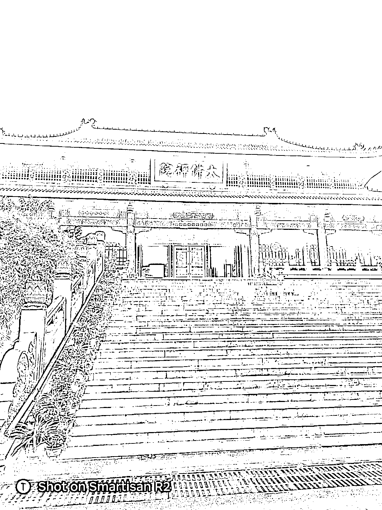
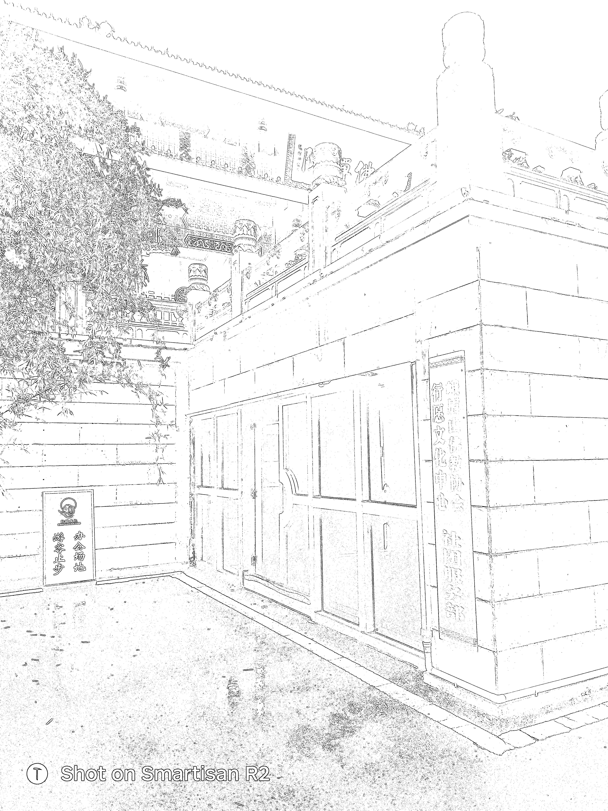

# 峨眉大佛禅院面试揭示的运营机会和挑战

> 原文：[`www.yuque.com/for_lazy/xkrm14/dgg62lzuno21dmb9`](https://www.yuque.com/for_lazy/xkrm14/dgg62lzuno21dmb9)

作者： 小天

日期：2023-06-28

点赞数：51

<ne-hole id="uace77b02" data-lake-id="uace77b02">

正文：

之前我记得在风向标看到过一个寺院瓦片捐赠的，今天我从成都直接去了峨眉大佛禅院里面面试，专门招社群负责人岗位，才开始 3 个月，来去做类似的事情。这种有资源的倒是可以尝试（当时说报销车费，还要开车来接我。我以为是传销组织，我是直接去的大佛禅院直接去看的，才打消顾虑[捂脸]） 那个公司就在峨眉大佛禅院里面常驻，做了 30 年了，付费目前是供灯、供香、供花、捐赠等，还在拓展产品。峨眉大佛禅院是亚洲最大的 我今天听我媳妇说春节她去雍和宫求了个手串，开了光的，就是 480 一串。其他寺院也可能有专门的公司来运营，可以看里面的机会，可以对接渠道和资源，通过这次面试我发现 我想的运营模式： 发抖音或者自媒体的话，需要有宗教许可证，很容易被封号。这个受监管力度很大，对接完资源，批量做号可能可以，封了重新做号就行。也不能做太火，国家肯定会管 私域里面做机会会更大，要看流量怎么来

  <ne-p id="u5b907593" data-lake-id="u5b907593">  <ne-p id="uc0c8d56d" data-lake-id="uc0c8d56d">  <ne-p id="ubc974338" data-lake-id="ubc974338">  <ne-p id="ub71de3df" data-lake-id="ub71de3df">  <ne-p id="u6b48d3ee" data-lake-id="u6b48d3ee">  <ne-p id="uc6011509" data-lake-id="uc6011509">  <ne-p id="u5183a625" data-lake-id="u5183a625">

<ne-hole id="ub31f729c" data-lake-id="ub31f729c">

评论区：

饲养员 : 请问风向标的群怎么进

小天 : 找鱼丸，有指标的

胖大魔 : 我自从在深圳大华兴寺听到和尚找富婆要法器的全程对话，我对他们的印象就[害羞]

小天 : 可能那个更商业化，这个峨眉大佛禅院里面僧人是不负责去推销的

胖大魔 : 是吧

樱花梦珞 : 我之前在佛学类的公司做过运营，公司和寺院合作搞钱，流量很好搞，抖音发佛学相关视频引流到微信就可以了，很简单的。就是有点费号。

四哥升华经 : [强]

<ne-hole id="u216529ba" data-lake-id="u216529ba">

公众号懒人找资源，懒人专属群分享

</ne-hole></ne-hole></ne-p></ne-p></ne-p></ne-p></ne-p></ne-p></ne-p></ne-hole>