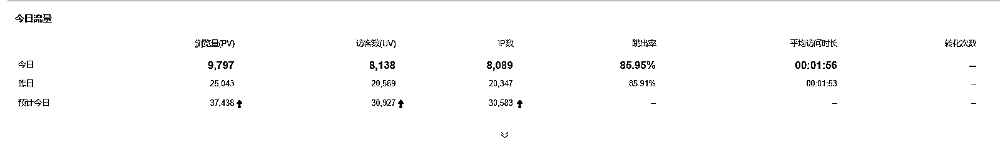
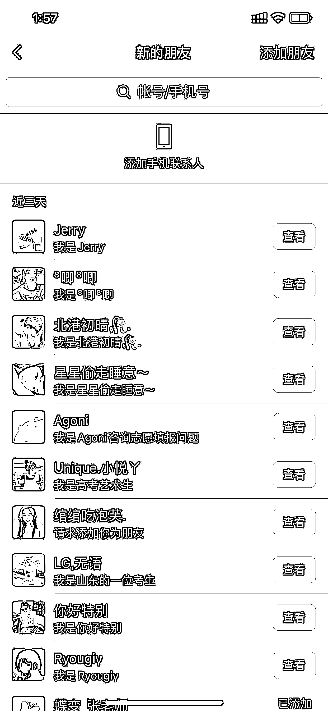

# 高考查分引爆网站流量，日 IP 达 3 万

> 原文：[`www.yuque.com/for_lazy/xkrm14/xm4xz6nnsl1ifd49`](https://www.yuque.com/for_lazy/xkrm14/xm4xz6nnsl1ifd49)

<ne-text id="u1e466140">作者： 权爹笔记</ne-text>

<ne-text id="uc5809aac">日期：2023-06-27</ne-text>

<ne-text id="uf05e9ce5">点赞数：</ne-text><ne-text id="uf9019f5c" ne-bold="true">41</ne-text>

<ne-hole id="u34825fc6" data-lake-id="u34825fc6"><ne-card data-card-name="hr" data-card-type="block" id="OEjfW" data-event-boundary="card">

<ne-text id="u04107b46">正文：</ne-text>

<ne-text id="u6caf182a">最近高考查分，网站流量暴涨日 ip3 万 3 月做了个留学站三个月时间做到权重 4 流量突破 3w，服务器带宽直接拉满。 突然来的流量不知道该怎么转化，提前没有准备</ne-text> <ne-text id="u23a724a7">说下我怎么起的这个网站 1:选择老域名，近年 3 年有持续标题，无灰无拦截 2:服务器国内 2h2g3m 3:备案（不备案收录难）</ne-text> <ne-text id="u6829d3f0">前期网站上线前在本地上传 100 篇文章在上线，上线后每天在固定时间 9 点手动更新文章 60 篇，养好百度蜘蛛习惯，等待日收录出现。日收录过后就开始采集同行的网站文章，后面用 gpt 洗稿在发布，日更 1000。</ne-text>

<ne-card data-card-name="image" data-card-type="inline" id="qZuNh" data-event-boundary="card">  <ne-p id="uaf317320" data-lake-id="uaf317320"><ne-card data-card-name="image" data-card-type="inline" id="i0N7Y" data-event-boundary="card">  <ne-p id="u6032038f" data-lake-id="u6032038f"><ne-card data-card-name="image" data-card-type="inline" id="tPH8u" data-event-boundary="card">  <ne-hole id="u9918a0e1" data-lake-id="u9918a0e1"><ne-card data-card-name="hr" data-card-type="block" id="gjoyv" data-event-boundary="card"><ne-p id="ube0c4a45" data-lake-id="ube0c4a45"><ne-text id="u9b7c5c96">评论区：</ne-text>

<ne-text id="uc2fa89f2">首页作者 : [强]我这边一个作文站，流量有 1w，但是根本转化不了[捂脸]得向大佬学习</ne-text>

<ne-text id="u301c6fb1">权爹笔记 : 弄个复制收费功能试试</ne-text>

<ne-text id="u311d3923">华一 : 我们思维导图工具可以一起看看怎么合作一下，我有预算</ne-text>

<ne-text id="u69297859">华一 : 也可以交流一下 我是 AI 思维导图工具，有预算，可以付费合作一下</ne-text>

<ne-text id="u44ab2e81">阿星 : gpt 洗稿指令有推荐的嘛</ne-text>

<ne-text id="ucd91e5fb">权爹笔记 : 文章丢进去 告诉他改写还有字数</ne-text>

<ne-text id="ua6b078f9">阿星 : 😂bing 改出来的老是大部分内容相同，gpt4 效果有效是嘛</ne-text>

<ne-hole id="u8567afbf" data-lake-id="u8567afbf"><ne-card data-card-name="hr" data-card-type="block" id="rKJII" data-event-boundary="card">

<ne-text id="u7f529fa9">公众号懒人找资源，懒人专属群分享</ne-text>

</ne-card></ne-hole></ne-card></ne-hole></ne-card></ne-p></ne-card></ne-p></ne-card></ne-p></ne-card></ne-hole>