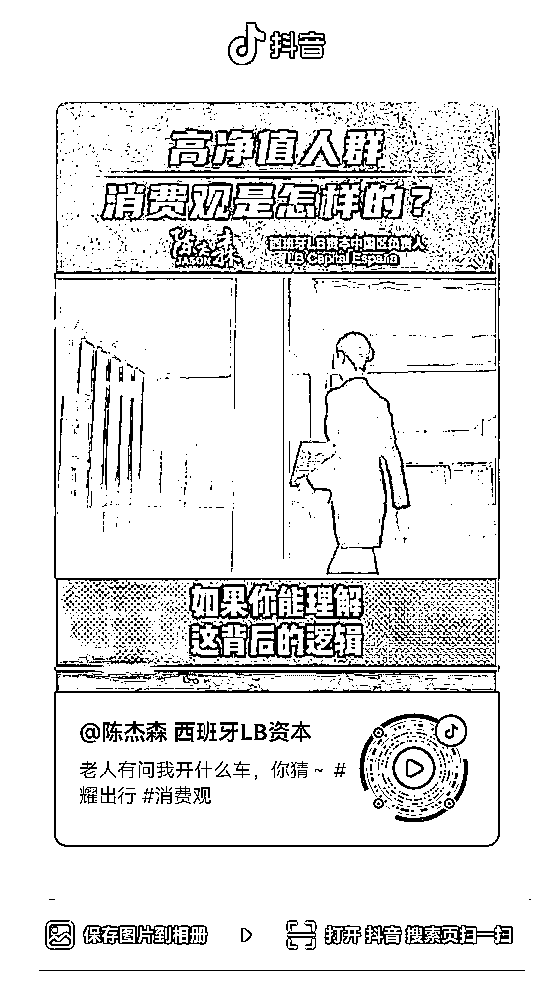
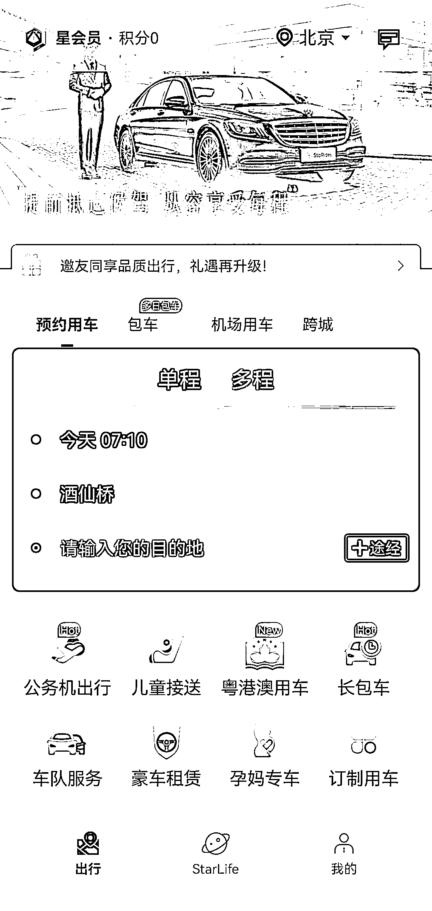
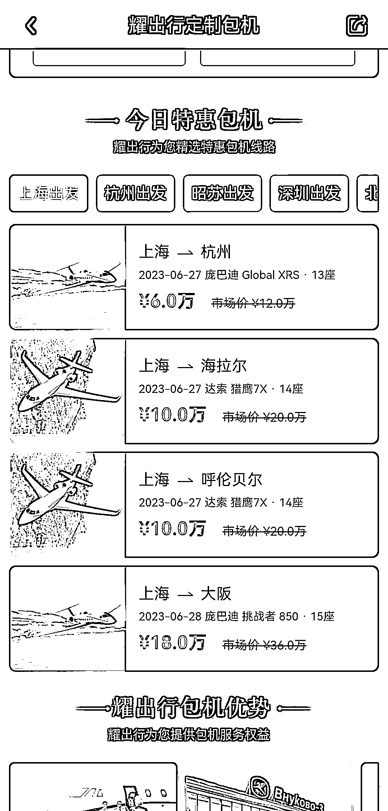

# 耀出行 app：豪车出行赛道的新选择

> 原文：[`www.yuque.com/for_lazy/xkrm14/ftnv8zcwo5mhizmi`](https://www.yuque.com/for_lazy/xkrm14/ftnv8zcwo5mhizmi)

<ne-text id="u72037828">作者： 勤学力行</ne-text>

<ne-text id="u2a6604e1">日期：2023-06-27</ne-text>

<ne-text id="u95754cf4">点赞数：</ne-text><ne-text id="u7094040c" ne-bold="true">38</ne-text>

<ne-hole id="ub019f6b8" data-lake-id="ub019f6b8"><ne-card data-card-name="hr" data-card-type="block" id="X846U" data-event-boundary="card">

<ne-text id="u8e383364">正文：</ne-text>

<ne-text id="u9f85f8da">耀出行 app 值得下载测试；豪车出行赛道 上一篇风向标讲了面向普通大众和面向有钱人群这两条不同的赛道，这一篇是后者的延续</ne-text> <ne-text id="u69081e1a">比如普通大众使用滴滴打车的频率都在下降，但是面向有钱人群的豪车出行赛道却在有序发展。 通过图 1 的介绍，下载测试了耀出行 app。 1、里面的车，最低是奔驰 E。</ne-text> <ne-text id="u851fbfa6">2、车好 + 专业的礼宾司机服务，是核心卖点。 3、toC 用户群，老板、金融小鳄、大厂高管；toB 用户群，著名咨询公司、奢侈品企业、金融机构。</ne-text> <ne-text id="u99fee6fd">4、从北京朝阳区酒仙桥到 T3 航站楼，价格在 270-490 元之间，重要的接待可以接受。 5、还有私人飞机打飞的服务，价格普遍在 10-20 万之间。</ne-text> <ne-text id="u8991080a">所以生意要打开思路，面向大众人群、面向有钱人群的业务，是截然不同的商业思路。 面向有钱人群的各种业务，值得深挖。</ne-text>

<ne-card data-card-name="image" data-card-type="inline" id="WBrXN" data-event-boundary="card">  <ne-p id="ub84f33ac" data-lake-id="ub84f33ac"><ne-card data-card-name="image" data-card-type="inline" id="RgMTE" data-event-boundary="card">  <ne-p id="u1c4fb7a8" data-lake-id="u1c4fb7a8"><ne-card data-card-name="image" data-card-type="inline" id="j3NR3" data-event-boundary="card">  <ne-p id="u9ca6cff4" data-lake-id="u9ca6cff4"><ne-card data-card-name="image" data-card-type="inline" id="rb7rt" data-event-boundary="card">  <ne-p id="uaf5d4307" data-lake-id="uaf5d4307"><ne-card data-card-name="image" data-card-type="inline" id="Jf9nJ" data-event-boundary="card">  <ne-p id="uf9416d2f" data-lake-id="uf9416d2f"><ne-card data-card-name="image" data-card-type="inline" id="oeHYn" data-event-boundary="card">  <ne-hole id="u73544668" data-lake-id="u73544668"><ne-card data-card-name="hr" data-card-type="block" id="gFii4" data-event-boundary="card"><ne-p id="u37001061" data-lake-id="u37001061"><ne-text id="ued821b0e">评论区：</ne-text>

<ne-text id="uc3914055">贝壳 : 未来的滴滴司机都要去买奔驰才能接单？</ne-text>

<ne-text id="uc676f179">勤学力行 : 可以完整看一下第一张图里的视频，你就知道这个问题的答案了</ne-text>

<ne-hole id="ub0f4460d" data-lake-id="ub0f4460d"><ne-card data-card-name="hr" data-card-type="block" id="PsGfW" data-event-boundary="card">

<ne-text id="u82680bd4">公众号懒人找资源，懒人专属群分享</ne-text>

</ne-card></ne-hole></ne-card></ne-hole></ne-card></ne-p></ne-card></ne-p></ne-card></ne-p></ne-card></ne-p></ne-card></ne-p></ne-card></ne-p></ne-card></ne-hole>