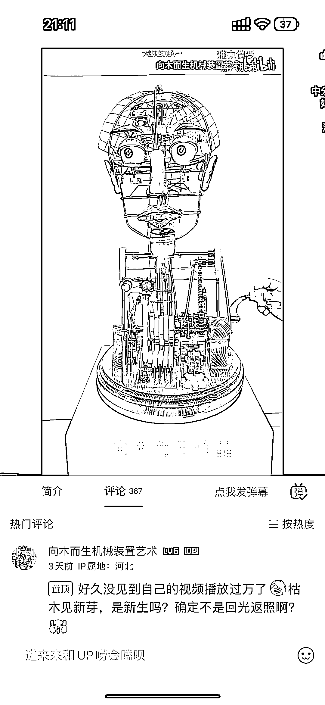

# 视频网站成为艺术文化领域手工业者的新展览平台

> 原文：[`www.yuque.com/for_lazy/xkrm14/lclem4y9uig6k09p`](https://www.yuque.com/for_lazy/xkrm14/lclem4y9uig6k09p)

作者： Amor

日期：2023-06-29

点赞数：43

<ne-hole id="uc4f7c875" data-lake-id="uc4f7c875">

正文：

艺术文化领域的手工业者多在 B 站，抖音等视频网站上发布艺术品制作的有趣视频 or 工艺品的效果展示视频，能有效吸引更多流量，从而带来更多成交量。 其实视频网站就是变相的展览，不过不是纯艺展览，而是诸多事物的集大成展览。而且这个展览既不占用实际场地，不用交展位费，再加上强大的兴趣算法，推荐算法，能让更多艺术家借互联网的流量被更多人看到。曝光量一大，再加上算法的精准推荐，更容易接触到真的对你这类作品感兴趣的有缘人，自然成交量会增大，而且能比跑线下展览接触到更广阔的客群（因为线下文化艺术展一般都是业内人士才会特地去逛，而互联网的视频推送机制能让更多非业内人士也能够接触到，了解到本来普罗大众没那么感兴趣的文化艺术领域） 再加上现在阿 B 开设了“工房”这一板块，更多的艺术家能够在视频中充分展现作品，吸引流量后放上工房链接，成功在站内完成引流+下单购买的闭环（其实就跟抖音商铺一样了，有自己的站内商铺系统就是好！） 而且 B 站对各种新兴事物的包容度更高，搞怪氛围浓厚，适合孕育各种各样的艺术新形式，新作品。 当然了，有利也有弊，毕竟视频展示这种方式对于老一辈手工艺人来说颇有点难度，再加上还要做得足够有趣，搞怪，吸引人，就更是要下功夫好好研究一番。怎么说呢，也是时代的新趋势，其实也是艺术家们与这个世界产生更多接触，交互的一个极好的方式，毕竟号做起来了，也能有效的吸引全国各地，甚至全球各地的粉丝，自然不愁营收了（当然了，更好的商业化模式还需要摸索，不过互联网真的造福文化艺术领域是真的，毕竟以前车马都还很慢的时候，艺术文化领域业内的交流，还有艺术与民众的融合都是十分困难的，现在有了互联网还有其他录音录像的科技设备，真的让很多原本高贵的宫廷艺术能够“旧时王谢堂前燕 ，飞入寻常百姓家。” 感恩科技，感恩生产力！感恩时代🥹

  <ne-p id="u7b35465a" data-lake-id="u7b35465a">  <ne-p id="u2aa11d52" data-lake-id="u2aa11d52">  <ne-p id="ua396d355" data-lake-id="ua396d355">  <ne-p id="u1668f796" data-lake-id="u1668f796">  <ne-hole id="ubd3a63de" data-lake-id="ubd3a63de"><ne-p id="uace00581" data-lake-id="uace00581">评论区：

Frank 老师 : 理解：通过视频网站（如 B 站，抖音）展示手工艺品的制作过程或艺术品的效果，手工艺人可以利用网络平台的强大推荐算法，接触到更广阔的客群，从而提升曝光率和成交量。尽管制作吸引人的视频有一定难度，但是这是艺术家们与世界产生更多接触和交互的有效方式。同时，这也体现了互联网对于文化艺术领域的重大贡献，使得原本高贵的艺术能够更广泛地融入到普通人的生活中。

Hanson-才 : 很有创意的

<ne-hole id="u9c6f3d37" data-lake-id="u9c6f3d37">

公众号懒人找资源，懒人专属群分享

</ne-hole></ne-hole></ne-p></ne-p></ne-p></ne-p></ne-p></ne-hole>