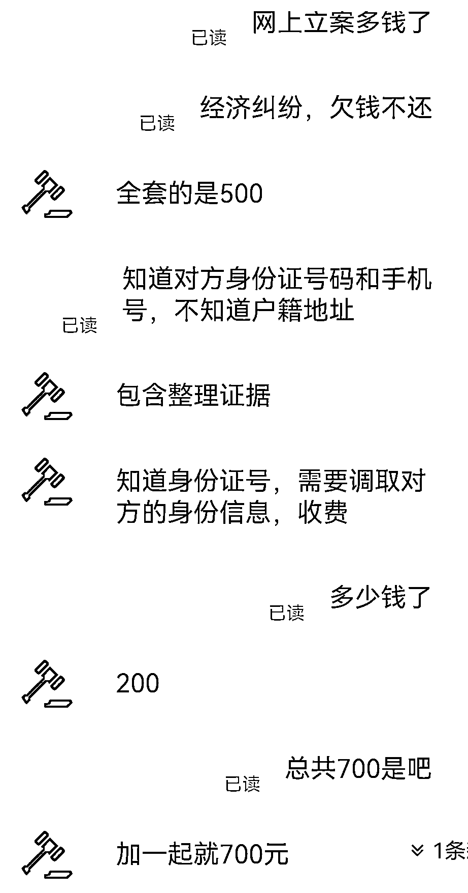
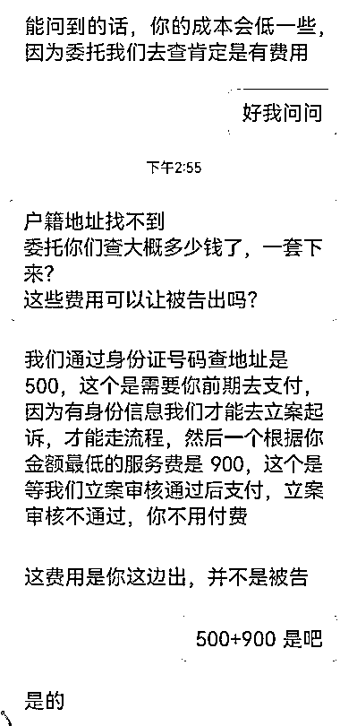
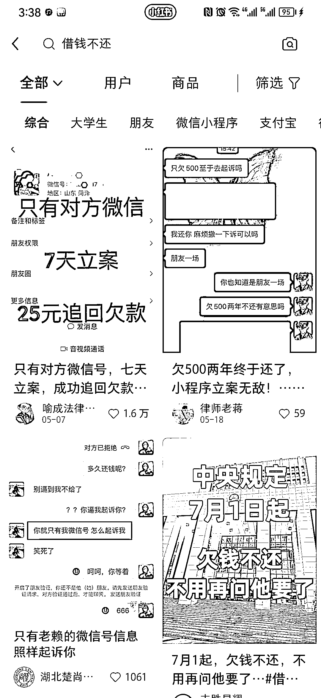

# 自己接单转律所，小红书立案查询费用高于拼多多

> 原文：[`www.yuque.com/for_lazy/xkrm14/kyz8rxqpui1izkvg`](https://www.yuque.com/for_lazy/xkrm14/kyz8rxqpui1izkvg)

作者： 左飞

日期：2023-06-30

点赞数：114

正文：

一个信息差，欠钱不还。自己接单转律所 小红书立案查询在 1500 左右，PDD 在 700 左右。各大平台都可以引流，一半利润[得意] 重点：小红书在花广告费推广

  

  

  

评论区：

周宇 : 这个厉害了

我的名字叫蓝 : 理解：接单欠钱不还的客户。转手让律所处理，赚取差价。

马律师|沈阳 : 不要做太多，侵犯公民个人信息罪。

左飞 : 可以具体讲讲，侵犯公民信息罪是指哪些了？单纯请教[抱拳]

Mr.冯 : 我这可以做后端

恒一 : 留个联系方式

比心飞扬 : 价格多少[呲牙][呲牙]

公众号懒人找资源，懒人专属群分享

