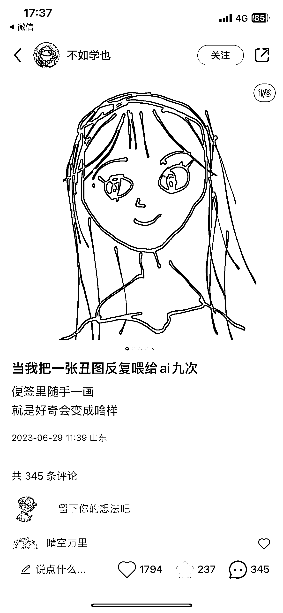

# 小红书上有趣的素人发的 AI 绘画作品，值得一试

> 原文：[`www.yuque.com/for_lazy/xkrm14/vk81tii8xc6pqiw8`](https://www.yuque.com/for_lazy/xkrm14/vk81tii8xc6pqiw8)

作者： sky 陈天

日期：2023-06-30

点赞数：118

正文：

这个小红书赞藏挺多的，是一个素人发的，比较有趣，ai 绘画的可以试试

  

  

评论区：

百宝 : 说是美图 ai 的软广 不过效果还挺不错

sky 陈天 : 那这软广也不错

伟业 : 理解：通过把丑图变为美图的效果展示，吸引对 AI 绘画感兴趣的人，通过广告，卖账号，收徒等变现。是一种不错的流量姿势

sky 陈天 : 今天再看一已经 6k 赞了，而且好像是美图秀秀的软广

sky 陈天 : [强][强][强]总结到位

Super 六六 : 小红书自身有这个涂鸦功能在内测

Frank 老师 : 用美图，比使用国外的 MidJourney 等软件的门槛低了很多，容易推广

公众号懒人找资源，懒人专属群分享

</ne-p></ne-p>