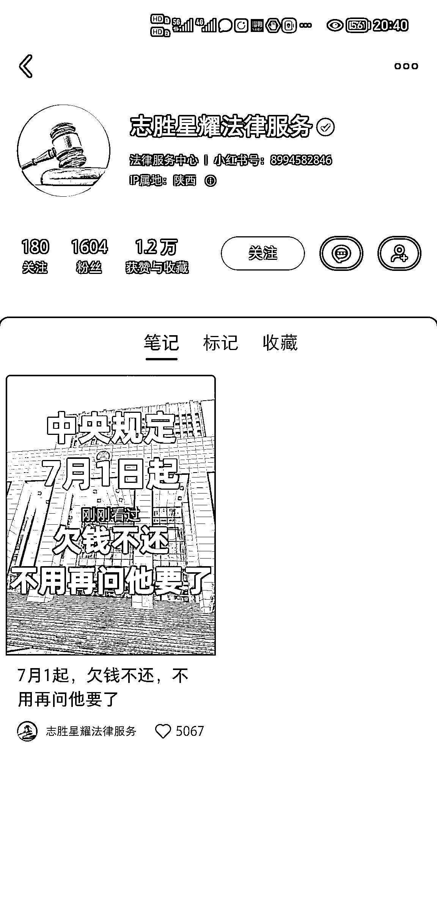

# 小红书、抖音视频号收集客户，法律团队代写文书，利润可达 1600 元

> 原文：[`www.yuque.com/for_lazy/xkrm14/zu4rmu051iheg2ar`](https://www.yuque.com/for_lazy/xkrm14/zu4rmu051iheg2ar)

作者： 星星之火

日期：2023-06-27

点赞数：106

<ne-hole id="u93b4eb0d" data-lake-id="u93b4eb0d">

正文：

分享一个我 4 月份去卧底武汉那边新媒体公司，了解到的一个项目——《欠债法律起诉》。一般通过小红书，抖音视频号收集客户，然后对接到法律团队，拿提成。当时了解到的收费是 2000 到 5000 一单，服务内容帮客户在小程序提起诉讼，然后代写文书，让客户自己上庭起诉。要是有周围做律师的更好，几乎没什么成本。没有律师可以淘宝找人服务，400 元一个。一单利润最低 1600，有资源的可以做一下。

  <ne-p id="uef60a0c1" data-lake-id="uef60a0c1">  <ne-p id="u3a3945d6" data-lake-id="u3a3945d6">  <ne-p id="u440e9616" data-lake-id="u440e9616">  <ne-p id="u1f920153" data-lake-id="u1f920153">  <ne-p id="u81fea186" data-lake-id="u81fea186">  <ne-p id="ucbfba2f7" data-lake-id="ucbfba2f7">  <ne-p id="u54f3a86e" data-lake-id="u54f3a86e">  <ne-hole id="uf5ef637b" data-lake-id="uf5ef637b"><ne-p id="u969b8480" data-lake-id="u969b8480">评论区：

翰飞 : 这个需求，今年很多

Mr.冯 : 有人做流量吗？我这里可以做后端，全国大部分地区可做。

木头小哥 : 留个微

Mr.冯 : 看我主页有

<ne-hole id="u789187d5" data-lake-id="u789187d5">

公众号懒人找资源，懒人专属群分享

</ne-hole></ne-hole></ne-p></ne-p></ne-p></ne-p></ne-p></ne-p></ne-p></ne-p></ne-hole>