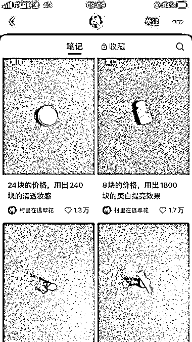
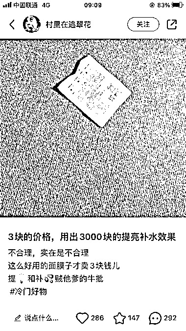

# 种草文案+简洁图片，1.3 万粉丝的护肤博主揭秘成功秘诀

> 原文：[`www.yuque.com/for_lazy/xkrm14/qzsc2g6k1igioxe7`](https://www.yuque.com/for_lazy/xkrm14/qzsc2g6k1igioxe7)

<ne-text id="ufb42b417">作者： 白白盼盼</ne-text>

<ne-text id="ue118544c">日期：2023-06-30</ne-text>

<ne-text id="u71be4fc9">点赞数：</ne-text><ne-text id="u50c9afe6" ne-bold="true">80</ne-text>

<ne-hole id="ua17cc35b" data-lake-id="ua17cc35b"><ne-card data-card-name="hr" data-card-type="block" id="Q1AAu" data-event-boundary="card">

<ne-text id="udddf4a7f">正文：</ne-text>

<ne-text id="u0e5bb65a">一个仅用种草文案+简洁图片就收获了 1.3 万粉丝的护肤博主 标题利用价格对比+突出功效，比如“3 块的价格，用出 3000 块的提亮补水效果”</ne-text> <ne-text id="u8fbcb0cf">内容都是在输出情绪价值，引发女生共鸣，很有记忆点，粉丝粘性极高</ne-text>

<ne-card data-card-name="image" data-card-type="inline" id="Qz3LK" data-event-boundary="card">  <ne-p id="u360e461d" data-lake-id="u360e461d"><ne-card data-card-name="image" data-card-type="inline" id="neVSm" data-event-boundary="card">  <ne-p id="u2e071a6d" data-lake-id="u2e071a6d"><ne-card data-card-name="image" data-card-type="inline" id="J2UH4" data-event-boundary="card">  <ne-hole id="uf299acf4" data-lake-id="uf299acf4"><ne-card data-card-name="hr" data-card-type="block" id="B66E6" data-event-boundary="card"><ne-p id="u37423f7a" data-lake-id="u37423f7a"><ne-text id="ue8ebeb74">评论区：</ne-text>

<ne-text id="uc46adaa7">白白盼盼 : 感谢老大[害羞]</ne-text>

<ne-text id="u8ea34097">Frank 老师 : 理解：通过种草文案和简洁图片，强调价格优势和产品功效，输出情绪价值引发女性用户共鸣，成功吸引并保持了 1.3 万粉丝的高粘性。</ne-text>

<ne-text id="uf24f6bbb">Frank 老师 : 这些标题和文案的模式可以总结为： 1\. 价格对比效果：用较低的价格来展示相对高昂的效果。格式为“X 块的价格，用出 Y 块的(Z 功效)”。 2.</ne-text> <ne-text id="u535240df">强调商品性价比：通过强调价格低廉而效果显著，来突出商品的高性价比。例如“不合理，实在是不合理这么好用的面膜子才卖 3 块钱儿提，和补品贼他爹的牛批”。</ne-text>

<ne-text id="u150895e3">Frank 老师 : 这种风格可以用 AI 快速模仿： "5 块的价格，用出 500 块的深层清洁效果。" "10 块的价格，用出 2000 块的紧致肌肤效果。"</ne-text> <ne-text id="ucfbb8e7d">"15 块的价格，用出 1500 块的抗衰老效果。" "不可思议，实在是不可思议这么有效的护肤品只卖 10 块钱，简直比奢侈品还要牛逼！"</ne-text>

<ne-text id="u149fc929">白白盼盼 : 厉害👍🏻不愧是 Frank 老师</ne-text>

<ne-text id="u2922ea90">Frank 老师 : [呲牙][呲牙]</ne-text>

<ne-text id="u4467cf60">e 姨。 : 这号 后面的要怎么变现呢？接广告？</ne-text>

<ne-hole id="u0b3d2f91" data-lake-id="u0b3d2f91"><ne-card data-card-name="hr" data-card-type="block" id="SIAm7" data-event-boundary="card">

<ne-text id="ua269eb61">公众号懒人找资源，懒人专属群分享</ne-text>

</ne-card></ne-hole></ne-card></ne-hole></ne-card></ne-p></ne-card></ne-p></ne-card></ne-p></ne-card></ne-hole>