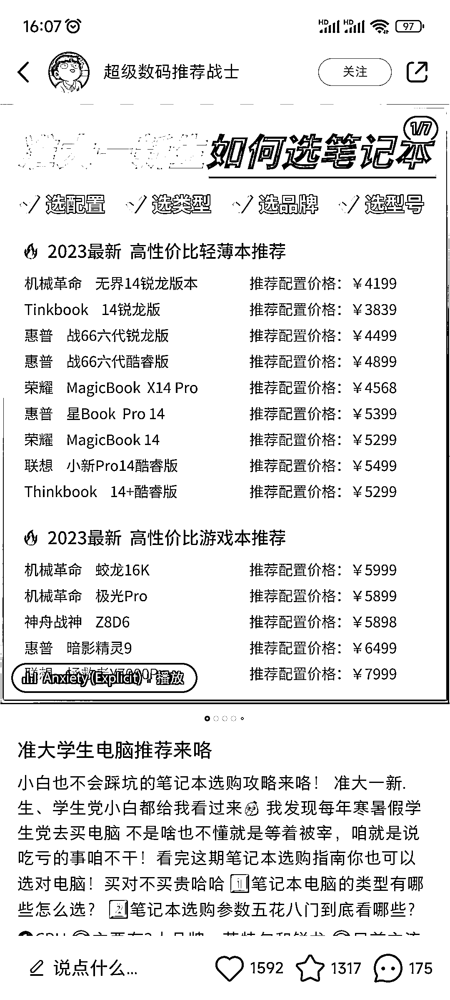
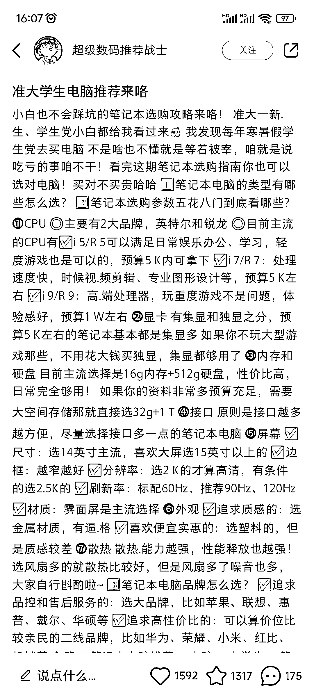
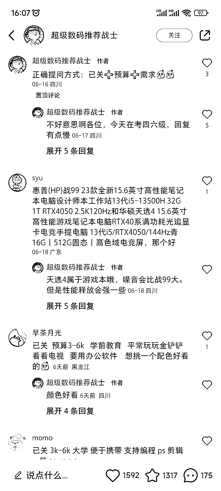
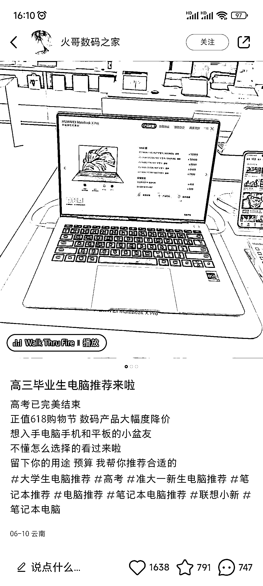

# 小红书热门笔记：准大学生和高三毕业生电脑推荐，引发关注和讨论

> 原文：[`www.yuque.com/for_lazy/xkrm14/gz99a0hhf26m9yqy`](https://www.yuque.com/for_lazy/xkrm14/gz99a0hhf26m9yqy)

作者： 九香虫

日期：2023-06-27

点赞数：74

正文：

小红书一篇【准大学生电脑推荐】【高三毕业生电脑推荐】笔记，挺火🔥，评论区引导提问方式:已关➕预算➕需求，底下评论区一群关注并将需求及预算留言的。看评论用户不止准大学生需求电脑，还有一些大二或者想换电脑的人群。准大学生、高三毕业生字样还可趁波流量。

  

  

  

  

  

评论区：

九香虫 : 感谢！！！[呲牙]

老彭 : 我最近也在帮弟弟挑电脑，在看小红书

九香虫 : 现在不少人查一些东西会选择上小红书搜，例如:旅游攻略……

公众号懒人找资源，懒人专属群分享

</ne-p></ne-p></ne-p></ne-p></ne-p>