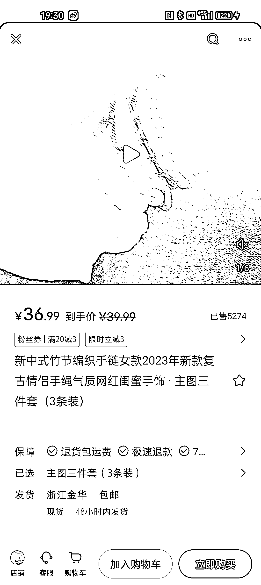
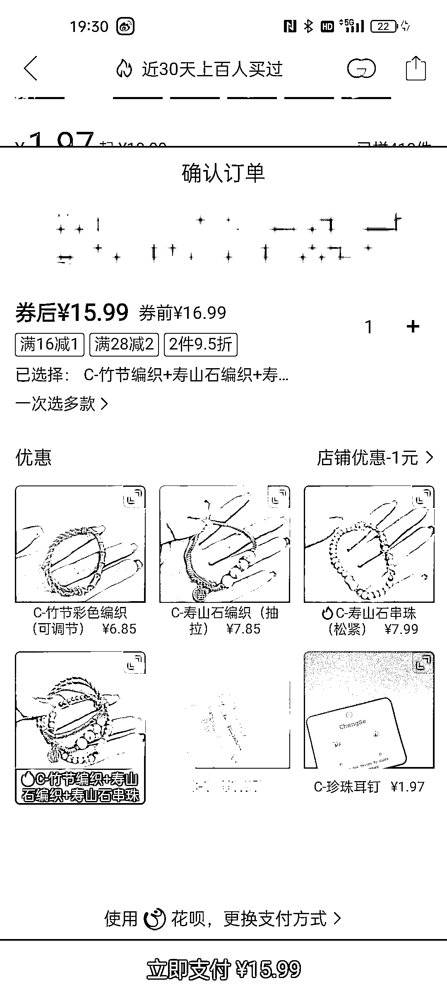

# 小红书卖首饰，玄学风格照片吸引众多购买者

> 原文：[`www.yuque.com/for_lazy/xkrm14/vw3hwhqzpw8m2pnw`](https://www.yuque.com/for_lazy/xkrm14/vw3hwhqzpw8m2pnw)

<ne-p id="udc4e4e52" data-lake-id="udc4e4e52"><ne-text id="ue09371e5">作者： 沐琳</ne-text></ne-p> <ne-p id="ud22b86d9" data-lake-id="ud22b86d9"><ne-text id="u54f85bc4">日期：2023-06-29</ne-text></ne-p> <ne-p id="uf1c08958" data-lake-id="uf1c08958"><ne-text id="u8d698e23">点赞数：</ne-text><ne-text id="u03fb9933" ne-bold="true">67</ne-text></ne-p> <ne-hole id="uc6033373" data-lake-id="uc6033373"><ne-card data-card-name="hr" data-card-type="block" id="En0Bs" data-event-boundary="card"><ne-p id="u4c81e061" data-lake-id="u4c81e061"><ne-text id="uedbd2efa">正文：</ne-text></ne-p> <ne-p id="ua4bd213e" data-lake-id="ua4bd213e"><ne-text id="u7aa9b6d5">小红书卖首饰，买的人还不少，小红书很吃这类风格的照片，最好玩法是跟玄学挂钩，客单价提高，弄些设计款 diy 款，客户粘性很高的，人家买的是服务审美，不掉进卷价格的坑里。</ne-text></ne-p> <ne-p id="ub9fd08e8" data-lake-id="ub9fd08e8"><ne-card data-card-name="image" data-card-type="inline" id="L90QW" data-event-boundary="card">  <ne-p id="uf3c457e9" data-lake-id="uf3c457e9"><ne-card data-card-name="image" data-card-type="inline" id="mxlKK" data-event-boundary="card">  <ne-p id="u1112ccc5" data-lake-id="u1112ccc5"><ne-card data-card-name="image" data-card-type="inline" id="zQotO" data-event-boundary="card">  <ne-p id="u68f93356" data-lake-id="u68f93356"><ne-card data-card-name="image" data-card-type="inline" id="tPkos" data-event-boundary="card">  <ne-hole id="ud65e4b6f" data-lake-id="ud65e4b6f"><ne-card data-card-name="hr" data-card-type="block" id="SlRkd" data-event-boundary="card"><ne-p id="ue6b94092" data-lake-id="ue6b94092"><ne-text id="u747284e3">评论区：</ne-text></ne-p> <ne-p id="u8419b83f" data-lake-id="u8419b83f"><ne-text id="ub031cd9c">BLUE : 杭州西湖边上的寺庙玩的很 6</ne-text></ne-p> <ne-p id="u4b52334a" data-lake-id="u4b52334a"><ne-text id="u4f7a5c9b">Frank 老师 : 理解：小红书上销售首饰的模式成功地提升了客单价和客户粘性，其关键在于结合审美服务与玄学元素，避免陷入价格竞争。同时，新中式设计和 DIY 元素也吸引了大量购买者。</ne-text></ne-p> <ne-p id="u43db2a8c" data-lake-id="u43db2a8c"><ne-text id="uf5a05e43">闫君 : 讲讲呗[呲牙]</ne-text></ne-p> <ne-p id="u921cf582" data-lake-id="u921cf582"><ne-text id="udbcf7866">李天心天总 : 哪里有货源哇</ne-text></ne-p> <ne-hole id="u82af9cfc" data-lake-id="u82af9cfc"><ne-card data-card-name="hr" data-card-type="block" id="UkAsZ" data-event-boundary="card"><ne-p id="ubdcc12e0" data-lake-id="ubdcc12e0"><ne-text id="u1dc415ad">公众号懒人找资源，懒人专属群分享</ne-text></ne-p></ne-card></ne-hole></ne-card></ne-hole></ne-card></ne-p></ne-card></ne-p></ne-card></ne-p></ne-card></ne-p></ne-card></ne-hole>