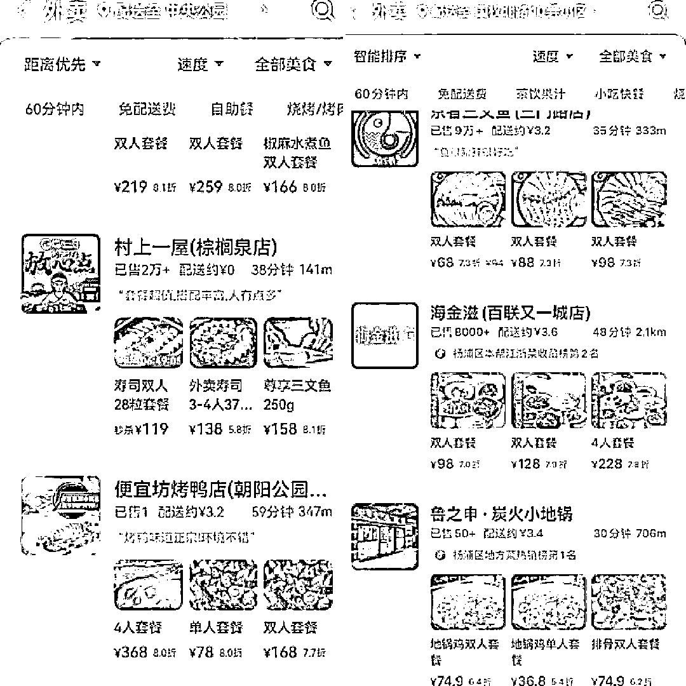

# 抖音外卖调整策略，主攻中高客单价市场，避开与美团、饿了么直接竞争

> 原文：[`www.yuque.com/for_lazy/xkrm14/cdeakoegp4or9d9t`](https://www.yuque.com/for_lazy/xkrm14/cdeakoegp4or9d9t)

<ne-p id="u2320839a" data-lake-id="u2320839a"><ne-text id="u92e62d1c">作者： Hai 陽</ne-text></ne-p> <ne-p id="u6f7ad855" data-lake-id="u6f7ad855"><ne-text id="u6c8d69c6">日期：2023-06-27</ne-text></ne-p> <ne-p id="ub925b04e" data-lake-id="ub925b04e"><ne-text id="u42542f29">点赞数：</ne-text><ne-text id="u9049cb3c" ne-bold="true">50</ne-text></ne-p> <ne-hole id="ua671a366" data-lake-id="ua671a366"><ne-card data-card-name="hr" data-card-type="block" id="E0T3X" data-event-boundary="card"><ne-p id="u6bb825e7" data-lake-id="u6bb825e7"><ne-text id="u85995bed">正文：</ne-text></ne-p> <ne-p id="u36a95a47" data-lake-id="u36a95a47"><ne-text id="u4f0c9acc">抖音外卖调整策略，主攻 60 元以上套餐，以中高客单价 避开与美团，饿了么外卖平台直接竞争</ne-text> <ne-text id="ud84708a4">。抖音做外卖存在交易效率的短板。而效率低来自于两方面，一是用户心智，外卖的主要场景是即时性用餐，美团、饿了么外卖平台的强大用户心智+强搜索属性可帮助用户即时获取商品信息，相比而言抖音的刷视频获取商品信息模式，较为低效；二是配送短板，美团、饿了么外卖平台自建的强大配送体系的高效率，则是抖音依靠顺丰等第三方运力的模式难以匹配的。为了匹配这种弱时效的需求，抖音外卖还上线了“先囤后约”功能——当用户打开抖音，受到短视频的激发从而购买了团购套餐后，可以预约一个特定时间送到家中。而进一步明确主打 60 元中高客单价市场，也将降低与美团、饿了么外卖平台的直接竞争。</ne-text></ne-p> <ne-p id="u37f6c9ed" data-lake-id="u37f6c9ed"><ne-card data-card-name="image" data-card-type="inline" id="BjoG7" data-event-boundary="card">  <ne-hole id="u32af10e4" data-lake-id="u32af10e4"><ne-card data-card-name="hr" data-card-type="block" id="PGsVh" data-event-boundary="card"><ne-p id="u11497e5f" data-lake-id="u11497e5f"><ne-text id="uf9767b99">评论区：</ne-text></ne-p> <ne-p id="uec0c8e9e" data-lake-id="uec0c8e9e"><ne-text id="u2cd93031">Hai 陽 : 谢谢</ne-text></ne-p> <ne-p id="u7891cf36" data-lake-id="u7891cf36"><ne-text id="u837da70a">三林 : 难做的业务，只会逐步式微</ne-text></ne-p> <ne-p id="uc5e29a5c" data-lake-id="uc5e29a5c"><ne-text id="u3d6ffe8b">Hai 陽 : [强][强]</ne-text></ne-p> <ne-hole id="u8c6ba791" data-lake-id="u8c6ba791"><ne-card data-card-name="hr" data-card-type="block" id="KEZzb" data-event-boundary="card"><ne-p id="u7c18e4b5" data-lake-id="u7c18e4b5"><ne-text id="u22df6141">公众号懒人找资源，懒人专属群分享</ne-text></ne-p></ne-card></ne-hole></ne-card></ne-hole></ne-card></ne-p></ne-card></ne-hole>