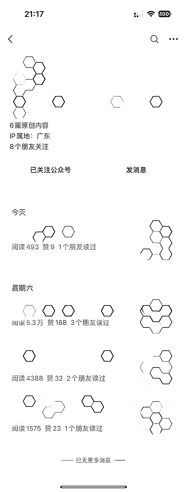

# 公众号流量主，ChatGPT+Ai 绘画，3 天入池

> 原文：[`www.yuque.com/for_lazy/xkrm14/dqboouc6lnv01r0n`](https://www.yuque.com/for_lazy/xkrm14/dqboouc6lnv01r0n)

作者： 元彻

日期：2023-06-26

点赞数：67

正文：

公众号流量主，chatgpt+Ai 绘画，3 天入池，5w+ 同时起老号和 0 粉号，确实老号入池容易些

  <ne-p id="u9375afef" data-lake-id="u9375afef">

评论区：

思行 Super : 情感文+美女图嘛？

元彻 : 是的

思行 Super : 牛逼[强]

元彻 : 谢谢，有兴趣可以试一下

思行 Super : 有个点不明白，假如是当做文章配图，AI 绘画和美女配图有什么不一样的作用嘛？[疑问]

羽落 : 老哥，请教个问题，情感文和美女图的比重是怎么分配的，就是偏重哪一块？最近也在整这个，也会进池子，但是最高阅读量也就 1000 左右。

元彻 : 我感觉文 1:图 9，然后图片尽量偏真实和有质感，让看的人有视觉享受但又不违规。 入池了就坚持更，靠量博运气。

羽落 : 在问一个(有点脸皮厚了)😆，标题会带 Ai 绘画一类的关键字吗？

公众号懒人找资源，懒人专属群分享

</ne-p>