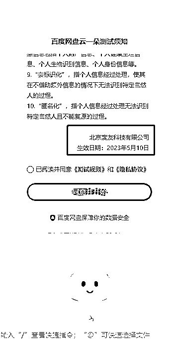
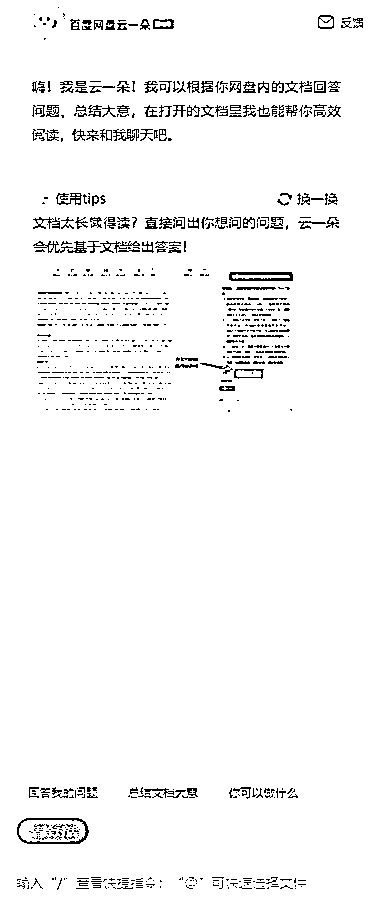
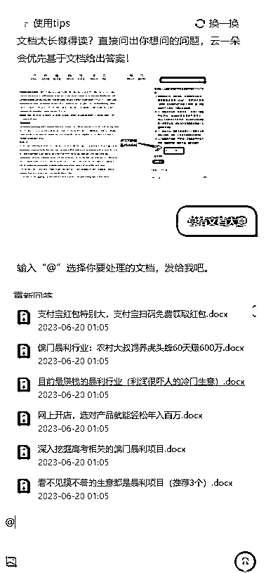
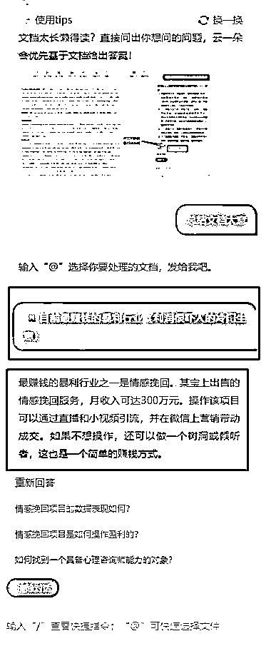
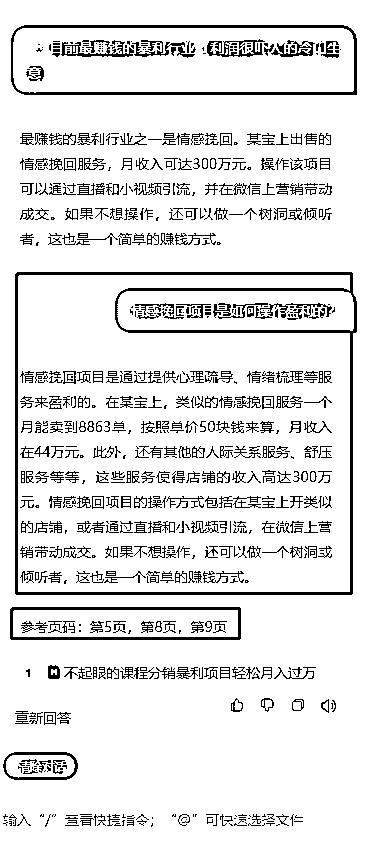

# 百度网盘内测 AI 功能，提升创作灵感和内容阅读效率

> 原文：[`www.yuque.com/for_lazy/xkrm14/vk5d2hnp3509m3ca`](https://www.yuque.com/for_lazy/xkrm14/vk5d2hnp3509m3ca)

<ne-text id="uccc9b430">作者： 施霖终生学习者-链接</ne-text>

<ne-text id="ub13b8824">日期：2023-06-27</ne-text>

<ne-text id="ub5776f76">点赞数：</ne-text><ne-text id="u4a038d14" ne-bold="true">101</ne-text>

<ne-hole id="u6d135572" data-lake-id="u6d135572"><ne-card data-card-name="hr" data-card-type="block" id="gwXhE" data-event-boundary="card">

<ne-text id="u08915392">正文：</ne-text>

<ne-text id="uef86b897">今天登录百度网盘帮人下载个资料， 跳出来内测的栏目 #百度云一朵 我习惯性的去操作了下每个步骤， 感觉很丝滑 原来网盘加上 AI 还可以这么玩</ne-text> <ne-text id="u416025a9">现在发现的是可以 AI 总结文档要点 提高创作灵感，做内容 快速阅读📖，提取重点 还可以关联发问， 这样做爆款内容和解读研报， 做相关的内容很丝滑</ne-text> <ne-text id="ufa60a9be">我想到几个点， 可以去尝试， 1.用云一朵解读研报， 然后把提取的重点加部分研报， 发小红书或者其他平台， 留钩子发研报全部内容， 结合网盘拉新，</ne-text> <ne-text id="u1d57a859">可以有正反馈。 2.做虚拟资源的， 可以用工具🛠️二创下， 最近公众号的带货和广告互选平台出来了， 很多流量在公众号， 可以出爆款内容，</ne-text> <ne-text id="u36f08ef6">流量主和接广告变现！ 3.结合视频内容， 提供脚本服务， 或者批量剪辑， 做图文视频， 壁纸，文案，情感，音乐号， 都可以再来， 4.其他的还很多，</ne-text> <ne-text id="u2ebc515f">圈友们可以评论区留言， ㊗️生财有术啊[呲牙]</ne-text>

<ne-card data-card-name="image" data-card-type="inline" id="stEow" data-event-boundary="card"></ne-card>

<ne-card data-card-name="image" data-card-type="inline" id="DRr1L" data-event-boundary="card"></ne-card>

<ne-card data-card-name="image" data-card-type="inline" id="IcZET" data-event-boundary="card"></ne-card>

<ne-card data-card-name="image" data-card-type="inline" id="KxoR2" data-event-boundary="card"></ne-card>

<ne-card data-card-name="image" data-card-type="inline" id="l2Pdr" data-event-boundary="card"></ne-card>

<ne-card data-card-name="image" data-card-type="inline" id="rwhON" data-event-boundary="card"></ne-card>

<ne-card data-card-name="image" data-card-type="inline" id="ucnSu" data-event-boundary="card"></ne-card>

<ne-hole id="ubada69a8" data-lake-id="ubada69a8"><ne-card data-card-name="hr" data-card-type="block" id="qQRRw" data-event-boundary="card">

<ne-text id="u021b7fe1">评论区：</ne-text>

<ne-text id="u966b8d2a">胖大魔 : 妙啊，今天风向标好水，你的干货满满</ne-text>

<ne-text id="u503bdefd">倪大胖 : 这个有点像 chatpdf</ne-text>

<ne-text id="u25218d16">晨冬 : 同感</ne-text>

<ne-text id="uc5431b3f">施霖终生学习者-链接 : 谢谢，</ne-text>

<ne-text id="ua2677c49">施霖终生学习者-链接 : 是的，期待更多精彩，</ne-text>

<ne-text id="u80217352">火星的土著 : 提示我，年卡用户加速排队中。。。。</ne-text>

<ne-text id="u41c443ea">liong : 学习 ing</ne-text>

<ne-hole id="u8b6930e9" data-lake-id="u8b6930e9"><ne-card data-card-name="hr" data-card-type="block" id="k4rQH" data-event-boundary="card">

<ne-text id="u6c17d2ad">公众号懒人找资源，懒人专属群分享</ne-text>

</ne-card></ne-hole></ne-card></ne-hole></ne-card></ne-hole>