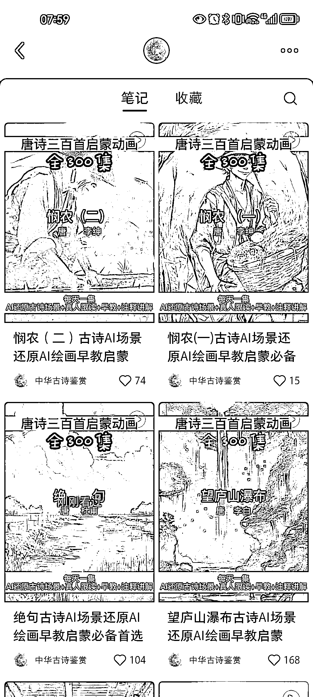

# AI 绘画唐诗 300 首，涨粉近 4000，适合批量生产和教育场景

> 原文：[`www.yuque.com/for_lazy/xkrm14/zdeoaf6gymgok8ee`](https://www.yuque.com/for_lazy/xkrm14/zdeoaf6gymgok8ee)

作者： Daemon

日期：2023-06-30

点赞数：112

<ne-hole id="u8c991e49" data-lake-id="u8c991e49"><ne-card data-card-name="hr" data-card-type="block" id="jqITp" data-event-boundary="card">

正文：

另类小说推文，将唐诗 300 首用 ai 绘画，每句诗用 sd 生成一张图片，发了 12 个视频，涨粉近 4000。 适合直接批量生产，也可以应用在特定场景下，比如小学生必背的 XX 首唐诗/宋词，“孩子不喜欢背诗，让孩子爱上诗”等等

<ne-card data-card-name="image" data-card-type="inline" id="BDjm7" data-event-boundary="card">  <ne-p id="u26762926" data-lake-id="u26762926"><ne-card data-card-name="image" data-card-type="inline" id="ogsvY" data-event-boundary="card">  <ne-hole id="u2075c48a" data-lake-id="u2075c48a"><ne-card data-card-name="hr" data-card-type="block" id="hwMzH" data-event-boundary="card"><ne-p id="u0a897aa1" data-lake-id="u0a897aa1">评论区：

万简 : sd 是什么

Daemon : stable diffusion

万律师 : 这个刚和在小红书看到的一个思路契合，还准备发风向标呢

mikan 阿橘 KK* : 这种号怎么变现呢？

💪🏻吉吉积极向上 : 有需求就有产品

伟业 : 理解：利用 AI 绘画为古诗配图，吸引小学家长，解决孩子不爱学习古诗的问题。变现可以引流私域，卖小学生的教培课程

小白脸 : 这个创意我之前想过，可以做成绘本，但是不知道是不是牵扯版权问题。

<ne-hole id="u5e6bf32e" data-lake-id="u5e6bf32e"><ne-card data-card-name="hr" data-card-type="block" id="scx70" data-event-boundary="card">

公众号懒人找资源，懒人专属群分享

</ne-card></ne-hole></ne-card></ne-hole></ne-card></ne-p></ne-card></ne-p></ne-card></ne-hole>