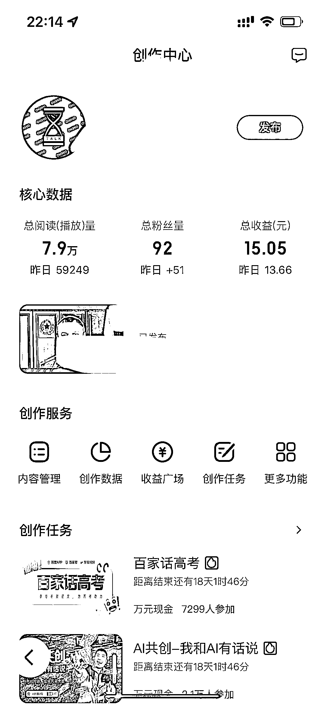

# 百度 AI 创作，每天免费做 3 个视频，收入惊喜增长

> 原文：[`www.yuque.com/for_lazy/xkrm14/yxkzz14u798ufvq4`](https://www.yuque.com/for_lazy/xkrm14/yxkzz14u798ufvq4)

作者： 叉叉敌

日期：2023-06-27

点赞数：85

<ne-hole id="u82195ff9" data-lake-id="u82195ff9">

正文：

百度最近有个 ai 创作，4 分钟出一个视频，每天免费可以做 3 个视频 我试了下，做了几个视频，今天打开一看，收入居然 10 块了， 量化，多搞几个账号，对发几个视频 做公众号的建议也试试这个，一鱼多吃😏😏😏

  <ne-hole id="u54aef329" data-lake-id="u54aef329"><ne-p id="uac52654f" data-lake-id="uac52654f">评论区：

刘卡卡 : 是在什么软件做

叉叉敌 : 百度自带 ai 成片

卢思羽 : 百度搜百家号，然后登录进去，点击发布内容后，会出现 AI 成片。这个是百度自身的一个功能，不是什么软件

花满楼 : 这个怎么变现

MSLY-SKY : [强]

叉叉敌 : 广告，还有就是到货

李九折 : 做了一个月，收入不到 10 块。😂你做的什么垂类啊，流量这么高

<ne-hole id="udfb4e591" data-lake-id="udfb4e591">

公众号懒人找资源，懒人专属群分享

</ne-hole></ne-hole></ne-p></ne-hole>