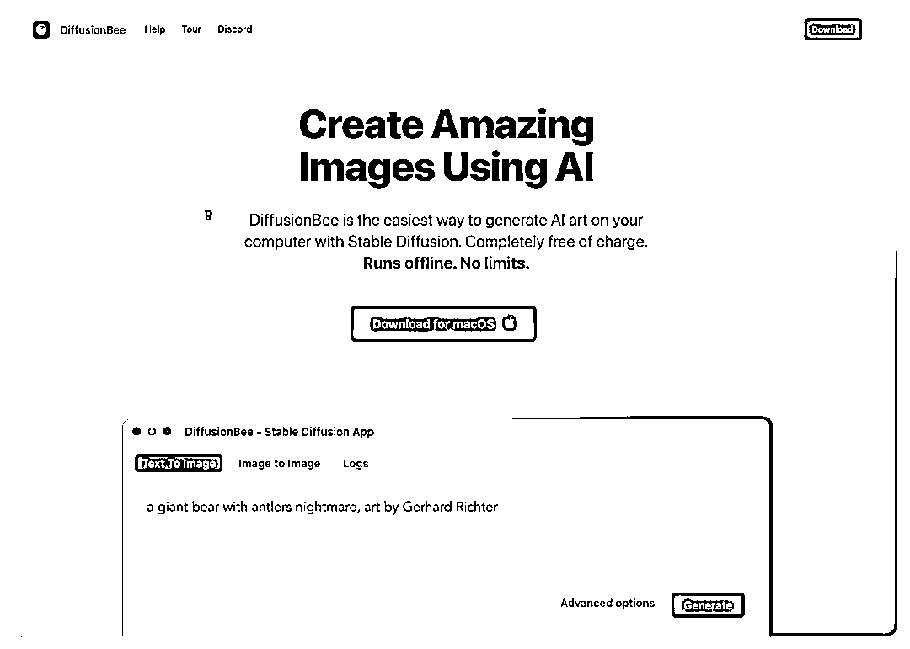

# Mac 用户福利，DiffusionBee AI 2.0 版本发布，支持无限 AI 画布和第三方模型

> 原文：[`www.yuque.com/for_lazy/xkrm14/aga167b0hus4hnvk`](https://www.yuque.com/for_lazy/xkrm14/aga167b0hus4hnvk)

作者： D-

日期：2023-06-29

点赞数：90

正文：

Mac 用户大福利，可以直接 AI 生成视频📀 刚刚 diffusionbee 更新了 2.0 版本🧨🧨🧨 我立刻下载体验 🤖 通过 Deforum 完成 AI 生成视频 🏞️ 支持无限 AI 画布，自由修改图片 🚀 支持各种第三方模型 [DiffusionBee- StableDiffusionAppforAIArt](https://diffusionbee.com/)

  

评论区：

D- : 原贴链接 [https://twitter.com/punk2898/status/16714254363358...](https://twitter.com/punk2898/status/1671425436335874051?s=61&t=eiWuOh2mGKUwEsb2CZ9sOg)

D- : 原来 2.0 版本还在内测。。在这里下载。[Releasesdivamguptadiffusionbee-stable-diffusion-ui...](https://github.com/divamgupta/diffusionbee-stable-diffusion-ui/releases)

D- : Deforum Video 效果

D- :

看好你 : 你好 我下载模型为啥一直下载不下来呢？提示稍后再试 一直都是 下载软件的时候没有开 V ，下载模型的时候尝试过 2 种方法 开 V 和不开 V 但是 都不行

D- : 多试几次 网络问题

看好你 : 需要开 V 吗？

公众号懒人找资源，懒人专属群分享

