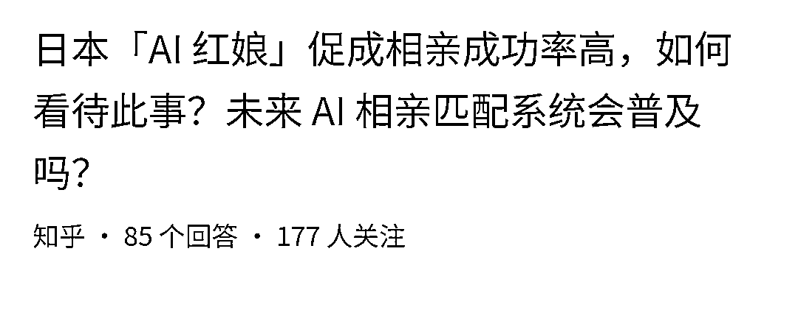
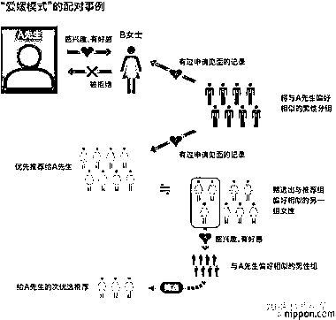

# AI 红娘：本地相亲引流新利器

> 原文：[`www.yuque.com/for_lazy/xkrm14/obpaccuvyhfo6rq9`](https://www.yuque.com/for_lazy/xkrm14/obpaccuvyhfo6rq9)

<ne-p id="ufc564c58" data-lake-id="ufc564c58"><ne-text id="u0747c054">作者： 苟有恒</ne-text></ne-p> <ne-p id="u033f056d" data-lake-id="u033f056d"><ne-text id="u62ecabc3">日期：2023-06-29</ne-text></ne-p> <ne-p id="u9ceba250" data-lake-id="u9ceba250"><ne-text id="u28699994">点赞数：</ne-text><ne-text id="u5f01d0db" ne-bold="true">78</ne-text></ne-p> <ne-hole id="u1d154893" data-lake-id="u1d154893"><ne-card data-card-name="hr" data-card-type="block" id="HDO0a" data-event-boundary="card"><ne-p id="u78484455" data-lake-id="u78484455"><ne-text id="u50fa392d">正文：</ne-text></ne-p> <ne-p id="u59db815b" data-lake-id="u59db815b"><ne-text id="uc9ba5352">AI 红娘，数据匹配，管不管用先放一边，至少可以用来本地相亲引流。</ne-text></ne-p> <ne-p id="u23f973c1" data-lake-id="u23f973c1"><ne-card data-card-name="image" data-card-type="inline" id="L2N2Q" data-event-boundary="card"></ne-card></ne-p> <ne-p id="u0ba19bc1" data-lake-id="u0ba19bc1"><ne-card data-card-name="image" data-card-type="inline" id="EehiN" data-event-boundary="card"></ne-card></ne-p> <ne-hole id="u03819112" data-lake-id="u03819112"><ne-card data-card-name="hr" data-card-type="block" id="h5I3P" data-event-boundary="card"><ne-p id="ub45ede76" data-lake-id="ub45ede76"><ne-text id="u7525fd0a">评论区：</ne-text></ne-p> <ne-p id="uc0c23e00" data-lake-id="uc0c23e00"><ne-text id="u874ac50e">胖大魔 : 妙</ne-text></ne-p> <ne-p id="u8923207b" data-lake-id="u8923207b"><ne-text id="u1f2f1017">金九渊 : 6</ne-text></ne-p> <ne-p id="u7f5aa184" data-lake-id="u7f5aa184"><ne-text id="u48a70401">苟有恒 : 感谢亦仁的肯定</ne-text></ne-p> <ne-p id="u6c614737" data-lake-id="u6c614737"><ne-text id="uc076d7d0">沧鸣北望 : 大哥可以再提示一下么？怎么用来本地相亲引流？</ne-text></ne-p> <ne-p id="ua3bb26f5" data-lake-id="ua3bb26f5"><ne-text id="u56cb2f03">我的名字叫蓝 : 个人理解：这个应该是做一个差异化的东西。 让客户觉得匹配到的人更科学化和优质。 人对机器的信任度可能已经大于对同类的信任度。</ne-text></ne-p> <ne-p id="u133a10f7" data-lake-id="u133a10f7"><ne-text id="u9bd4ee52">Frank 老师 : 理解：AI 红娘利用数据匹配帮助单身人士找到理想的配对，尽管其有效性有待商榷，但无疑提供了一种新的引流方式。例如，日本的 TAI 红娘以高的相亲成功率闻名。它利用用户数据进行配对，并根据偏好相似的男女进行筛选和推荐。这种应用可以预见在未来的相亲和配对系统中越来越普及。</ne-text></ne-p> <ne-hole id="u00000285" data-lake-id="u00000285"><ne-card data-card-name="hr" data-card-type="block" id="xNvD8" data-event-boundary="card"><ne-p id="u6f659ac8" data-lake-id="u6f659ac8"><ne-text id="u9e6c4128">公众号懒人找资源，懒人专属群分享</ne-text></ne-p></ne-card></ne-hole></ne-card></ne-hole></ne-card></ne-hole>