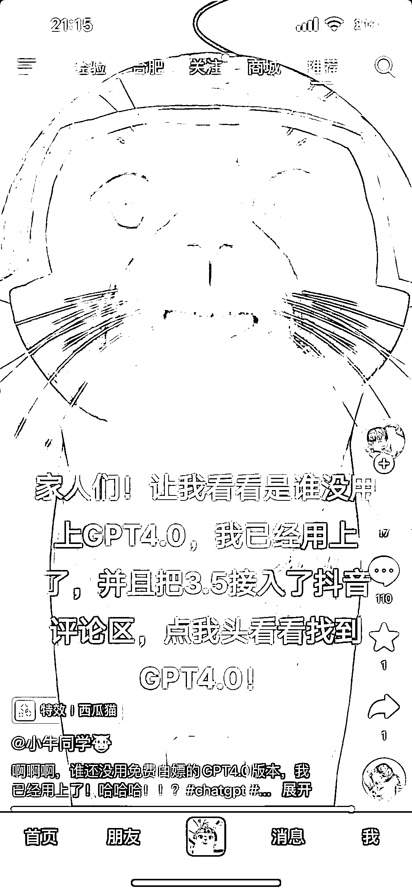

# 使用 ChatGPT 在线直播进行抖音自动回复，回复速度快得惊人

> 原文：[`www.yuque.com/for_lazy/xkrm14/tb292tm171xzdkgf`](https://www.yuque.com/for_lazy/xkrm14/tb292tm171xzdkgf)

作者： 罍啦

日期：2023-06-26

点赞数：61

<ne-hole id="u7e63bc46" data-lake-id="u7e63bc46"><ne-card data-card-name="hr" data-card-type="block" id="A4GTn" data-event-boundary="card">

正文：

用 GPT 在线直播输入问题的玩法刚刚出来，这个人已经把 GPT 接入了抖音自动回复，亲测，回复速度还是很快的，人工很难达到。 各位大佬知不知道如何做到的，1 小时可以达到一百多的评论，以后流量肯定会爆起来。

<ne-card data-card-name="image" data-card-type="inline" id="zzNjc" data-event-boundary="card"></ne-card>

<ne-card data-card-name="image" data-card-type="inline" id="mrrlN" data-event-boundary="card"></ne-card>

<ne-hole id="u74e262af" data-lake-id="u74e262af"><ne-card data-card-name="hr" data-card-type="block" id="jhLmK" data-event-boundary="card">

评论区：

技术老 baby : 利用 RPA 或者 chrome 插件开发自动回复机器人就能实现

李彬 : 直播能用吗？

罍啦 : 直播时间充裕，可以自己输入问题，抖音回复要做自动化

罍啦 : 感谢大佬

李彬 : 直播要是也能自动化回复也是好想法

罍啦 : 说的也是[强]

小宇 Mick : 这种模式有个问题，就是一些敏感信息不好控制。如果是中文的话还可以通过敏感词拦截进行过滤，但是有坏坏用其他语言如英语进行提问，评论区就很容易炸。

keerzm : 算的过来账吗？

<ne-hole id="u610eadd6" data-lake-id="u610eadd6"><ne-card data-card-name="hr" data-card-type="block" id="aLIeR" data-event-boundary="card">

公众号懒人找资源，懒人专属群分享

</ne-card></ne-hole></ne-card></ne-hole></ne-card></ne-hole>