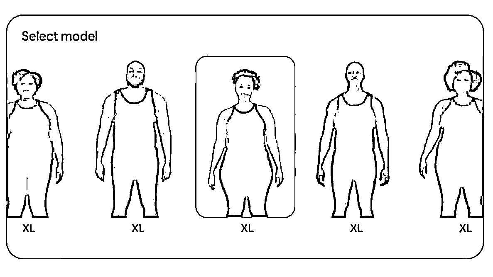
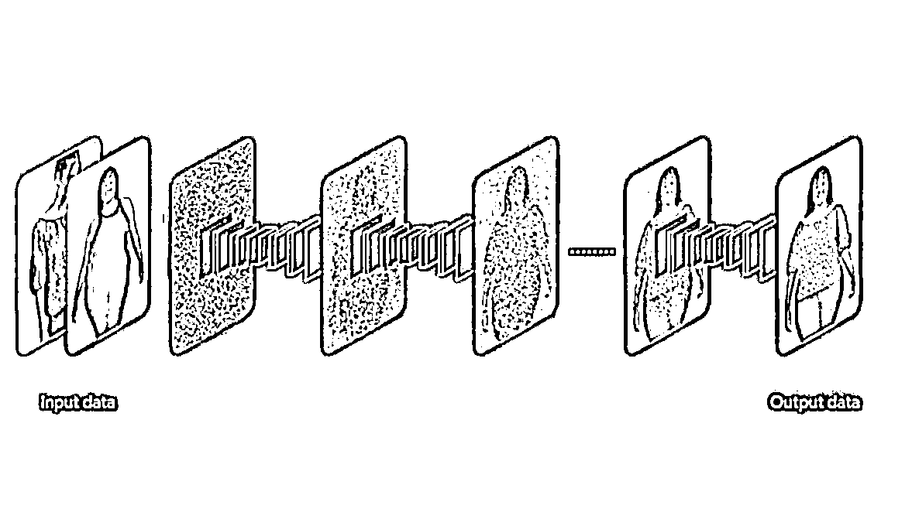
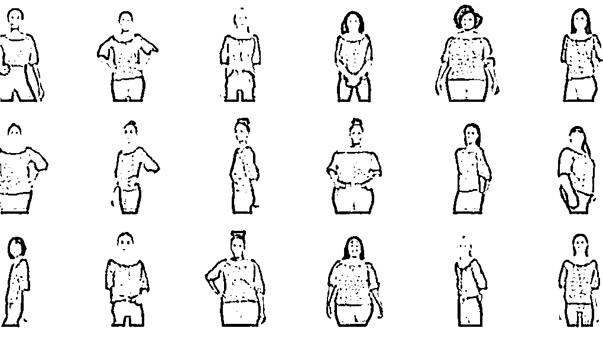

# Google AI 推出无限虚拟试穿，为电商购物带来全新体验

> 原文：[`www.yuque.com/for_lazy/xkrm14/rx4h550m93vqzwb9`](https://www.yuque.com/for_lazy/xkrm14/rx4h550m93vqzwb9)

作者： 荧

日期：2023-06-30

点赞数：66

正文：

google 的 AI 试穿 带来新的电商购物体验 无限虚拟试穿：装载各种不同身形不同肤色的真人模型，可以在模特身上生成指定服装的各种穿戴效果，从 XXS 到 XXXXL，甚至折痕跟阴影都和真人试穿一样。

评论区：

大王 : 请教是哪个软件？

伟业 : 解读：给想要网购的人，提供试穿图，解决买不到合适衣服的问题。也可以上传一个模型，来替代模特，给网点供图来实现变现

Frank 老师 : 这个模式，似乎需要用户上传自己照片，才能模拟出来

Frank 老师 : 理解：Google 的 AI 试穿功能引领新的电商购物体验，利用真人模型生成详细的服装穿戴效果，包括各种体型、肤色和衣物细节，为消费者提供更真实的虚拟试穿体验。

叁岁 : 很多年前淘宝就想推出这个什么试衣镜还是什么玩意的一个概念这么多年过去也还是没落地

中华 : 现在只是出了一篇论文，没地方可以使用吧？？？

公众号懒人找资源，懒人专属群分享

